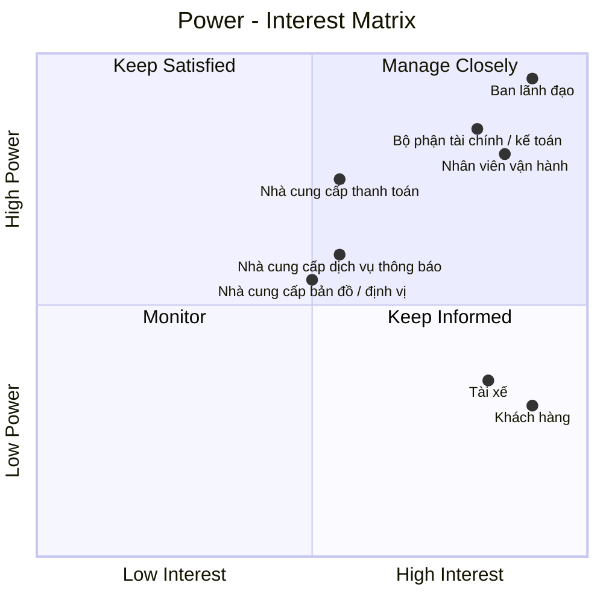

# 23630751_LeMinhThienPhuc_Cabsystem
## 1. Phân tích nghiệp vụ
### Hiện tại, Công ty ABC đang gặp nhiều khó khăn trong hoạt động đặt xe do việc phân công tài xế chủ yếu được thực hiện thủ công, khách hàng khó theo dõi trạng thái chuyến đi, thông tin thanh toán chưa được quản lý tập trung và bộ phận vận hành gặp nhiều hạn chế khi số lượng khách hàng, tài xế tăng lên. Ngoài ra, doanh nghiệp chưa có cơ chế tự động tìm và phân công tài xế phù hợp, xử lý trường hợp tài xế từ chối hoặc không phản hồi, cũng như chưa quản lý hiệu quả dữ liệu chuyến đi, giao dịch và hoạt động của tài xế. 
### Vì vậy, doanh nghiệp cần xây dựng một hệ thống CAB nhằm số hóa và tự động hóa toàn bộ quy trình đặt xe. Hệ thống cho phép khách hàng đăng ký, quản lý thông tin, nhập điểm đón và điểm đến, lựa chọn loại xe, gửi yêu cầu đặt xe và theo dõi trạng thái chuyến. Hệ thống tự động tìm kiếm và phân công tài xế dựa trên vị trí, trạng thái sẵn sàng và các tiêu chí vận hành; nếu tài xế không phản hồi hoặc từ chối, hệ thống tiếp tục tìm tài xế khác và thông báo cho khách hàng khi không tìm được tài xế. Tài xế có thể quản lý hồ sơ, phương tiện, trạng thái hoạt động, nhận hoặc từ chối chuyến và cập nhật trạng thái trong quá trình thực hiện chuyến. Sau khi chuyến hoàn thành, hệ thống thực hiện tính cước, hỗ trợ thanh toán bằng tiền mặt hoặc thanh toán điện tử thông qua nhà cung cấp bên ngoài, đồng thời quản lý lịch sử giao dịch và xử lý trường hợp thanh toán thất bại. Nhân viên vận hành có thể quản lý khách hàng, tài xế, phương tiện và chuyến đi, theo dõi các chuyến đang diễn ra, xử lý sự cố và tra cứu lịch sử. 
### Bên cạnh đó, hệ thống cung cấp thông báo cho khách hàng và tài xế, phân quyền người dùng, lưu vết các thao tác quan trọng và cung cấp báo cáo về số lượng chuyến, doanh thu, tỷ lệ hoàn thành, tỷ lệ hủy và hiệu quả hoạt động của tài xế. Hệ thống được định hướng xây dựng linh hoạt, có khả năng mở rộng để đáp ứng nhu cầu tăng trưởng và bổ sung các loại dịch vụ, phương thức thanh toán hoặc kênh thông báo mới trong tương lai.
## 2. Stakeholder

| Tên Stakeholder | Vai trò |
|:---|:---|
| Ban lãnh đạo | Định hướng, phê duyệt và đưa ra các quyết định quan trọng của dự án |
| Khách hàng | Đăng ký, đặt xe, theo dõi chuyến, thanh toán và đánh giá tài xế |
| Tài xế | Nhận chuyến, thực hiện chuyến và cập nhật trạng thái chuyến đi |
| Nhân viên vận hành | Quản lý khách hàng, tài xế, phương tiện, chuyến đi và xử lý sự cố |
| Nhà cung cấp thanh toán | Cung cấp dịch vụ và xử lý các giao dịch thanh toán điện tử |
| Bộ phận tài chính / kế toán | Quản lý doanh thu, giao dịch, đối soát và báo cáo tài chính |
| Nhà cung cấp bản đồ / định vị | Cung cấp dữ liệu vị trí, bản đồ, khoảng cách và hỗ trợ xác định tài xế |
| Nhà cung cấp dịch vụ thông báo | Cung cấp kênh gửi như thông báo ứng dụng, tin nhắn, thư điện tử... |
## 3. Stakeholder matrix

## 4. Business Goals

| Mã | Business Goal | Mô tả |
|:---|:---|:---|
| **BG01** | **Tự động hóa và tối ưu hóa hoạt động điều phối xe** | Chuyển đổi quy trình tiếp nhận và phân công chuyến từ thủ công sang tự động, giảm thời gian xử lý yêu cầu và nâng cao hiệu quả sử dụng đội ngũ tài xế. |
| **BG02** | **Nâng cao chất lượng dịch vụ và trải nghiệm khách hàng** | Cung cấp quy trình đặt xe minh bạch, thuận tiện và có khả năng theo dõi xuyên suốt từ khi tạo yêu cầu đến khi hoàn thành chuyến, đồng thời cung cấp thông tin kịp thời thông qua hệ thống thông báo. |
| **BG03** | **Nâng cao hiệu quả quản lý và vận hành** | Cung cấp cho bộ phận vận hành khả năng theo dõi tập trung khách hàng, tài xế, phương tiện và chuyến đi; hỗ trợ xử lý các tình huống bất thường và đưa ra quyết định dựa trên dữ liệu vận hành. |
| **BG04** | **Chuẩn hóa và kiểm soát hoạt động tính cước, thanh toán và doanh thu** | Quản lý thống nhất quá trình tính cước và thanh toán, hỗ trợ nhiều phương thức thanh toán, kiểm soát trạng thái giao dịch và cung cấp dữ liệu phục vụ đối soát, quản lý doanh thu và báo cáo. |
| **BG05** | **Tăng cường khả năng kiểm soát và khai thác dữ liệu** | Hình thành nguồn dữ liệu tập trung về khách hàng, tài xế, phương tiện, chuyến đi và giao dịch nhằm phục vụ vận hành, tra cứu, báo cáo và phân tích hiệu quả kinh doanh. |
| **BG06** | **Đảm bảo tính liên tục và khả năng mở rộng của hoạt động kinh doanh** | Xây dựng nền tảng có khả năng đáp ứng sự gia tăng về số lượng khách hàng, tài xế và chuyến đi; hạn chế việc một thành phần gặp sự cố làm gián đoạn toàn bộ dịch vụ. |
| **BG07** | **Tạo nền tảng linh hoạt cho việc phát triển dịch vụ trong tương lai** | Cho phép doanh nghiệp bổ sung loại hình dịch vụ, phương thức thanh toán, kênh thông báo và các thành phần tích hợp mới mà không phải thay đổi lớn toàn bộ hệ thống. |
| **BG08** | **Đảm bảo an toàn thông tin và tuân thủ trong hoạt động kinh doanh** | Bảo vệ thông tin cá nhân, dữ liệu vị trí và dữ liệu giao dịch; kiểm soát quyền truy cập, lưu vết các thao tác quan trọng và hỗ trợ truy xuất khi phát sinh sự cố. |
## 5. Phạm vi dự án

Trong thời gian 7 tuần, dự án tập trung xây dựng các chức năng cơ bản và cần thiết để hệ thống CAB có thể vận hành như một nền tảng đặt xe trực tuyến, đồng thời hỗ trợ nhân viên vận hành quản lý khách hàng, tài xế, phương tiện và chuyến đi.

| STT | Module | Nội dung |
|:---:|:---|:---|
| 1 | **Quản lý khách hàng** | Quản lý thông tin tài khoản, hồ sơ, trạng thái hoạt động và lịch sử chuyến đi của khách hàng. |
| 2 | **Quản lý tài xế** | Quản lý thông tin tài khoản, hồ sơ, trạng thái hoạt động và thông tin phương tiện của tài xế. |
| 3 | **Đặt xe** | Khách hàng nhập điểm đón, điểm đến, lựa chọn loại xe và gửi yêu cầu đặt xe. |
| 4 | **Tìm và phân công tài xế** | Hệ thống tìm tài xế phù hợp dựa trên vị trí, trạng thái sẵn sàng và các tiêu chí cơ bản. |
| 5 | **Quản lý chuyến đi** | Tài xế nhận chuyến và cập nhật trạng thái trong quá trình thực hiện chuyến. |
| 6 | **Theo dõi chuyến đi** | Khách hàng theo dõi trạng thái và vị trí tài xế. |
| 7 | **Tính cước và thanh toán** | Tính số tiền phải trả và hỗ trợ thanh toán bằng tiền mặt hoặc thanh toán điện tử. |
| 8 | **Thông báo** | Gửi thông báo về các trạng thái quan trọng của chuyến đi cho khách hàng và tài xế. |
| 9 | **Quản lý vận hành** | Nhân viên vận hành theo dõi và xử lý khách hàng, tài xế, phương tiện và các chuyến đi đang diễn ra. |
| 10 | **Lịch sử và đánh giá** | Lưu lịch sử chuyến đi và cho phép khách hàng đánh giá tài xế sau khi hoàn thành chuyến. |
| 11 | **Bảo mật và phân quyền** | Xác thực người dùng, phân quyền chức năng quản trị và bảo vệ dữ liệu cơ bản. |
## 6. Business Requirements

Dựa trên phạm vi dự án và các module MVP đã xác định, hệ thống CAB cần đáp ứng các yêu cầu nghiệp vụ sau:

| Mã | Business Requirement | Mô tả |
|:---|:---|:---|
| **BR01** | **Quản lý tài khoản khách hàng** | Hệ thống cho phép khách hàng đăng ký, đăng nhập và xác thực tài khoản để sử dụng các dịch vụ của hệ thống. |
| **BR02** | **Quản lý thông tin khách hàng** | Hệ thống cho phép khách hàng quản lý và cập nhật thông tin cá nhân phục vụ quá trình sử dụng dịch vụ. |
| **BR03** | **Quản lý trạng thái khách hàng** | Hệ thống quản lý trạng thái hoạt động của tài khoản khách hàng để phục vụ việc kiểm soát sử dụng dịch vụ. |
| **BR04** | **Quản lý lịch sử khách hàng** | Hệ thống lưu trữ và cho phép khách hàng tra cứu lịch sử các chuyến đi đã thực hiện. |
| **BR05** | **Quản lý tài khoản tài xế** | Hệ thống cho phép tài xế đăng ký hoặc nhân viên vận hành tạo và quản lý tài khoản tài xế. |
| **BR06** | **Quản lý hồ sơ và phương tiện tài xế** | Hệ thống cho phép quản lý thông tin hồ sơ tài xế và thông tin phương tiện được sử dụng để cung cấp dịch vụ. |
| **BR07** | **Quản lý trạng thái tài xế** | Hệ thống cho phép tài xế cập nhật trạng thái hoạt động và khả năng sẵn sàng nhận chuyến. |
| **BR08** | **Quản lý tài xế và phương tiện** | Hệ thống hỗ trợ nhân viên vận hành tra cứu và quản lý thông tin, trạng thái tài xế và phương tiện. |
| **BR09** | **Tạo yêu cầu đặt xe** | Hệ thống cho phép khách hàng tạo yêu cầu đặt xe bằng cách cung cấp điểm đón, điểm đến và lựa chọn loại xe hoặc dịch vụ. |
| **BR10** | **Xác nhận yêu cầu đặt xe** | Hệ thống kiểm tra và xác nhận các thông tin cần thiết trước khi tiếp nhận yêu cầu đặt xe. |
| **BR11** | **Quản lý trạng thái yêu cầu đặt xe** | Hệ thống quản lý trạng thái yêu cầu đặt xe từ khi được tạo cho đến khi được phân công hoặc kết thúc. |
| **BR12** | **Tiếp nhận yêu cầu đặt xe** | Hệ thống thông báo cho khách hàng khi yêu cầu đặt xe được tiếp nhận thành công. |
| **BR13** | **Tự động tìm kiếm tài xế** | Hệ thống tự động tìm kiếm tài xế phù hợp dựa trên vị trí, trạng thái sẵn sàng và loại xe hoặc dịch vụ. |
| **BR14** | **Ưu tiên tài xế phù hợp** | Hệ thống hỗ trợ cơ chế ưu tiên tài xế phù hợp và gần khách hàng theo các tiêu chí vận hành của doanh nghiệp. |
| **BR15** | **Phân công chuyến cho tài xế** | Hệ thống gửi yêu cầu nhận chuyến đến tài xế phù hợp và ghi nhận việc tài xế chấp nhận hoặc từ chối chuyến. |
| **BR16** | **Xử lý tài xế không nhận chuyến** | Hệ thống tiếp tục tìm tài xế khác khi tài xế được đề xuất từ chối hoặc không phản hồi trong thời gian quy định. |
| **BR17** | **Thông báo kết quả tìm tài xế** | Hệ thống thông báo cho khách hàng khi tìm được tài xế hoặc khi không tìm được tài xế phù hợp. |
| **BR18** | **Tiếp nhận chuyến đi** | Hệ thống cho phép tài xế tiếp nhận và xem thông tin chuyến được phân công. |
| **BR19** | **Quản lý trạng thái chuyến đi** | Hệ thống quản lý và cập nhật trạng thái chuyến đi trong suốt quá trình thực hiện. |
| **BR20** | **Cập nhật quá trình thực hiện chuyến** | Hệ thống hỗ trợ ghi nhận các trạng thái chính của chuyến gồm đã đến điểm đón, đã đón khách, đang di chuyển và hoàn thành. |
| **BR21** | **Lưu trữ thông tin chuyến đi** | Hệ thống lưu trữ thông tin và lịch sử trạng thái của chuyến đi để phục vụ theo dõi, thanh toán và tra cứu. |
| **BR22** | **Theo dõi trạng thái chuyến đi** | Hệ thống cho phép khách hàng theo dõi trạng thái hiện tại của chuyến đi trong quá trình thực hiện. |
| **BR23** | **Hiển thị thông tin tài xế và phương tiện** | Hệ thống cung cấp cho khách hàng thông tin tài xế và phương tiện sau khi chuyến được phân công. |
| **BR24** | **Theo dõi vị trí tài xế** | Hệ thống ghi nhận và cung cấp thông tin vị trí của tài xế để hỗ trợ khách hàng theo dõi chuyến đi. |
| **BR25** | **Dự kiến thời gian tài xế đến** | Hệ thống cung cấp thời gian dự kiến tài xế đến điểm đón và cập nhật thông tin khi có thay đổi. |
| **BR26** | **Tính cước chuyến đi** | Hệ thống xác định số tiền khách hàng phải trả dựa trên loại dịch vụ và thông tin chuyến đi theo chính sách của doanh nghiệp. |
| **BR27** | **Hỗ trợ phương thức thanh toán** | Hệ thống hỗ trợ khách hàng thanh toán bằng tiền mặt hoặc phương thức thanh toán điện tử. |
| **BR28** | **Tích hợp thanh toán điện tử** | Hệ thống tích hợp với nhà cung cấp thanh toán bên ngoài để xử lý giao dịch điện tử mà không lưu trực tiếp thông tin nhạy cảm của khách hàng. |
| **BR29** | **Quản lý trạng thái thanh toán** | Hệ thống ghi nhận và quản lý trạng thái của giao dịch thanh toán. |
| **BR30** | **Xử lý thanh toán thất bại** | Hệ thống thông báo cho khách hàng về kết quả thanh toán và hỗ trợ xử lý lại giao dịch khi thanh toán điện tử thất bại theo chính sách doanh nghiệp. |
| **BR31** | **Quản lý thông tin giao dịch** | Hệ thống lưu trữ thông tin giao dịch cần thiết để phục vụ tra cứu và đối soát. |
| **BR32** | **Thông báo trạng thái đặt xe và chuyến đi** | Hệ thống thông báo cho khách hàng về các sự kiện quan trọng như tiếp nhận yêu cầu, tài xế nhận chuyến, tài xế đến điểm đón và hoàn thành chuyến. |
| **BR33** | **Thông báo kết quả thanh toán** | Hệ thống thông báo cho khách hàng về kết quả của giao dịch thanh toán. |
| **BR34** | **Thông báo cho tài xế** | Hệ thống thông báo cho tài xế về chuyến mới và những thay đổi quan trọng liên quan đến chuyến đang thực hiện. |
| **BR35** | **Mở rộng kênh thông báo** | Hệ thống hỗ trợ mở rộng hoặc bổ sung các kênh thông báo trong tương lai mà không ảnh hưởng lớn đến các nghiệp vụ hiện có. |
| **BR36** | **Quản lý dữ liệu vận hành** | Hệ thống cung cấp cho nhân viên vận hành khả năng tra cứu và quản lý thông tin khách hàng, tài xế và phương tiện. |
| **BR37** | **Theo dõi chuyến đang diễn ra** | Hệ thống cho phép nhân viên vận hành theo dõi các chuyến đang diễn ra và trạng thái hiện tại của từng chuyến. |
| **BR38** | **Theo dõi trạng thái tài xế** | Hệ thống cho phép nhân viên vận hành theo dõi trạng thái hoạt động và khả năng nhận chuyến của tài xế. |
| **BR39** | **Xử lý chuyến đi bất thường** | Hệ thống hỗ trợ nhân viên vận hành tra cứu và xử lý các trường hợp chuyến đi phát sinh lỗi hoặc bất thường. |
| **BR40** | **Tra cứu giao dịch** | Hệ thống cho phép nhân viên vận hành tra cứu lịch sử giao dịch phục vụ công tác hỗ trợ và kiểm tra. |
| **BR41** | **Lưu trữ lịch sử chuyến đi** | Hệ thống lưu trữ và cung cấp thông tin lịch sử các chuyến đi đã thực hiện. |
| **BR42** | **Tra cứu chi tiết chuyến đi** | Hệ thống cho phép khách hàng xem thông tin chi tiết của chuyến đi và số tiền phải trả hoặc đã thanh toán. |
| **BR43** | **Đánh giá tài xế** | Hệ thống cho phép khách hàng đánh giá tài xế sau khi chuyến đi hoàn thành. |
| **BR44** | **Quản lý đánh giá** | Hệ thống lưu trữ kết quả đánh giá và liên kết đánh giá với chuyến đi và tài xế tương ứng. |
| **BR45** | **Xác thực người dùng** | Hệ thống yêu cầu khách hàng và tài xế xác thực trước khi sử dụng các chức năng yêu cầu tài khoản. |
| **BR46** | **Phân quyền người dùng** | Hệ thống kiểm soát quyền truy cập dựa trên vai trò và đảm bảo nhân viên vận hành chỉ thực hiện được các chức năng được phân quyền. |
| **BR47** | **Bảo vệ dữ liệu** | Hệ thống bảo vệ thông tin cá nhân, thông tin phương tiện, dữ liệu vị trí và dữ liệu giao dịch khỏi việc truy cập hoặc sử dụng trái phép. |
| **BR48** | **Lưu vết hoạt động** | Hệ thống lưu vết các thao tác quản trị và các thao tác quan trọng để phục vụ kiểm tra, đối soát và xử lý sự cố. |
