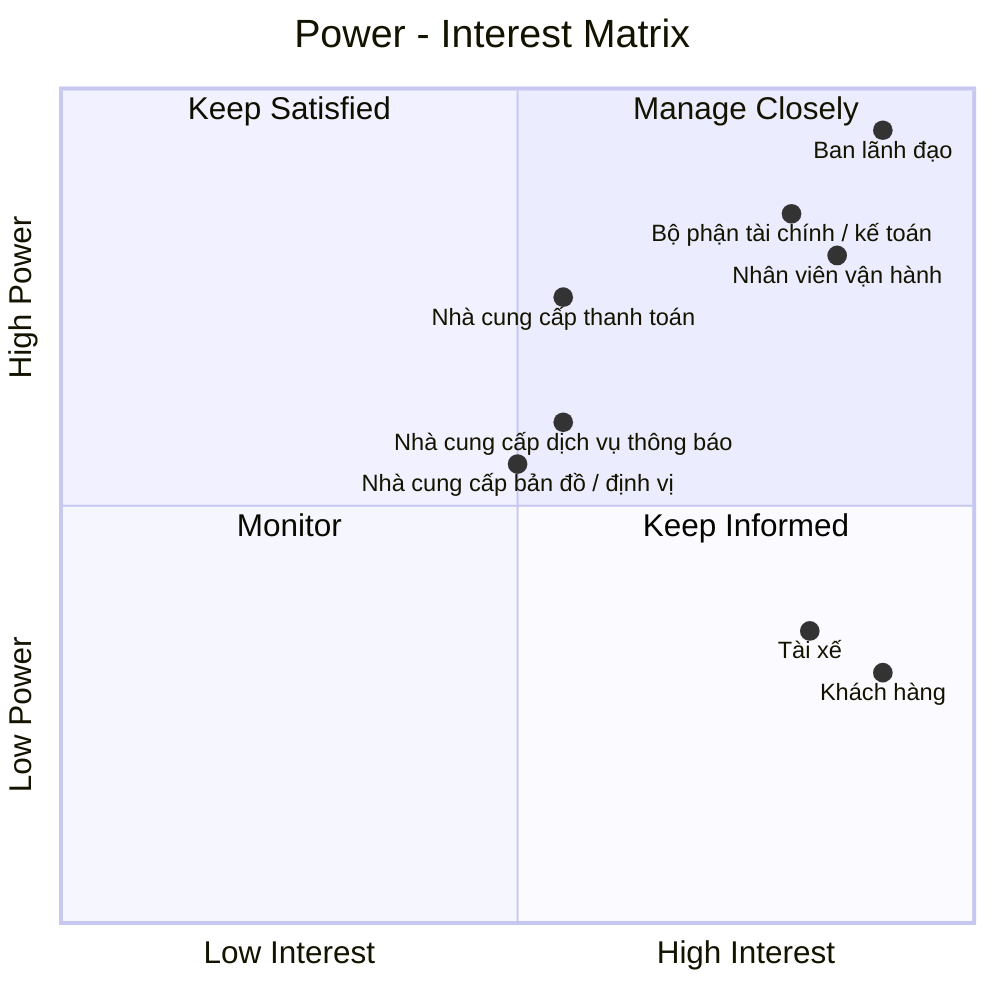

# 23630751_LeMinhThienPhuc_Cabsystem
## 1. Phân tích nghiệp vụ
### Hiện tại, Công ty ABC đang gặp nhiều khó khăn trong hoạt động đặt xe do việc phân công tài xế chủ yếu được thực hiện thủ công, khách hàng khó theo dõi trạng thái chuyến đi, thông tin thanh toán chưa được quản lý tập trung và bộ phận vận hành gặp nhiều hạn chế khi số lượng khách hàng, tài xế tăng lên. Ngoài ra, doanh nghiệp chưa có cơ chế tự động tìm và phân công tài xế phù hợp, xử lý trường hợp tài xế từ chối hoặc không phản hồi, cũng như chưa quản lý hiệu quả dữ liệu chuyến đi, giao dịch và hoạt động của tài xế. 
### Vì vậy, doanh nghiệp cần xây dựng một hệ thống CAB nhằm số hóa và tự động hóa toàn bộ quy trình đặt xe. Hệ thống cho phép khách hàng đăng ký, quản lý thông tin, nhập điểm đón và điểm đến, lựa chọn loại xe, gửi yêu cầu đặt xe và theo dõi trạng thái chuyến. Hệ thống tự động tìm kiếm và phân công tài xế dựa trên vị trí, trạng thái sẵn sàng và các tiêu chí vận hành; nếu tài xế không phản hồi hoặc từ chối, hệ thống tiếp tục tìm tài xế khác và thông báo cho khách hàng khi không tìm được tài xế. Tài xế có thể quản lý hồ sơ, phương tiện, trạng thái hoạt động, nhận hoặc từ chối chuyến và cập nhật trạng thái trong quá trình thực hiện chuyến. Sau khi chuyến hoàn thành, hệ thống thực hiện tính cước, hỗ trợ thanh toán bằng tiền mặt hoặc thanh toán điện tử thông qua nhà cung cấp bên ngoài, đồng thời quản lý lịch sử giao dịch và xử lý trường hợp thanh toán thất bại. Nhân viên vận hành có thể quản lý khách hàng, tài xế, phương tiện và chuyến đi, theo dõi các chuyến đang diễn ra, xử lý sự cố và tra cứu lịch sử. 
### Bên cạnh đó, hệ thống cung cấp thông báo cho khách hàng và tài xế, phân quyền người dùng, lưu vết các thao tác quan trọng và cung cấp báo cáo về số lượng chuyến, doanh thu, tỷ lệ hoàn thành, tỷ lệ hủy và hiệu quả hoạt động của tài xế. Hệ thống được định hướng xây dựng linh hoạt, có khả năng mở rộng để đáp ứng nhu cầu tăng trưởng và bổ sung các loại dịch vụ, phương thức thanh toán hoặc kênh thông báo mới trong tương lai.
## 2. Stakeholder

| Tên Stakeholder | Vai trò |
|:---|:---|
| Ban lãnh đạo | Định hướng, phê duyệt và đưa ra các quyết định quan trọng của dự án |
| Khách hàng | Đăng ký, đặt xe, theo dõi chuyến, thanh toán và đánh giá tài xế |
| Tài xế | Nhận chuyến, thực hiện chuyến và cập nhật trạng thái chuyến đi |
| Nhân viên vận hành | Quản lý khách hàng, tài xế, phương tiện, chuyến đi và xử lý sự cố |
| Nhà cung cấp thanh toán | Cung cấp dịch vụ và xử lý các giao dịch thanh toán điện tử |
| Bộ phận tài chính / kế toán | Quản lý doanh thu, giao dịch, đối soát và báo cáo tài chính |
| Nhà cung cấp bản đồ / định vị | Cung cấp dữ liệu vị trí, bản đồ, khoảng cách và hỗ trợ xác định tài xế |
| Nhà cung cấp dịch vụ thông báo | Cung cấp kênh gửi như thông báo ứng dụng, tin nhắn, thư điện tử... |
## Stakeholder matrix

## 3. Business Goals

| Mã | Business Goal | Mô tả |
|:---|:---|:---|
| **BG01** | **Tự động hóa và tối ưu hóa hoạt động điều phối xe** | Chuyển đổi quy trình tiếp nhận và phân công chuyến từ thủ công sang tự động, giảm thời gian xử lý yêu cầu và nâng cao hiệu quả sử dụng đội ngũ tài xế. |
| **BG02** | **Nâng cao chất lượng dịch vụ và trải nghiệm khách hàng** | Cung cấp quy trình đặt xe minh bạch, thuận tiện và có khả năng theo dõi xuyên suốt từ khi tạo yêu cầu đến khi hoàn thành chuyến, đồng thời cung cấp thông tin kịp thời thông qua hệ thống thông báo. |
| **BG03** | **Nâng cao hiệu quả quản lý và vận hành** | Cung cấp cho bộ phận vận hành khả năng theo dõi tập trung khách hàng, tài xế, phương tiện và chuyến đi; hỗ trợ xử lý các tình huống bất thường và đưa ra quyết định dựa trên dữ liệu vận hành. |
| **BG04** | **Chuẩn hóa và kiểm soát hoạt động tính cước, thanh toán và doanh thu** | Quản lý thống nhất quá trình tính cước và thanh toán, hỗ trợ nhiều phương thức thanh toán, kiểm soát trạng thái giao dịch và cung cấp dữ liệu phục vụ đối soát, quản lý doanh thu và báo cáo. |
| **BG05** | **Tăng cường khả năng kiểm soát và khai thác dữ liệu** | Hình thành nguồn dữ liệu tập trung về khách hàng, tài xế, phương tiện, chuyến đi và giao dịch nhằm phục vụ vận hành, tra cứu, báo cáo và phân tích hiệu quả kinh doanh. |
| **BG06** | **Đảm bảo tính liên tục và khả năng mở rộng của hoạt động kinh doanh** | Xây dựng nền tảng có khả năng đáp ứng sự gia tăng về số lượng khách hàng, tài xế và chuyến đi; hạn chế việc một thành phần gặp sự cố làm gián đoạn toàn bộ dịch vụ. |
| **BG07** | **Tạo nền tảng linh hoạt cho việc phát triển dịch vụ trong tương lai** | Cho phép doanh nghiệp bổ sung loại hình dịch vụ, phương thức thanh toán, kênh thông báo và các thành phần tích hợp mới mà không phải thay đổi lớn toàn bộ hệ thống. |
| **BG08** | **Đảm bảo an toàn thông tin và tuân thủ trong hoạt động kinh doanh** | Bảo vệ thông tin cá nhân, dữ liệu vị trí và dữ liệu giao dịch; kiểm soát quyền truy cập, lưu vết các thao tác quan trọng và hỗ trợ truy xuất khi phát sinh sự cố. |
## 4. Phạm vi dự án

Trong thời gian 7 tuần, dự án tập trung xây dựng các chức năng cơ bản và cần thiết để hệ thống CAB có thể vận hành như một nền tảng đặt xe trực tuyến, đồng thời hỗ trợ nhân viên vận hành quản lý khách hàng, tài xế, phương tiện và chuyến đi.

| STT | Module | Nội dung |
|:---:|:---|:---|
| 1 | **Quản lý khách hàng** | Quản lý thông tin tài khoản, hồ sơ, trạng thái hoạt động và lịch sử chuyến đi của khách hàng. |
| 2 | **Quản lý tài xế** | Quản lý thông tin tài khoản, hồ sơ, trạng thái hoạt động và thông tin phương tiện của tài xế. |
| 3 | **Đặt xe** | Nhập điểm đón, điểm đến, chọn loại xe và tạo yêu cầu đặt xe |
| 4 | **Tìm & phân công tài xế** | Tìm tài xế phù hợp, gửi yêu cầu, xử lý nhận/từ chối/không phản hồi |
| 5 | **Quản lý & theo dõi chuyến** | Nhận chuyến, cập nhật trạng thái, theo dõi trạng thái/vị trí/ETA |
| 6 | **Tính cước & thanh toán** | Tính cước, thanh toán tiền mặt/điện tử, xử lý kết quả thanh toán |
| 7 | **Thông báo** | Thông báo các sự kiện quan trọng cho Customer và Driver |
| 8 | **Quản lý vận hành** | Quản lý Customer, Driver, phương tiện, chuyến đi và xử lý sự cố |
| 9 | **Lịch sử & đánh giá** | Xem lịch sử chuyến, số tiền và đánh giá tài xế |
| 10 | **Bảo mật & phân quyền** | Xác thực, phân quyền và bảo vệ dữ liệu |
## 5. Business Requirements

Trong phạm vi MVP với thời gian triển khai **7 tuần**, hệ thống CAB tập trung vào các nghiệp vụ cốt lõi phục vụ toàn bộ quy trình đặt xe, từ quản lý người dùng, đặt xe, tìm tài xế, thực hiện chuyến, thanh toán đến quản lý vận hành và bảo mật.

| BR ID | Module | Business Requirement |
|:---:|:---|:---|
| **BR01** | Quản lý khách hàng | Hệ thống phải hỗ trợ khách hàng đăng ký, đăng nhập và quản lý thông tin tài khoản cá nhân. |
| **BR02** | Quản lý tài xế & phương tiện | Hệ thống phải hỗ trợ doanh nghiệp quản lý tài khoản, hồ sơ, phương tiện và trạng thái hoạt động của tài xế. |
| **BR03** | Đặt xe | Hệ thống phải cho phép khách hàng tạo yêu cầu đặt xe với điểm đón, điểm đến và loại xe hoặc dịch vụ. |
| **BR04** | Đặt xe | Hệ thống phải quản lý trạng thái của yêu cầu đặt xe trong quá trình xử lý. |
| **BR05** | Tìm & phân công tài xế | Hệ thống phải tự động tìm và lựa chọn tài xế phù hợp dựa trên trạng thái, vị trí và tiêu chí vận hành. |
| **BR06** | Tìm & phân công tài xế | Hệ thống phải xử lý trường hợp tài xế chấp nhận, từ chối hoặc không phản hồi và tiếp tục tìm tài xế khác khi cần. |
| **BR07** | Tìm & phân công tài xế | Hệ thống phải thông báo cho khách hàng khi không tìm được tài xế phù hợp. |
| **BR08** | Quản lý & theo dõi chuyến | Hệ thống phải tạo và quản lý chuyến đi sau khi tài xế nhận yêu cầu. |
| **BR09** | Quản lý & theo dõi chuyến | Hệ thống phải cho phép tài xế cập nhật các trạng thái chính và cung cấp thông tin chuyến cho khách hàng. |
| **BR10** | Quản lý & theo dõi chuyến | Hệ thống phải hỗ trợ cập nhật và hiển thị thông tin vị trí, thời gian dự kiến và trạng thái chuyến trong phạm vi cho phép. |
| **BR11** | Tính cước & thanh toán | Hệ thống phải tính và lưu cước chuyến đi dựa trên loại dịch vụ và thông tin chuyến. |
| **BR12** | Tính cước & thanh toán | Hệ thống phải hỗ trợ thanh toán tiền mặt và thanh toán điện tử thông qua nhà cung cấp bên ngoài. |
| **BR13** | Tính cước & thanh toán | Hệ thống phải quản lý kết quả giao dịch và hỗ trợ xử lý thanh toán thất bại theo chính sách doanh nghiệp. |
| **BR14** | Thông báo | Hệ thống phải gửi thông báo cho khách hàng và tài xế về các sự kiện quan trọng liên quan đến yêu cầu và chuyến đi. |
| **BR15** | Quản lý vận hành | Hệ thống phải cho phép nhân viên vận hành quản lý khách hàng, tài xế, phương tiện và theo dõi các chuyến đang diễn ra. |
| **BR16** | Quản lý vận hành | Hệ thống phải hỗ trợ nhân viên vận hành tra cứu và xử lý các chuyến có lỗi, bất thường và thông tin giao dịch theo quyền được cấp. |
| **BR17** | Lịch sử & đánh giá | Hệ thống phải lưu trữ lịch sử chuyến đi, thông tin thanh toán và cho phép khách hàng đánh giá tài xế sau chuyến. |
| **BR18** | Báo cáo | Hệ thống phải cung cấp các báo cáo cơ bản về số lượng chuyến, doanh thu, tỷ lệ hoàn thành, tỷ lệ hủy và hiệu quả tài xế. |
| **BR19** | Bảo mật & phân quyền | Hệ thống phải xác thực người dùng, phân quyền theo vai trò và bảo vệ dữ liệu khỏi truy cập trái phép. |
| **BR20** | Bảo mật & phân quyền | Hệ thống phải lưu vết các thao tác quan trọng để phục vụ kiểm tra và xử lý sự cố. |

## 6. Functional Requirements

Functional Requirements (FR) được phân rã từ 35 Business Requirements (BR), mô tả các chức năng cụ thể mà hệ thống CAB cần cung cấp để đáp ứng phạm vi MVP trong thời gian 7 tuần.

## 6.1. Quản lý khách hàng

| FR ID | BR ID | Functional Requirement |
|:---:|:---:|:---|
| **FR01** | BR01 | Hệ thống cho phép khách hàng đăng ký, đăng nhập và đăng xuất tài khoản. |
| **FR02** | BR01 | Hệ thống cho phép khách hàng xem và cập nhật thông tin cá nhân. |
| **FR03** | BR01 | Hệ thống xác thực thông tin tài khoản trước khi cho phép truy cập chức năng yêu cầu đăng nhập. |

## 6.2. Quản lý tài xế

| FR ID | BR ID | Functional Requirement |
|:---:|:---:|:---|
| **FR04** | BR02 | Hệ thống cho phép doanh nghiệp tạo, xem và cập nhật hồ sơ tài xế. |
| **FR05** | BR02 | Hệ thống cho phép quản lý thông tin phương tiện và liên kết phương tiện với tài xế. |
| **FR06** | BR02 | Hệ thống cho phép tài xế cập nhật trạng thái hoạt động và trạng thái sẵn sàng nhận chuyến. |

## 6.3. Đặt xe

| FR ID | BR ID | Functional Requirement |
|:---:|:---:|:---|
| **FR07** | BR03 | Hệ thống cho phép khách hàng nhập điểm đón, điểm đến và lựa chọn loại xe hoặc dịch vụ. |
| **FR08** | BR03 | Hệ thống hiển thị thông tin yêu cầu để khách hàng kiểm tra và xác nhận đặt xe. |
| **FR09** | BR04 | Hệ thống tạo mã yêu cầu và quản lý trạng thái đặt xe trong quá trình xử lý. |

## 6.4. Tìm và phân công tài xế

| FR ID | BR ID | Functional Requirement |
|:---:|:---:|:---|
| **FR10** | BR05 | Hệ thống tự động tìm kiếm các tài xế có khả năng nhận chuyến dựa trên trạng thái và vị trí. |
| **FR11** | BR05 | Hệ thống áp dụng tiêu chí vận hành để lựa chọn và ưu tiên tài xế phù hợp. |
| **FR12** | BR06 | Hệ thống gửi yêu cầu nhận chuyến và ghi nhận kết quả chấp nhận, từ chối hoặc không phản hồi của tài xế. |
| **FR13** | BR06 | Hệ thống tự động chuyển sang tài xế khác khi tài xế được đề xuất từ chối hoặc không phản hồi trong thời gian quy định. |
| **FR14** | BR07 | Hệ thống kết thúc quá trình tìm kiếm khi không còn tài xế phù hợp và thông báo cho khách hàng. |

## 6.5. Quản lý chuyến đi

| FR ID | BR ID | Functional Requirement |
|:---:|:---:|:---|
| **FR15** | BR08 | Hệ thống tạo chuyến đi và liên kết chuyến với khách hàng, tài xế và phương tiện sau khi tài xế nhận chuyến. |
| **FR16** | BR09 | Hệ thống cho phép tài xế cập nhật các trạng thái chính: đã đến điểm đón, đã đón khách, đang di chuyển và hoàn thành. |
| **FR17** | BR09 | Hệ thống hiển thị trạng thái và thông tin tài xế của chuyến đi cho khách hàng. |
| **FR18** | BR10 | Hệ thống tiếp nhận và cập nhật thông tin vị trí của tài xế trong quá trình thực hiện chuyến. |
| **FR19** | BR10 | Hệ thống hiển thị vị trí và thời gian dự kiến tài xế đến cho khách hàng dựa trên dữ liệu vị trí. |

## 6.6. Tính cước và thanh toán

| FR ID | BR ID | Functional Requirement |
|:---:|:---:|:---|
| **FR20** | BR11 | Hệ thống tính và lưu số tiền phải thanh toán dựa trên loại dịch vụ và thông tin chuyến đi. |
| **FR21** | BR12 | Hệ thống cho phép khách hàng lựa chọn thanh toán bằng tiền mặt hoặc thanh toán điện tử. |
| **FR22** | BR12 | Hệ thống gửi yêu cầu thanh toán điện tử đến nhà cung cấp thanh toán bên ngoài và tiếp nhận kết quả giao dịch. |
| **FR23** | BR13 | Hệ thống cập nhật trạng thái giao dịch và thông báo kết quả thanh toán cho khách hàng. |
| **FR24** | BR13 | Hệ thống hỗ trợ thực hiện lại thanh toán khi giao dịch điện tử thất bại theo chính sách doanh nghiệp. |

## 6.7. Thông báo

| FR ID | BR ID | Functional Requirement |
|:---:|:---:|:---|
| **FR25** | BR14 | Hệ thống gửi thông báo cho khách hàng về các sự kiện chính: tiếp nhận yêu cầu, nhận chuyến, tài xế đến, hoàn thành chuyến và kết quả thanh toán. |
| **FR26** | BR14 | Hệ thống gửi thông báo cho tài xế về chuyến mới và các thay đổi quan trọng liên quan đến chuyến. |

## 6.8. Quản lý vận hành

| FR ID | BR ID | Functional Requirement |
|:---:|:---:|:---|
| **FR27** | BR15 | Hệ thống cung cấp chức năng tra cứu và quản lý khách hàng, tài xế và phương tiện cho nhân viên vận hành. |
| **FR28** | BR15 | Hệ thống hiển thị danh sách và trạng thái các chuyến đang diễn ra. |
| **FR29** | BR16 | Hệ thống cho phép nhân viên vận hành tra cứu các chuyến có lỗi hoặc bất thường. |
| **FR30** | BR16 | Hệ thống cho phép nhân viên vận hành xử lý hoặc cập nhật trạng thái chuyến theo quyền được cấp. |
| **FR31** | BR16 | Hệ thống cho phép nhân viên vận hành tra cứu thông tin và lịch sử giao dịch. |

## 6.9. Lịch sử và đánh giá

| FR ID | BR ID | Functional Requirement |
|:---:|:---:|:---|
| **FR32** | BR17 | Hệ thống lưu trữ và cho phép khách hàng tra cứu lịch sử chuyến đi. |
| **FR33** | BR17 | Hệ thống hiển thị chi tiết chuyến đi, số tiền và trạng thái thanh toán. |
| **FR34** | BR17 | Hệ thống cho phép khách hàng đánh giá tài xế sau khi chuyến hoàn thành và lưu kết quả đánh giá. |
## 6.10. Bảo mật và phân quyền

| FR ID | BR ID | Functional Requirement |
|:---:|:---:|:---|
| **FR37** | BR19 | Hệ thống xác thực người dùng và phân quyền truy cập theo vai trò Customer, Driver và nhân viên vận hành. |
| **FR38** | BR19 | Hệ thống ngăn người dùng thực hiện các chức năng ngoài phạm vi quyền được cấp. |
| **FR39** | BR19 | Hệ thống bảo vệ thông tin cá nhân, phương tiện, vị trí và dữ liệu giao dịch khỏi truy cập trái phép. |
| **FR40** | BR20 | Hệ thống ghi nhận các thao tác quan trọng của người dùng và nhân viên vận hành. |
| **FR41** | BR20 | Hệ thống cho phép người dùng có quyền tra cứu lịch sử thao tác phục vụ kiểm tra và xử lý sự cố. |
## 7. Usecase tổng quát

