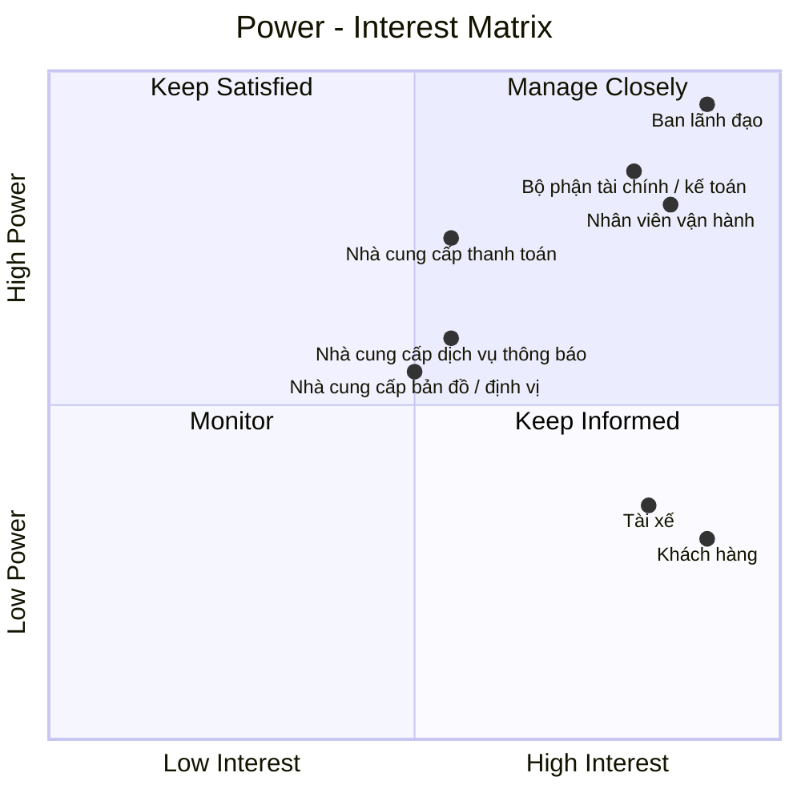

# 23630751_LeMinhThienPhuc_Cabsystem
## 1. Phân tích nghiệp vụ
### Hiện tại, Công ty ABC đang gặp nhiều khó khăn trong hoạt động đặt xe do việc phân công tài xế chủ yếu được thực hiện thủ công, khách hàng khó theo dõi trạng thái chuyến đi, thông tin thanh toán chưa được quản lý tập trung và bộ phận vận hành gặp nhiều hạn chế khi số lượng khách hàng, tài xế tăng lên. Ngoài ra, doanh nghiệp chưa có cơ chế tự động tìm và phân công tài xế phù hợp, xử lý trường hợp tài xế từ chối hoặc không phản hồi, cũng như chưa quản lý hiệu quả dữ liệu chuyến đi, giao dịch và hoạt động của tài xế. 
### Vì vậy, doanh nghiệp cần xây dựng một hệ thống CAB nhằm số hóa và tự động hóa toàn bộ quy trình đặt xe. Hệ thống cho phép khách hàng đăng ký, quản lý thông tin, nhập điểm đón và điểm đến, lựa chọn loại xe, gửi yêu cầu đặt xe và theo dõi trạng thái chuyến. Hệ thống tự động tìm kiếm và phân công tài xế dựa trên vị trí, trạng thái sẵn sàng và các tiêu chí vận hành; nếu tài xế không phản hồi hoặc từ chối, hệ thống tiếp tục tìm tài xế khác và thông báo cho khách hàng khi không tìm được tài xế. Tài xế có thể quản lý hồ sơ, phương tiện, trạng thái hoạt động, nhận hoặc từ chối chuyến và cập nhật trạng thái trong quá trình thực hiện chuyến. Sau khi chuyến hoàn thành, hệ thống thực hiện tính cước, hỗ trợ thanh toán bằng tiền mặt hoặc thanh toán điện tử thông qua nhà cung cấp bên ngoài, đồng thời quản lý lịch sử giao dịch và xử lý trường hợp thanh toán thất bại. Nhân viên vận hành có thể quản lý khách hàng, tài xế, phương tiện và chuyến đi, theo dõi các chuyến đang diễn ra, xử lý sự cố và tra cứu lịch sử. 
### Bên cạnh đó, hệ thống cung cấp thông báo cho khách hàng và tài xế, phân quyền người dùng, lưu vết các thao tác quan trọng và cung cấp báo cáo về số lượng chuyến, doanh thu, tỷ lệ hoàn thành, tỷ lệ hủy và hiệu quả hoạt động của tài xế. Hệ thống được định hướng xây dựng linh hoạt, có khả năng mở rộng để đáp ứng nhu cầu tăng trưởng và bổ sung các loại dịch vụ, phương thức thanh toán hoặc kênh thông báo mới trong tương lai.
## 2. Stakeholder

| Tên Stakeholder | Vai trò |
|:---|:---|
| Ban lãnh đạo | Định hướng, phê duyệt và đưa ra các quyết định quan trọng của dự án |
| Khách hàng | Đăng ký, đặt xe, theo dõi chuyến, thanh toán và đánh giá tài xế |
| Tài xế | Nhận chuyến, thực hiện chuyến và cập nhật trạng thái chuyến đi |
| Nhân viên vận hành | Quản lý khách hàng, tài xế, phương tiện, chuyến đi và xử lý sự cố |
| Nhà cung cấp thanh toán | Cung cấp dịch vụ và xử lý các giao dịch thanh toán điện tử |
| Bộ phận tài chính / kế toán | Quản lý doanh thu, giao dịch, đối soát và báo cáo tài chính |
| Nhà cung cấp bản đồ / định vị | Cung cấp dữ liệu vị trí, bản đồ, khoảng cách và hỗ trợ xác định tài xế |
| Nhà cung cấp dịch vụ thông báo | Cung cấp kênh gửi như thông báo ứng dụng, tin nhắn, thư điện tử... |
## Stakeholder matrix

## 3. Business Goals

| Mã | Business Goal | Mô tả |
|:---|:---|:---|
| **BG01** | **Tự động hóa và tối ưu hóa hoạt động điều phối xe** | Chuyển đổi quy trình tiếp nhận và phân công chuyến từ thủ công sang tự động, giảm thời gian xử lý yêu cầu và nâng cao hiệu quả sử dụng đội ngũ tài xế. |
| **BG02** | **Nâng cao chất lượng dịch vụ và trải nghiệm khách hàng** | Cung cấp quy trình đặt xe minh bạch, thuận tiện và có khả năng theo dõi xuyên suốt từ khi tạo yêu cầu đến khi hoàn thành chuyến, đồng thời cung cấp thông tin kịp thời thông qua hệ thống thông báo. |
| **BG03** | **Nâng cao hiệu quả quản lý và vận hành** | Cung cấp cho bộ phận vận hành khả năng theo dõi tập trung khách hàng, tài xế, phương tiện và chuyến đi; hỗ trợ xử lý các tình huống bất thường và đưa ra quyết định dựa trên dữ liệu vận hành. |
| **BG04** | **Chuẩn hóa và kiểm soát hoạt động tính cước, thanh toán và doanh thu** | Quản lý thống nhất quá trình tính cước và thanh toán, hỗ trợ nhiều phương thức thanh toán, kiểm soát trạng thái giao dịch và cung cấp dữ liệu phục vụ đối soát, quản lý doanh thu và báo cáo. |
| **BG05** | **Tăng cường khả năng kiểm soát và khai thác dữ liệu** | Hình thành nguồn dữ liệu tập trung về khách hàng, tài xế, phương tiện, chuyến đi và giao dịch nhằm phục vụ vận hành, tra cứu, báo cáo và phân tích hiệu quả kinh doanh. |
| **BG06** | **Đảm bảo tính liên tục và khả năng mở rộng của hoạt động kinh doanh** | Xây dựng nền tảng có khả năng đáp ứng sự gia tăng về số lượng khách hàng, tài xế và chuyến đi; hạn chế việc một thành phần gặp sự cố làm gián đoạn toàn bộ dịch vụ. |
| **BG07** | **Tạo nền tảng linh hoạt cho việc phát triển dịch vụ trong tương lai** | Cho phép doanh nghiệp bổ sung loại hình dịch vụ, phương thức thanh toán, kênh thông báo và các thành phần tích hợp mới mà không phải thay đổi lớn toàn bộ hệ thống. |
| **BG08** | **Đảm bảo an toàn thông tin và tuân thủ trong hoạt động kinh doanh** | Bảo vệ thông tin cá nhân, dữ liệu vị trí và dữ liệu giao dịch; kiểm soát quyền truy cập, lưu vết các thao tác quan trọng và hỗ trợ truy xuất khi phát sinh sự cố. |
## 4. Phạm vi dự án

Trong thời gian 7 tuần, dự án tập trung xây dựng các chức năng cơ bản và cần thiết để hệ thống CAB có thể vận hành như một nền tảng đặt xe trực tuyến, đồng thời hỗ trợ nhân viên vận hành quản lý khách hàng, tài xế, phương tiện và chuyến đi.

| STT | Module | Nội dung |
|:---:|:---|:---|
| 1 | **Quản lý khách hàng** | Quản lý thông tin tài khoản, hồ sơ, trạng thái hoạt động và lịch sử chuyến đi của khách hàng. |
| 2 | **Quản lý tài xế** | Quản lý thông tin tài khoản, hồ sơ, trạng thái hoạt động và thông tin phương tiện của tài xế. |
| 3 | **Đặt xe** | Nhập điểm đón, điểm đến, chọn loại xe và tạo yêu cầu đặt xe |
| 4 | **Tìm & phân công tài xế** | Tìm tài xế phù hợp, gửi yêu cầu, xử lý nhận/từ chối/không phản hồi |
| 5 | **Quản lý & theo dõi chuyến** | Nhận chuyến, cập nhật trạng thái, theo dõi trạng thái/vị trí/ETA |
| 6 | **Tính cước & thanh toán** | Tính cước, thanh toán tiền mặt/điện tử, xử lý kết quả thanh toán |
| 7 | **Thông báo** | Thông báo các sự kiện quan trọng cho Customer và Driver |
| 8 | **Quản lý vận hành** | Quản lý Customer, Driver, phương tiện, chuyến đi và xử lý sự cố |
| 9 | **Lịch sử & đánh giá** | Xem lịch sử chuyến, số tiền và đánh giá tài xế |
| 10 | **Bảo mật & phân quyền** | Xác thực, phân quyền và bảo vệ dữ liệu |
## 5. Business Requirements

Trong phạm vi MVP với thời gian triển khai **7 tuần**, hệ thống CAB tập trung vào các nghiệp vụ cốt lõi phục vụ toàn bộ quy trình đặt xe, từ quản lý người dùng, đặt xe, tìm tài xế, thực hiện chuyến, thanh toán đến quản lý vận hành và bảo mật.

| BR ID | Module | Business Requirement |
|:---:|:---|:---|
| **BR01** | Quản lý khách hàng | Hệ thống phải hỗ trợ khách hàng đăng ký, đăng nhập và quản lý tài khoản. |
| **BR02** | Quản lý khách hàng | Hệ thống phải cho phép khách hàng quản lý và cập nhật thông tin cá nhân cần thiết cho việc sử dụng dịch vụ. |
| **BR03** | Quản lý tài xế | Hệ thống phải hỗ trợ doanh nghiệp quản lý tài khoản và hồ sơ của tài xế. |
| **BR04** | Quản lý tài xế | Hệ thống phải hỗ trợ quản lý phương tiện và liên kết phương tiện với tài xế. |
| **BR05** | Quản lý tài xế | Hệ thống phải cho phép tài xế cập nhật trạng thái hoạt động và khả năng nhận chuyến. |
| **BR06** | Đặt xe | Hệ thống phải cho phép khách hàng tạo yêu cầu đặt xe bằng cách cung cấp điểm đón, điểm đến và loại xe hoặc loại dịch vụ. |
| **BR07** | Đặt xe | Hệ thống phải quản lý trạng thái của yêu cầu đặt xe trong quá trình xử lý. |
| **BR08** | Tìm & phân công tài xế | Hệ thống phải tự động tìm kiếm và lựa chọn tài xế phù hợp dựa trên trạng thái, vị trí và tiêu chí vận hành. |
| **BR09** | Tìm & phân công tài xế | Hệ thống phải xử lý trường hợp tài xế chấp nhận, từ chối hoặc không phản hồi yêu cầu nhận chuyến. |
| **BR10** | Tìm & phân công tài xế | Hệ thống phải tiếp tục tìm tài xế khác khi tài xế được đề xuất từ chối hoặc không phản hồi và thông báo cho khách hàng khi không tìm được tài xế. |
| **BR11** | Quản lý & theo dõi chuyến | Hệ thống phải tạo và quản lý chuyến đi sau khi tài xế chấp nhận yêu cầu đặt xe. |
| **BR12** | Quản lý & theo dõi chuyến | Hệ thống phải cho phép tài xế cập nhật các trạng thái chính trong quá trình thực hiện chuyến. |
| **BR13** | Quản lý & theo dõi chuyến | Hệ thống phải cung cấp cho khách hàng thông tin trạng thái, tài xế và vị trí chuyến đi trong phạm vi cho phép. |
| **BR14** | Tính cước & thanh toán | Hệ thống phải xác định và lưu trữ số tiền khách hàng phải thanh toán dựa trên thông tin chuyến đi và chính sách giá. |
| **BR15** | Tính cước & thanh toán | Hệ thống phải hỗ trợ thanh toán bằng tiền mặt và thanh toán điện tử. |
| **BR16** | Tính cước & thanh toán | Hệ thống phải tích hợp với nhà cung cấp thanh toán bên ngoài và quản lý kết quả giao dịch. |
| **BR17** | Tính cước & thanh toán | Hệ thống phải thông báo và hỗ trợ xử lý lại khi giao dịch thanh toán điện tử thất bại theo chính sách doanh nghiệp. |
| **BR18** | Thông báo | Hệ thống phải gửi thông báo cho khách hàng về các sự kiện quan trọng liên quan đến yêu cầu đặt xe và chuyến đi. |
| **BR19** | Thông báo | Hệ thống phải gửi thông báo cho tài xế về chuyến mới và các thay đổi quan trọng liên quan đến chuyến. |
| **BR20** | Quản lý vận hành | Hệ thống phải cho phép nhân viên vận hành tra cứu và quản lý khách hàng, tài xế và phương tiện theo quyền được cấp. |
| **BR21** | Quản lý vận hành | Hệ thống phải cho phép nhân viên vận hành theo dõi các chuyến đang diễn ra và trạng thái hoạt động của tài xế. |
| **BR22** | Quản lý vận hành | Hệ thống phải hỗ trợ nhân viên vận hành tra cứu và xử lý các chuyến có lỗi hoặc bất thường. |
| **BR23** | Quản lý vận hành | Hệ thống phải cho phép nhân viên vận hành tra cứu thông tin giao dịch phục vụ hoạt động vận hành. |
| **BR24** | Lịch sử & đánh giá | Hệ thống phải lưu trữ và cho phép khách hàng tra cứu lịch sử các chuyến đi đã thực hiện. |
| **BR25** | Lịch sử & đánh giá | Hệ thống phải cho phép khách hàng xem chi tiết chuyến đi và số tiền đã thanh toán. |
| **BR26** | Lịch sử & đánh giá | Hệ thống phải cho phép khách hàng đánh giá tài xế sau khi chuyến đi hoàn thành. |
| **BR27** | Bảo mật & phân quyền | Hệ thống phải xác thực người dùng trước khi cho phép truy cập các chức năng yêu cầu tài khoản. |
| **BR28** | Bảo mật & phân quyền | Hệ thống phải kiểm soát quyền truy cập dựa trên vai trò của người dùng. |
| **BR29** | Bảo mật & phân quyền | Hệ thống phải bảo vệ thông tin cá nhân, phương tiện, vị trí và dữ liệu giao dịch khỏi truy cập trái phép. |
| **BR30** | Bảo mật & phân quyền | Hệ thống phải lưu vết các thao tác quan trọng để phục vụ kiểm tra và xử lý sự cố. |

## 6. Functional Requirements

Functional Requirements (FR) được phân rã từ 35 Business Requirements (BR), mô tả các chức năng cụ thể mà hệ thống CAB cần cung cấp để đáp ứng phạm vi MVP trong thời gian 7 tuần.

## 6.1. Quản lý khách hàng

| FR ID | BR ID | Functional Requirement |
|:---:|:---:|:---|
| **FR01** | BR01 | Hệ thống cho phép khách hàng đăng ký tài khoản bằng các thông tin cần thiết. |
| **FR02** | BR01 | Hệ thống cho phép khách hàng đăng nhập và đăng xuất. |
| **FR03** | BR01 | Hệ thống kiểm tra thông tin xác thực trước khi cho phép khách hàng truy cập các chức năng yêu cầu tài khoản. |
| **FR04** | BR02 | Hệ thống cho phép khách hàng xem thông tin cá nhân của mình. |
| **FR05** | BR02 | Hệ thống cho phép khách hàng cập nhật thông tin cá nhân. |
| **FR06** | BR02 | Hệ thống lưu thông tin cá nhân sau khi cập nhật thành công. |

## 6.2. Quản lý tài xế

| FR ID | BR ID | Functional Requirement |
|:---:|:---:|:---|
| **FR07** | BR03 | Hệ thống cho phép tài xế đăng nhập và đăng xuất. |
| **FR08** | BR03 | Hệ thống cho phép doanh nghiệp xem và cập nhật thông tin hồ sơ tài xế. |
| **FR09** | BR04 | Hệ thống cho phép nhân viên vận hành tạo thông tin phương tiện. |
| **FR10** | BR04 | Hệ thống cho phép cập nhật thông tin phương tiện. |
| **FR11** | BR04 | Hệ thống cho phép liên kết phương tiện với tài xế. |
| **FR12** | BR04 | Hệ thống cho phép tra cứu phương tiện đang được liên kết với tài xế. |
| **FR13** | BR05 | Hệ thống cho phép tài xế chuyển sang trạng thái sẵn sàng nhận chuyến. |
| **FR14** | BR05 | Hệ thống cho phép tài xế chuyển sang trạng thái không sẵn sàng nhận chuyến. |
| **FR15** | BR05 | Hệ thống cập nhật trạng thái hoạt động hiện tại của tài xế. |

## 6.3. Đặt xe

| FR ID | BR ID | Functional Requirement |
|:---:|:---:|:---|
| **FR16** | BR06 | Hệ thống cho phép khách hàng nhập hoặc lựa chọn điểm đón. |
| **FR17** | BR06 | Hệ thống cho phép khách hàng nhập hoặc lựa chọn điểm đến. |
| **FR18** | BR06 | Hệ thống cho phép khách hàng lựa chọn loại xe hoặc loại dịch vụ. |
| **FR19** | BR06 | Hệ thống hiển thị lại thông tin đặt xe để khách hàng kiểm tra trước khi xác nhận. |
| **FR20** | BR06 | Hệ thống cho phép khách hàng xác nhận và gửi yêu cầu đặt xe. |
| **FR21** | BR07 | Hệ thống tạo mã định danh cho mỗi yêu cầu đặt xe. |
| **FR22** | BR07 | Hệ thống quản lý trạng thái của yêu cầu đặt xe. |
| **FR23** | BR07 | Hệ thống cập nhật trạng thái yêu cầu khi quá trình xử lý có thay đổi. |

## 6.4. Tìm và phân công tài xế

| FR ID | BR ID | Functional Requirement |
|:---:|:---:|:---|
| **FR24** | BR08 | Hệ thống tự động kích hoạt quá trình tìm kiếm tài xế khi nhận yêu cầu đặt xe hợp lệ. |
| **FR25** | BR08 | Hệ thống lấy danh sách các tài xế có khả năng nhận chuyến. |
| **FR26** | BR08 | Hệ thống lọc tài xế dựa trên trạng thái sẵn sàng nhận chuyến. |
| **FR27** | BR08 | Hệ thống sử dụng thông tin vị trí của tài xế để xác định tài xế phù hợp. |
| **FR28** | BR08 | Hệ thống áp dụng các tiêu chí vận hành để lựa chọn và ưu tiên tài xế. |
| **FR29** | BR09 | Hệ thống gửi yêu cầu nhận chuyến đến tài xế được lựa chọn. |
| **FR30** | BR09 | Hệ thống ghi nhận khi tài xế chấp nhận chuyến. |
| **FR31** | BR09 | Hệ thống ghi nhận khi tài xế từ chối chuyến. |
| **FR32** | BR09 | Hệ thống xác định trường hợp tài xế không phản hồi trong thời gian quy định. |
| **FR33** | BR10 | Hệ thống chuyển sang tài xế tiếp theo khi tài xế từ chối hoặc không phản hồi. |
| **FR34** | BR10 | Hệ thống tiếp tục tìm kiếm cho đến khi tìm được tài xế hoặc kết thúc quá trình tìm kiếm. |
| **FR35** | BR10 | Hệ thống cập nhật yêu cầu đặt xe khi không tìm được tài xế. |
| **FR36** | BR10 | Hệ thống thông báo cho khách hàng khi không tìm được tài xế. |

## 6.5. Quản lý chuyến đi

| FR ID | BR ID | Functional Requirement |
|:---:|:---:|:---|
| **FR37** | BR11 | Hệ thống tạo chuyến đi khi tài xế chấp nhận yêu cầu đặt xe. |
| **FR38** | BR11 | Hệ thống liên kết chuyến đi với khách hàng, tài xế và phương tiện. |
| **FR39** | BR11 | Hệ thống lưu thông tin điểm đón, điểm đến và loại dịch vụ của chuyến đi. |
| **FR40** | BR12 | Hệ thống cho phép tài xế cập nhật trạng thái đã đến điểm đón. |
| **FR41** | BR12 | Hệ thống cho phép tài xế cập nhật trạng thái đã đón khách. |
| **FR42** | BR12 | Hệ thống cho phép tài xế cập nhật trạng thái đang di chuyển. |
| **FR43** | BR12 | Hệ thống cho phép tài xế cập nhật trạng thái hoàn thành chuyến. |
| **FR44** | BR12 | Hệ thống lưu và cập nhật trạng thái hiện tại của chuyến đi. |
| **FR45** | BR13 | Hệ thống hiển thị trạng thái hiện tại của chuyến đi cho khách hàng. |
| **FR46** | BR13 | Hệ thống hiển thị thông tin tài xế đã nhận chuyến cho khách hàng. |
| **FR47** | BR13 | Hệ thống tiếp nhận và cập nhật thông tin vị trí của tài xế. |
| **FR48** | BR13 | Hệ thống hiển thị vị trí hiện tại của tài xế cho khách hàng trong phạm vi cho phép. |
| **FR49** | BR13 | Hệ thống cung cấp thời gian dự kiến tài xế đến điểm đón dựa trên dữ liệu vị trí và hành trình. |

## 6.6. Tính cước và thanh toán

| FR ID | BR ID | Functional Requirement |
|:---:|:---:|:---|
| **FR50** | BR14 | Hệ thống xác định số tiền phải trả dựa trên loại dịch vụ và thông tin chuyến đi. |
| **FR51** | BR14 | Hệ thống lưu thông tin cước của chuyến đi. |
| **FR52** | BR14 | Hệ thống hiển thị số tiền khách hàng phải thanh toán. |
| **FR53** | BR15 | Hệ thống cho phép khách hàng lựa chọn thanh toán bằng tiền mặt. |
| **FR54** | BR15 | Hệ thống cho phép khách hàng lựa chọn thanh toán điện tử. |
| **FR55** | BR16 | Hệ thống kết nối với nhà cung cấp dịch vụ thanh toán bên ngoài. |
| **FR56** | BR16 | Hệ thống gửi yêu cầu thanh toán đến nhà cung cấp thanh toán. |
| **FR57** | BR16 | Hệ thống tiếp nhận kết quả giao dịch từ nhà cung cấp thanh toán. |
| **FR58** | BR16 | Hệ thống cập nhật trạng thái giao dịch theo kết quả thanh toán. |
| **FR59** | BR17 | Hệ thống thông báo cho khách hàng khi giao dịch thanh toán thất bại. |
| **FR60** | BR17 | Hệ thống cho phép thực hiện lại thanh toán theo chính sách của doanh nghiệp. |

## 6.7. Thông báo

| FR ID | BR ID | Functional Requirement |
|:---:|:---:|:---|
| **FR61** | BR18 | Hệ thống gửi thông báo cho khách hàng khi yêu cầu đặt xe được tiếp nhận. |
| **FR62** | BR18 | Hệ thống gửi thông báo cho khách hàng khi tài xế nhận chuyến. |
| **FR63** | BR18 | Hệ thống gửi thông báo cho khách hàng khi tài xế đến điểm đón. |
| **FR64** | BR18 | Hệ thống gửi thông báo cho khách hàng khi chuyến đi hoàn thành. |
| **FR65** | BR18 | Hệ thống gửi thông báo cho khách hàng khi không tìm được tài xế. |
| **FR66** | BR19 | Hệ thống gửi thông báo cho tài xế khi có chuyến mới phù hợp. |
| **FR67** | BR19 | Hệ thống gửi thông báo cho tài xế khi có thay đổi quan trọng liên quan đến chuyến. |

## 6.8. Quản lý vận hành

| FR ID | BR ID | Functional Requirement |
|:---:|:---:|:---|
| **FR68** | BR20 | Hệ thống cho phép nhân viên vận hành tra cứu thông tin khách hàng. |
| **FR69** | BR20 | Hệ thống cho phép nhân viên vận hành tra cứu và quản lý thông tin tài xế theo quyền được cấp. |
| **FR70** | BR20 | Hệ thống cho phép nhân viên vận hành tra cứu và quản lý thông tin phương tiện theo quyền được cấp. |
| **FR71** | BR21 | Hệ thống hiển thị danh sách các chuyến đang diễn ra. |
| **FR72** | BR21 | Hệ thống cho phép nhân viên vận hành xem trạng thái hiện tại của chuyến. |
| **FR73** | BR21 | Hệ thống cho phép nhân viên vận hành xem trạng thái hoạt động của tài xế. |
| **FR74** | BR22 | Hệ thống cho phép nhân viên vận hành tra cứu các chuyến có lỗi hoặc bất thường. |
| **FR75** | BR22 | Hệ thống hỗ trợ nhân viên vận hành cập nhật hoặc xử lý trạng thái chuyến theo quyền được cấp. |
| **FR76** | BR23 | Hệ thống lưu trữ thông tin giao dịch phục vụ hoạt động vận hành. |
| **FR77** | BR23 | Hệ thống cho phép nhân viên vận hành tra cứu lịch sử giao dịch. |

## 6.9. Lịch sử và đánh giá

| FR ID | BR ID | Functional Requirement |
|:---:|:---:|:---|
| **FR78** | BR24 | Hệ thống lưu trữ lịch sử các chuyến đi đã phát sinh của khách hàng. |
| **FR79** | BR24 | Hệ thống cho phép khách hàng xem danh sách các chuyến đã thực hiện. |
| **FR80** | BR25 | Hệ thống cho phép khách hàng xem chi tiết chuyến đi. |
| **FR81** | BR25 | Hệ thống hiển thị số tiền và trạng thái thanh toán của chuyến đi. |
| **FR82** | BR26 | Hệ thống cho phép khách hàng đánh giá tài xế sau khi chuyến đi hoàn thành. |
| **FR83** | BR26 | Hệ thống lưu kết quả đánh giá và liên kết với chuyến đi tương ứng. |
## 6.10. Bảo mật và phân quyền

| FR ID | BR ID | Functional Requirement |
|:---:|:---:|:---|
| **FR84** | BR27 | Hệ thống xác thực khách hàng, tài xế và nhân viên vận hành trước khi truy cập các chức năng yêu cầu tài khoản. |
| **FR85** | BR28 | Hệ thống xác định quyền truy cập dựa trên vai trò của người dùng. |
| **FR86** | BR28 | Hệ thống ngăn người dùng thực hiện các chức năng ngoài phạm vi quyền được cấp. |
| **FR87** | BR29 | Hệ thống kiểm soát quyền truy cập đối với thông tin cá nhân của khách hàng và tài xế. |
| **FR88** | BR29 | Hệ thống bảo vệ dữ liệu phương tiện, dữ liệu vị trí và dữ liệu giao dịch khỏi truy cập trái phép. |
| **FR89** | BR30 | Hệ thống ghi nhận các thao tác quan trọng của người dùng và nhân viên vận hành. |
| **FR90** | BR30 | Hệ thống cho phép người dùng có quyền tra cứu lịch sử các thao tác quan trọng phục vụ kiểm tra và xử lý sự cố. |
