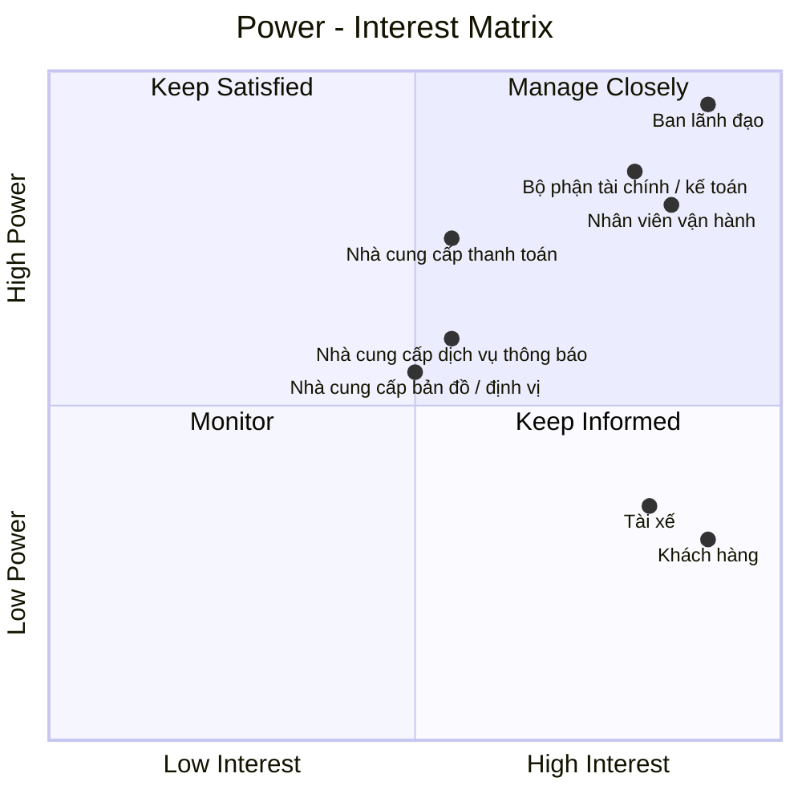

# 23630751_LeMinhThienPhuc_Cabsystem
## 1. Phân tích nghiệp vụ
### Hiện tại, Công ty ABC đang gặp nhiều khó khăn trong hoạt động đặt xe do việc phân công tài xế chủ yếu được thực hiện thủ công, khách hàng khó theo dõi trạng thái chuyến đi, thông tin thanh toán chưa được quản lý tập trung và bộ phận vận hành gặp nhiều hạn chế khi số lượng khách hàng, tài xế tăng lên. Ngoài ra, doanh nghiệp chưa có cơ chế tự động tìm và phân công tài xế phù hợp, xử lý trường hợp tài xế từ chối hoặc không phản hồi, cũng như chưa quản lý hiệu quả dữ liệu chuyến đi, giao dịch và hoạt động của tài xế. 
### Vì vậy, doanh nghiệp cần xây dựng một hệ thống CAB nhằm số hóa và tự động hóa toàn bộ quy trình đặt xe. Hệ thống cho phép khách hàng đăng ký, quản lý thông tin, nhập điểm đón và điểm đến, lựa chọn loại xe, gửi yêu cầu đặt xe và theo dõi trạng thái chuyến. Hệ thống tự động tìm kiếm và phân công tài xế dựa trên vị trí, trạng thái sẵn sàng và các tiêu chí vận hành; nếu tài xế không phản hồi hoặc từ chối, hệ thống tiếp tục tìm tài xế khác và thông báo cho khách hàng khi không tìm được tài xế. Tài xế có thể quản lý hồ sơ, phương tiện, trạng thái hoạt động, nhận hoặc từ chối chuyến và cập nhật trạng thái trong quá trình thực hiện chuyến. Sau khi chuyến hoàn thành, hệ thống thực hiện tính cước, hỗ trợ thanh toán bằng tiền mặt hoặc thanh toán điện tử thông qua nhà cung cấp bên ngoài, đồng thời quản lý lịch sử giao dịch và xử lý trường hợp thanh toán thất bại. Nhân viên vận hành có thể quản lý khách hàng, tài xế, phương tiện và chuyến đi, theo dõi các chuyến đang diễn ra, xử lý sự cố và tra cứu lịch sử. 
### Bên cạnh đó, hệ thống cung cấp thông báo cho khách hàng và tài xế, phân quyền người dùng, lưu vết các thao tác quan trọng và cung cấp báo cáo về số lượng chuyến, doanh thu, tỷ lệ hoàn thành, tỷ lệ hủy và hiệu quả hoạt động của tài xế. Hệ thống được định hướng xây dựng linh hoạt, có khả năng mở rộng để đáp ứng nhu cầu tăng trưởng và bổ sung các loại dịch vụ, phương thức thanh toán hoặc kênh thông báo mới trong tương lai.
## 2. Stakeholder

| Tên Stakeholder | Vai trò |
|:---|:---|
| Ban lãnh đạo | Định hướng, phê duyệt và đưa ra các quyết định quan trọng của dự án |
| Khách hàng | Đăng ký, đặt xe, theo dõi chuyến, thanh toán và đánh giá tài xế |
| Tài xế | Nhận chuyến, thực hiện chuyến và cập nhật trạng thái chuyến đi |
| Nhân viên vận hành | Quản lý khách hàng, tài xế, phương tiện, chuyến đi và xử lý sự cố |
| Nhà cung cấp thanh toán | Cung cấp dịch vụ và xử lý các giao dịch thanh toán điện tử |
| Bộ phận tài chính / kế toán | Quản lý doanh thu, giao dịch, đối soát và báo cáo tài chính |
| Nhà cung cấp bản đồ / định vị | Cung cấp dữ liệu vị trí, bản đồ, khoảng cách và hỗ trợ xác định tài xế |
| Nhà cung cấp dịch vụ thông báo | Cung cấp kênh gửi như thông báo ứng dụng, tin nhắn, thư điện tử... |
## Stakeholder matrix

## 3. Business Goals

| Mã | Business Goal | Mô tả |
|:---|:---|:---|
| **BG01** | **Tự động hóa và tối ưu hóa hoạt động điều phối xe** | Chuyển đổi quy trình tiếp nhận và phân công chuyến từ thủ công sang tự động, giảm thời gian xử lý yêu cầu và nâng cao hiệu quả sử dụng đội ngũ tài xế. |
| **BG02** | **Nâng cao chất lượng dịch vụ và trải nghiệm khách hàng** | Cung cấp quy trình đặt xe minh bạch, thuận tiện và có khả năng theo dõi xuyên suốt từ khi tạo yêu cầu đến khi hoàn thành chuyến, đồng thời cung cấp thông tin kịp thời thông qua hệ thống thông báo. |
| **BG03** | **Nâng cao hiệu quả quản lý và vận hành** | Cung cấp cho bộ phận vận hành khả năng theo dõi tập trung khách hàng, tài xế, phương tiện và chuyến đi; hỗ trợ xử lý các tình huống bất thường và đưa ra quyết định dựa trên dữ liệu vận hành. |
| **BG04** | **Chuẩn hóa và kiểm soát hoạt động tính cước, thanh toán và doanh thu** | Quản lý thống nhất quá trình tính cước và thanh toán, hỗ trợ nhiều phương thức thanh toán, kiểm soát trạng thái giao dịch và cung cấp dữ liệu phục vụ đối soát, quản lý doanh thu và báo cáo. |
| **BG05** | **Tăng cường khả năng kiểm soát và khai thác dữ liệu** | Hình thành nguồn dữ liệu tập trung về khách hàng, tài xế, phương tiện, chuyến đi và giao dịch nhằm phục vụ vận hành, tra cứu, báo cáo và phân tích hiệu quả kinh doanh. |
| **BG06** | **Đảm bảo tính liên tục và khả năng mở rộng của hoạt động kinh doanh** | Xây dựng nền tảng có khả năng đáp ứng sự gia tăng về số lượng khách hàng, tài xế và chuyến đi; hạn chế việc một thành phần gặp sự cố làm gián đoạn toàn bộ dịch vụ. |
| **BG07** | **Tạo nền tảng linh hoạt cho việc phát triển dịch vụ trong tương lai** | Cho phép doanh nghiệp bổ sung loại hình dịch vụ, phương thức thanh toán, kênh thông báo và các thành phần tích hợp mới mà không phải thay đổi lớn toàn bộ hệ thống. |
| **BG08** | **Đảm bảo an toàn thông tin và tuân thủ trong hoạt động kinh doanh** | Bảo vệ thông tin cá nhân, dữ liệu vị trí và dữ liệu giao dịch; kiểm soát quyền truy cập, lưu vết các thao tác quan trọng và hỗ trợ truy xuất khi phát sinh sự cố. |
## 4. Phạm vi dự án

Trong thời gian 7 tuần, dự án tập trung xây dựng các chức năng cơ bản và cần thiết để hệ thống CAB có thể vận hành như một nền tảng đặt xe trực tuyến, đồng thời hỗ trợ nhân viên vận hành quản lý khách hàng, tài xế, phương tiện và chuyến đi.

| STT | Module | Nội dung |
|:---:|:---|:---|
| 1 | **Quản lý khách hàng** | Quản lý thông tin tài khoản, hồ sơ, trạng thái hoạt động và lịch sử chuyến đi của khách hàng. |
| 2 | **Quản lý tài xế** | Quản lý thông tin tài khoản, hồ sơ, trạng thái hoạt động và thông tin phương tiện của tài xế. |
| 3 | **Đặt xe** | Khách hàng nhập điểm đón, điểm đến, lựa chọn loại xe và gửi yêu cầu đặt xe. |
| 4 | **Tìm và phân công tài xế** | Hệ thống tìm tài xế phù hợp dựa trên vị trí, trạng thái sẵn sàng và các tiêu chí cơ bản. |
| 5 | **Quản lý chuyến đi** | Tài xế nhận chuyến và cập nhật trạng thái trong quá trình thực hiện chuyến. |
| 6 | **Theo dõi chuyến đi** | Khách hàng theo dõi trạng thái và vị trí tài xế. |
| 7 | **Tính cước và thanh toán** | Tính số tiền phải trả và hỗ trợ thanh toán bằng tiền mặt hoặc thanh toán điện tử. |
| 8 | **Thông báo** | Gửi thông báo về các trạng thái quan trọng của chuyến đi cho khách hàng và tài xế. |
| 9 | **Quản lý vận hành** | Nhân viên vận hành theo dõi và xử lý khách hàng, tài xế, phương tiện và các chuyến đi đang diễn ra. |
| 10 | **Lịch sử và đánh giá** | Lưu lịch sử chuyến đi và cho phép khách hàng đánh giá tài xế sau khi hoàn thành chuyến. |
| 11 | **Bảo mật và phân quyền** | Xác thực người dùng, phân quyền chức năng quản trị và bảo vệ dữ liệu cơ bản. |
## 5. Business Requirements

## 1. Quản lý khách hàng

| Mã | Business Requirement | Mô tả |
|:---|:---|:---|
| **BR01** | **Quản lý tài khoản khách hàng** | Hệ thống phải hỗ trợ doanh nghiệp quản lý tài khoản khách hàng để khách hàng có thể sử dụng các dịch vụ của hệ thống CAB. |
| **BR02** | **Đăng ký và xác thực khách hàng** | Hệ thống phải hỗ trợ khách hàng đăng ký tài khoản và xác thực danh tính trước khi sử dụng các chức năng yêu cầu tài khoản. |
| **BR03** | **Quản lý hồ sơ khách hàng** | Hệ thống phải cho phép khách hàng quản lý và cập nhật các thông tin cá nhân cần thiết cho quá trình sử dụng dịch vụ. |
| **BR04** | **Quản lý trạng thái khách hàng** | Hệ thống phải hỗ trợ quản lý trạng thái hoạt động của khách hàng nhằm kiểm soát khả năng sử dụng dịch vụ khi cần thiết. |
| **BR05** | **Quản lý lịch sử sử dụng dịch vụ của khách hàng** | Hệ thống phải lưu trữ thông tin các chuyến đi của khách hàng để phục vụ tra cứu, hỗ trợ khách hàng và quản lý vận hành. |

## 2. Quản lý tài xế

| Mã | Business Requirement | Mô tả |
|:---|:---|:---|
| **BR06** | **Quản lý tài khoản tài xế** | Hệ thống phải hỗ trợ doanh nghiệp quản lý tài khoản tài xế, bao gồm trường hợp tài xế tự đăng ký hoặc được nhân viên vận hành tạo tài khoản. |
| **BR07** | **Quản lý hồ sơ tài xế** | Hệ thống phải cho phép quản lý thông tin hồ sơ của tài xế để phục vụ việc xác định và quản lý người thực hiện chuyến đi. |
| **BR08** | **Quản lý phương tiện** | Hệ thống phải hỗ trợ quản lý thông tin phương tiện được sử dụng để cung cấp dịch vụ vận chuyển và liên kết phương tiện với tài xế. |
| **BR09** | **Quản lý trạng thái hoạt động của tài xế** | Hệ thống phải cho phép tài xế và doanh nghiệp quản lý trạng thái hoạt động của tài xế, bao gồm khả năng sẵn sàng hoặc không sẵn sàng nhận chuyến. |
| **BR10** | **Quản lý khả năng nhận chuyến** | Hệ thống phải xác định những tài xế đang đủ điều kiện và sẵn sàng để được xem xét phân công chuyến. |

## 3. Đặt xe

| Mã | Business Requirement | Mô tả |
|:---|:---|:---|
| **BR11** | **Tạo yêu cầu đặt xe** | Hệ thống phải cho phép khách hàng tạo yêu cầu sử dụng dịch vụ đặt xe thông qua nền tảng CAB. |
| **BR12** | **Xác định điểm đón** | Hệ thống phải cho phép khách hàng cung cấp địa điểm mà tài xế sẽ đón khách. |
| **BR13** | **Xác định điểm đến** | Hệ thống phải cho phép khách hàng cung cấp địa điểm mà khách hàng muốn được đưa đến. |
| **BR14** | **Lựa chọn loại xe** | Hệ thống phải cho phép khách hàng lựa chọn loại xe hoặc loại dịch vụ phù hợp với nhu cầu chuyến đi. |
| **BR15** | **Xác nhận yêu cầu đặt xe** | Hệ thống phải đảm bảo yêu cầu đặt xe được xác nhận với đầy đủ thông tin cần thiết trước khi đưa vào quá trình tìm kiếm tài xế. |
| **BR16** | **Quản lý trạng thái yêu cầu đặt xe** | Hệ thống phải quản lý trạng thái của yêu cầu đặt xe từ khi khách hàng tạo yêu cầu cho đến khi yêu cầu được phân công, hoàn thành hoặc kết thúc theo quy định. |

## 4. Tìm và phân công tài xế

| Mã | Business Requirement | Mô tả |
|:---|:---|:---|
| **BR17** | **Tự động tìm kiếm tài xế** | Hệ thống phải tự động tìm kiếm tài xế phù hợp khi phát sinh yêu cầu đặt xe, hạn chế việc nhân viên vận hành phải phân công thủ công. |
| **BR18** | **Xác định tài xế theo trạng thái sẵn sàng** | Hệ thống phải ưu tiên các tài xế đang ở trạng thái sẵn sàng nhận chuyến khi thực hiện tìm kiếm. |
| **BR19** | **Xác định tài xế theo vị trí** | Hệ thống phải sử dụng thông tin vị trí của tài xế để xác định những tài xế phù hợp với vị trí đón khách. |
| **BR20** | **Xác định tài xế theo tiêu chí vận hành** | Hệ thống phải hỗ trợ lựa chọn tài xế dựa trên các tiêu chí vận hành được doanh nghiệp quy định. |
| **BR21** | **Ưu tiên tài xế phù hợp** | Hệ thống phải hỗ trợ cơ chế ưu tiên những tài xế phù hợp và có vị trí thuận lợi đối với yêu cầu đặt xe. |
| **BR22** | **Phân công chuyến cho tài xế** | Hệ thống phải hỗ trợ gửi yêu cầu nhận chuyến đến tài xế phù hợp và ghi nhận kết quả phản hồi của tài xế. |
| **BR23** | **Xử lý tài xế từ chối chuyến** | Hệ thống phải tiếp tục quá trình tìm kiếm tài xế khác khi tài xế được đề xuất từ chối yêu cầu chuyến. |
| **BR24** | **Xử lý tài xế không phản hồi** | Hệ thống phải tiếp tục quá trình tìm kiếm tài xế khác khi tài xế được đề xuất không phản hồi trong thời gian quy định. |
| **BR25** | **Xử lý trường hợp không tìm được tài xế** | Hệ thống phải thông báo rõ ràng cho khách hàng khi không tìm được tài xế phù hợp cho yêu cầu đặt xe. |

## 5. Quản lý chuyến đi

| Mã | Business Requirement | Mô tả |
|:---|:---|:---|
| **BR26** | **Tiếp nhận chuyến** | Hệ thống phải hỗ trợ tài xế tiếp nhận chuyến sau khi được phân công. |
| **BR27** | **Quản lý trạng thái chuyến** | Hệ thống phải quản lý trạng thái chuyến xuyên suốt quá trình thực hiện, từ khi tài xế nhận chuyến đến khi chuyến hoàn thành. |
| **BR28** | **Cập nhật trạng thái đã đến điểm đón** | Hệ thống phải hỗ trợ ghi nhận việc tài xế đã đến điểm đón khách. |
| **BR29** | **Cập nhật trạng thái đã đón khách** | Hệ thống phải hỗ trợ ghi nhận việc tài xế đã đón khách và bắt đầu thực hiện hành trình. |
| **BR30** | **Cập nhật trạng thái đang di chuyển** | Hệ thống phải phản ánh trạng thái chuyến khi tài xế đang đưa khách đến điểm đến. |
| **BR31** | **Hoàn thành chuyến đi** | Hệ thống phải hỗ trợ ghi nhận việc chuyến đi đã hoàn thành và chuyển chuyến sang trạng thái phù hợp để thực hiện các nghiệp vụ sau chuyến. |
| **BR32** | **Lưu thông tin quá trình chuyến đi** | Hệ thống phải lưu trữ thông tin và trạng thái của chuyến đi để phục vụ theo dõi, tra cứu, thanh toán và báo cáo. |

## 6. Theo dõi chuyến đi

| Mã | Business Requirement | Mô tả |
|:---|:---|:---|
| **BR33** | **Theo dõi trạng thái chuyến** | Hệ thống phải cho phép khách hàng theo dõi trạng thái hiện tại của chuyến đi trong suốt quá trình thực hiện. |
| **BR34** | **Hiển thị thông tin tài xế** | Hệ thống phải cung cấp cho khách hàng thông tin cần thiết về tài xế đã nhận chuyến. |
| **BR35** | **Theo dõi vị trí tài xế** | Hệ thống phải hỗ trợ khách hàng theo dõi vị trí của tài xế trong quá trình tài xế di chuyển đến điểm đón và thực hiện chuyến đi. |
| **BR36** | **Dự kiến thời gian tài xế đến** | Hệ thống phải cung cấp thông tin về thời gian dự kiến tài xế đến điểm đón để khách hàng chủ động theo dõi chuyến. |
| **BR37** | **Cập nhật thông tin theo thời gian thực** | Hệ thống phải cập nhật thông tin trạng thái và vị trí liên quan đến chuyến đi để khách hàng và bộ phận vận hành có thể theo dõi tình trạng hiện tại. |

## 7. Tính cước và thanh toán

| Mã | Business Requirement | Mô tả |
|:---|:---|:---|
| **BR38** | **Xác định cước chuyến đi** | Hệ thống phải xác định số tiền khách hàng phải trả dựa trên loại dịch vụ và các thông tin liên quan đến chuyến đi theo chính sách của doanh nghiệp. |
| **BR39** | **Quản lý thông tin cước** | Hệ thống phải lưu trữ thông tin cước của chuyến đi để phục vụ thanh toán, tra cứu và đối soát. |
| **BR40** | **Thanh toán bằng tiền mặt** | Hệ thống phải hỗ trợ phương thức thanh toán bằng tiền mặt cho khách hàng. |
| **BR41** | **Thanh toán điện tử** | Hệ thống phải hỗ trợ khách hàng thanh toán thông qua phương thức thanh toán điện tử. |
| **BR42** | **Tích hợp với nhà cung cấp thanh toán** | Hệ thống phải hỗ trợ kết nối với nhà cung cấp dịch vụ thanh toán bên ngoài để xử lý các giao dịch thanh toán điện tử. |
| **BR43** | **Bảo vệ thông tin thanh toán** | Hệ thống không được lưu trực tiếp các thông tin nhạy cảm của thẻ hoặc tài khoản thanh toán trong hệ thống CAB. |
| **BR44** | **Quản lý kết quả thanh toán** | Hệ thống phải ghi nhận và quản lý trạng thái của giao dịch thanh toán để xác định giao dịch thành công, thất bại hoặc cần xử lý tiếp. |
| **BR45** | **Xử lý thanh toán thất bại** | Hệ thống phải thông báo cho khách hàng khi giao dịch thanh toán điện tử thất bại và hỗ trợ xử lý lại theo chính sách của doanh nghiệp. |

## 8. Thông báo

| Mã | Business Requirement | Mô tả |
|:---|:---|:---|
| **BR46** | **Thông báo tiếp nhận yêu cầu** | Hệ thống phải thông báo cho khách hàng khi yêu cầu đặt xe được hệ thống tiếp nhận. |
| **BR47** | **Thông báo phân công tài xế** | Hệ thống phải thông báo cho khách hàng khi một tài xế đã nhận chuyến. |
| **BR48** | **Thông báo tài xế đến điểm đón** | Hệ thống phải thông báo cho khách hàng khi tài xế đã đến điểm đón. |
| **BR49** | **Thông báo hoàn thành chuyến** | Hệ thống phải thông báo cho khách hàng khi chuyến đi hoàn thành. |
| **BR50** | **Thông báo kết quả thanh toán** | Hệ thống phải thông báo cho khách hàng về kết quả của giao dịch thanh toán. |
| **BR51** | **Thông báo chuyến mới cho tài xế** | Hệ thống phải thông báo cho tài xế khi có yêu cầu chuyến phù hợp cần tài xế tiếp nhận. |
| **BR52** | **Thông báo thay đổi chuyến** | Hệ thống phải thông báo cho tài xế về những thay đổi quan trọng liên quan đến chuyến đang thực hiện. |
| **BR53** | **Hỗ trợ mở rộng kênh thông báo** | Hệ thống phải cho phép doanh nghiệp mở rộng hoặc thay đổi các kênh và nhà cung cấp dịch vụ thông báo trong tương lai mà hạn chế ảnh hưởng đến các nghiệp vụ hiện có. |

## 9. Quản lý vận hành

| Mã | Business Requirement | Mô tả |
|:---|:---|:---|
| **BR54** | **Quản lý khách hàng từ phía vận hành** | Hệ thống phải hỗ trợ nhân viên vận hành tra cứu và quản lý thông tin khách hàng phục vụ hoạt động vận hành và hỗ trợ khách hàng. |
| **BR55** | **Quản lý tài xế từ phía vận hành** | Hệ thống phải hỗ trợ nhân viên vận hành tra cứu và quản lý thông tin, trạng thái hoạt động của tài xế. |
| **BR56** | **Quản lý phương tiện từ phía vận hành** | Hệ thống phải hỗ trợ nhân viên vận hành quản lý thông tin phương tiện được sử dụng trong hoạt động cung cấp dịch vụ. |
| **BR57** | **Theo dõi chuyến đang diễn ra** | Hệ thống phải cung cấp cho nhân viên vận hành khả năng theo dõi các chuyến đang diễn ra và trạng thái hiện tại của từng chuyến. |
| **BR58** | **Theo dõi trạng thái tài xế** | Hệ thống phải hỗ trợ nhân viên vận hành kiểm tra trạng thái hoạt động và khả năng nhận chuyến của tài xế. |
| **BR59** | **Hỗ trợ xử lý chuyến bị lỗi** | Hệ thống phải hỗ trợ nhân viên vận hành tra cứu thông tin và xử lý các trường hợp chuyến đi phát sinh lỗi hoặc bất thường. |
| **BR60** | **Tra cứu lịch sử giao dịch** | Hệ thống phải cho phép nhân viên vận hành tra cứu thông tin các giao dịch phục vụ công tác kiểm tra và hỗ trợ. |

## 10. Lịch sử và đánh giá

| Mã | Business Requirement | Mô tả |
|:---|:---|:---|
| **BR61** | **Lưu trữ lịch sử chuyến đi** | Hệ thống phải lưu trữ thông tin các chuyến đi đã phát sinh để phục vụ tra cứu và quản lý. |
| **BR62** | **Tra cứu lịch sử chuyến đi** | Hệ thống phải cho phép khách hàng tra cứu các chuyến đi đã thực hiện và thông tin liên quan. |
| **BR63** | **Tra cứu số tiền của chuyến đi** | Hệ thống phải cung cấp thông tin số tiền khách hàng phải trả hoặc đã thanh toán cho các chuyến đi. |
| **BR64** | **Đánh giá tài xế** | Hệ thống phải cho phép khách hàng đánh giá tài xế sau khi chuyến đi hoàn thành. |
| **BR65** | **Lưu trữ kết quả đánh giá** | Hệ thống phải lưu trữ kết quả đánh giá để phục vụ quản lý chất lượng dịch vụ và đánh giá hiệu quả hoạt động của tài xế. |
| **BR66** | **Liên kết đánh giá với chuyến đi** | Hệ thống phải đảm bảo đánh giá được liên kết với chuyến đi và tài xế tương ứng để đảm bảo tính chính xác của dữ liệu đánh giá. |

## 11. Bảo mật và phân quyền

| Mã | Business Requirement | Mô tả |
|:---|:---|:---|
| **BR67** | **Xác thực người dùng** | Hệ thống phải yêu cầu khách hàng và tài xế xác thực trước khi sử dụng các chức năng yêu cầu tài khoản. |
| **BR68** | **Phân quyền người dùng** | Hệ thống phải kiểm soát quyền truy cập dựa trên vai trò của người sử dụng hệ thống. |
| **BR69** | **Phân quyền nhân viên vận hành** | Hệ thống phải đảm bảo nhân viên vận hành chỉ được thực hiện các chức năng quản trị phù hợp với quyền được cấp. |
| **BR70** | **Bảo vệ thông tin cá nhân** | Hệ thống phải bảo vệ thông tin cá nhân của khách hàng và tài xế khỏi việc truy cập hoặc sử dụng trái phép. |
| **BR71** | **Bảo vệ dữ liệu phương tiện và vị trí** | Hệ thống phải bảo vệ thông tin phương tiện và dữ liệu vị trí của tài xế. |
| **BR72** | **Bảo vệ dữ liệu giao dịch** | Hệ thống phải bảo vệ dữ liệu giao dịch và các thông tin liên quan đến thanh toán. |
| **BR73** | **Lưu vết thao tác quan trọng** | Hệ thống phải lưu vết các thao tác quan trọng của người dùng, đặc biệt là các thao tác quản trị và thao tác có ảnh hưởng đến dữ liệu hoặc hoạt động kinh doanh. |
| **BR74** | **Hỗ trợ kiểm tra và truy xuất** | Hệ thống phải cho phép doanh nghiệp truy xuất thông tin về các thao tác quan trọng khi cần kiểm tra, đối soát hoặc xử lý sự cố. |
