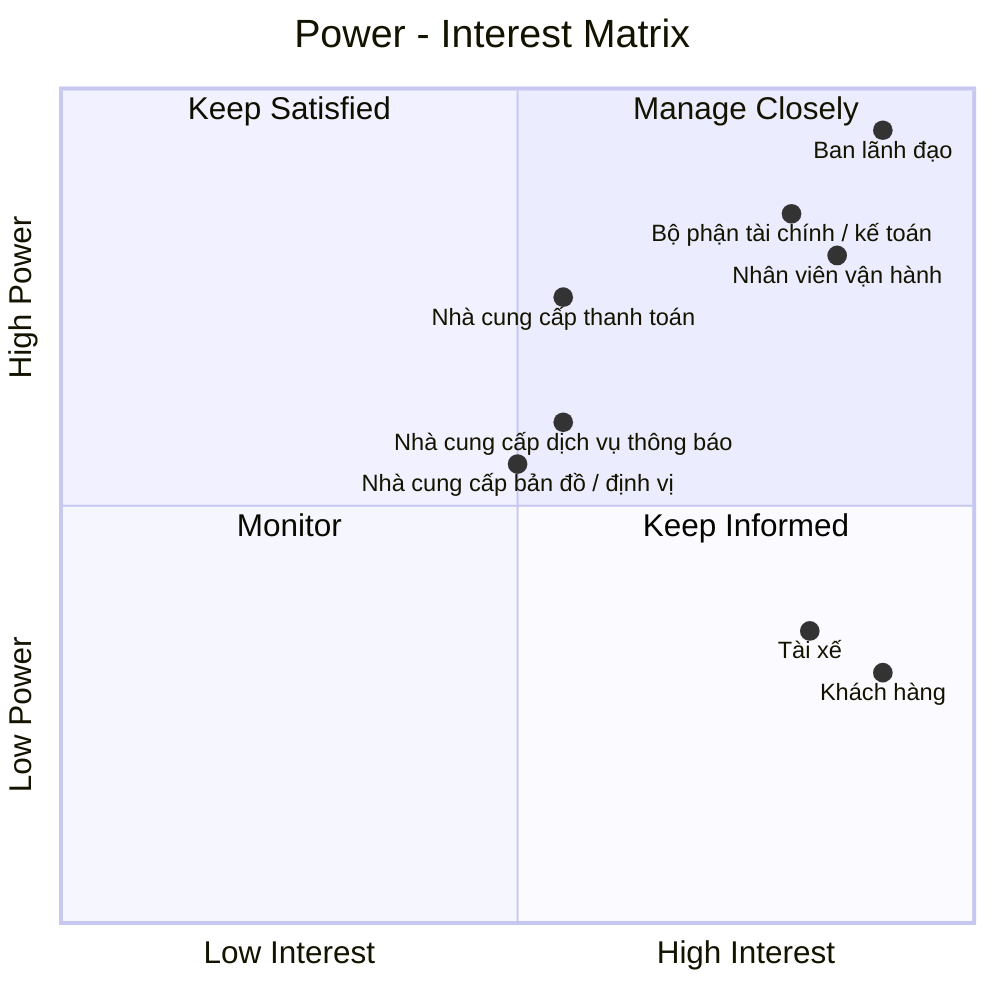

# 23630751_LeMinhThienPhuc_Cabsystem
## 1. Phân tích nghiệp vụ
### Hiện tại, Công ty ABC đang gặp nhiều khó khăn trong hoạt động đặt xe do việc phân công tài xế chủ yếu được thực hiện thủ công, khách hàng khó theo dõi trạng thái chuyến đi, thông tin thanh toán chưa được quản lý tập trung và bộ phận vận hành gặp nhiều hạn chế khi số lượng khách hàng, tài xế tăng lên. Ngoài ra, doanh nghiệp chưa có cơ chế tự động tìm và phân công tài xế phù hợp, xử lý trường hợp tài xế từ chối hoặc không phản hồi, cũng như chưa quản lý hiệu quả dữ liệu chuyến đi, giao dịch và hoạt động của tài xế. 
### Vì vậy, doanh nghiệp cần xây dựng một hệ thống CAB nhằm số hóa và tự động hóa toàn bộ quy trình đặt xe. Hệ thống cho phép khách hàng đăng ký, quản lý thông tin, nhập điểm đón và điểm đến, lựa chọn loại xe, gửi yêu cầu đặt xe và theo dõi trạng thái chuyến. Hệ thống tự động tìm kiếm và phân công tài xế dựa trên vị trí, trạng thái sẵn sàng và các tiêu chí vận hành; nếu tài xế không phản hồi hoặc từ chối, hệ thống tiếp tục tìm tài xế khác và thông báo cho khách hàng khi không tìm được tài xế. Tài xế có thể quản lý hồ sơ, phương tiện, trạng thái hoạt động, nhận hoặc từ chối chuyến và cập nhật trạng thái trong quá trình thực hiện chuyến. Sau khi chuyến hoàn thành, hệ thống thực hiện tính cước, hỗ trợ thanh toán bằng tiền mặt hoặc thanh toán điện tử thông qua nhà cung cấp bên ngoài, đồng thời quản lý lịch sử giao dịch và xử lý trường hợp thanh toán thất bại. Nhân viên vận hành có thể quản lý khách hàng, tài xế, phương tiện và chuyến đi, theo dõi các chuyến đang diễn ra, xử lý sự cố và tra cứu lịch sử. 
### Bên cạnh đó, hệ thống cung cấp thông báo cho khách hàng và tài xế, phân quyền người dùng, lưu vết các thao tác quan trọng và cung cấp báo cáo về số lượng chuyến, doanh thu, tỷ lệ hoàn thành, tỷ lệ hủy và hiệu quả hoạt động của tài xế. Hệ thống được định hướng xây dựng linh hoạt, có khả năng mở rộng để đáp ứng nhu cầu tăng trưởng và bổ sung các loại dịch vụ, phương thức thanh toán hoặc kênh thông báo mới trong tương lai.
## 2. Stakeholder

| Tên Stakeholder | Vai trò |
|:---|:---|
| Ban lãnh đạo | Định hướng, phê duyệt và đưa ra các quyết định quan trọng của dự án |
| Khách hàng | Đăng ký, đặt xe, theo dõi chuyến, thanh toán và đánh giá tài xế |
| Tài xế | Nhận chuyến, thực hiện chuyến và cập nhật trạng thái chuyến đi |
| Nhân viên vận hành | Quản lý khách hàng, tài xế, phương tiện, chuyến đi và xử lý sự cố |
| Nhà cung cấp thanh toán | Cung cấp dịch vụ và xử lý các giao dịch thanh toán điện tử |
| Bộ phận tài chính / kế toán | Quản lý doanh thu, giao dịch, đối soát và báo cáo tài chính |
| Nhà cung cấp bản đồ / định vị | Cung cấp dữ liệu vị trí, bản đồ, khoảng cách và hỗ trợ xác định tài xế |
| Nhà cung cấp dịch vụ thông báo | Cung cấp kênh gửi như thông báo ứng dụng, tin nhắn, thư điện tử... |
## Stakeholder matrix

## 3. Business Goals

| Mã | Business Goal | Mô tả |
|:---|:---|:---|
| **BG01** | **Tự động hóa và tối ưu hóa hoạt động điều phối xe** | Chuyển đổi quy trình tiếp nhận và phân công chuyến từ thủ công sang tự động, giảm thời gian xử lý yêu cầu và nâng cao hiệu quả sử dụng đội ngũ tài xế. |
| **BG02** | **Nâng cao chất lượng dịch vụ và trải nghiệm khách hàng** | Cung cấp quy trình đặt xe minh bạch, thuận tiện và có khả năng theo dõi xuyên suốt từ khi tạo yêu cầu đến khi hoàn thành chuyến, đồng thời cung cấp thông tin kịp thời thông qua hệ thống thông báo. |
| **BG03** | **Nâng cao hiệu quả quản lý và vận hành** | Cung cấp cho bộ phận vận hành khả năng theo dõi tập trung khách hàng, tài xế, phương tiện và chuyến đi; hỗ trợ xử lý các tình huống bất thường và đưa ra quyết định dựa trên dữ liệu vận hành. |
| **BG04** | **Chuẩn hóa và kiểm soát hoạt động tính cước, thanh toán và doanh thu** | Quản lý thống nhất quá trình tính cước và thanh toán, hỗ trợ nhiều phương thức thanh toán, kiểm soát trạng thái giao dịch và cung cấp dữ liệu phục vụ đối soát, quản lý doanh thu và báo cáo. |
| **BG05** | **Tăng cường khả năng kiểm soát và khai thác dữ liệu** | Hình thành nguồn dữ liệu tập trung về khách hàng, tài xế, phương tiện, chuyến đi và giao dịch nhằm phục vụ vận hành, tra cứu, báo cáo và phân tích hiệu quả kinh doanh. |
| **BG06** | **Đảm bảo tính liên tục và khả năng mở rộng của hoạt động kinh doanh** | Xây dựng nền tảng có khả năng đáp ứng sự gia tăng về số lượng khách hàng, tài xế và chuyến đi; hạn chế việc một thành phần gặp sự cố làm gián đoạn toàn bộ dịch vụ. |
| **BG07** | **Tạo nền tảng linh hoạt cho việc phát triển dịch vụ trong tương lai** | Cho phép doanh nghiệp bổ sung loại hình dịch vụ, phương thức thanh toán, kênh thông báo và các thành phần tích hợp mới mà không phải thay đổi lớn toàn bộ hệ thống. |
| **BG08** | **Đảm bảo an toàn thông tin và tuân thủ trong hoạt động kinh doanh** | Bảo vệ thông tin cá nhân, dữ liệu vị trí và dữ liệu giao dịch; kiểm soát quyền truy cập, lưu vết các thao tác quan trọng và hỗ trợ truy xuất khi phát sinh sự cố. |
## 4. Phạm vi dự án

Trong thời gian 7 tuần, dự án tập trung xây dựng các chức năng cơ bản và cần thiết để hệ thống CAB có thể vận hành như một nền tảng đặt xe trực tuyến, đồng thời hỗ trợ nhân viên vận hành quản lý khách hàng, tài xế, phương tiện và chuyến đi.

| STT | Module | Nội dung |
|:---:|:---|:---|
| 1 | **Quản lý khách hàng** | Quản lý thông tin tài khoản, hồ sơ, trạng thái hoạt động và lịch sử chuyến đi của khách hàng. |
| 2 | **Quản lý tài xế** | Quản lý thông tin tài khoản, hồ sơ, trạng thái hoạt động và thông tin phương tiện của tài xế. |
| 3 | **Đặt xe** | Nhập điểm đón, điểm đến, chọn loại xe và tạo yêu cầu đặt xe |
| 4 | **Tìm & phân công tài xế** | Tìm tài xế phù hợp, gửi yêu cầu, xử lý nhận/từ chối/không phản hồi |
| 5 | **Quản lý & theo dõi chuyến** | Nhận chuyến, cập nhật trạng thái, theo dõi trạng thái/vị trí/ETA |
| 6 | **Tính cước & thanh toán** | Tính cước, thanh toán tiền mặt/điện tử, xử lý kết quả thanh toán |
| 7 | **Thông báo** | Thông báo các sự kiện quan trọng cho Customer và Driver |
| 8 | **Quản lý vận hành** | Quản lý Customer, Driver, phương tiện, chuyến đi và xử lý sự cố |
| 9 | **Lịch sử & đánh giá** | Xem lịch sử chuyến, số tiền và đánh giá tài xế |
| 10 | **Bảo mật & phân quyền** | Xác thực, phân quyền và bảo vệ dữ liệu |
## 5. Business Requirements

Trong phạm vi MVP với thời gian triển khai **7 tuần**, hệ thống CAB tập trung vào các nghiệp vụ cốt lõi phục vụ toàn bộ quy trình đặt xe, từ quản lý người dùng, đặt xe, tìm tài xế, thực hiện chuyến, thanh toán đến quản lý vận hành và bảo mật.

| BR ID | Module | Business Requirement |
|:---:|:---|:---|
| **BR01** | Quản lý khách hàng | Hệ thống phải hỗ trợ khách hàng đăng ký, đăng nhập và quản lý thông tin tài khoản cá nhân. |
| **BR02** | Quản lý tài xế & phương tiện | Hệ thống phải hỗ trợ doanh nghiệp quản lý tài khoản, hồ sơ, phương tiện và trạng thái hoạt động của tài xế. |
| **BR03** | Đặt xe | Hệ thống phải cho phép khách hàng tạo yêu cầu đặt xe với điểm đón, điểm đến và loại xe hoặc dịch vụ. |
| **BR04** | Đặt xe | Hệ thống phải quản lý trạng thái của yêu cầu đặt xe trong quá trình xử lý. |
| **BR05** | Tìm & phân công tài xế | Hệ thống phải tự động tìm và lựa chọn tài xế phù hợp dựa trên trạng thái, vị trí và tiêu chí vận hành. |
| **BR06** | Tìm & phân công tài xế | Hệ thống phải xử lý trường hợp tài xế chấp nhận, từ chối hoặc không phản hồi và tiếp tục tìm tài xế khác khi cần. |
| **BR07** | Tìm & phân công tài xế | Hệ thống phải thông báo cho khách hàng khi không tìm được tài xế phù hợp. |
| **BR08** | Quản lý & theo dõi chuyến | Hệ thống phải tạo và quản lý chuyến đi sau khi tài xế nhận yêu cầu. |
| **BR09** | Quản lý & theo dõi chuyến | Hệ thống phải cho phép tài xế cập nhật các trạng thái chính và cung cấp thông tin chuyến cho khách hàng. |
| **BR10** | Quản lý & theo dõi chuyến | Hệ thống phải hỗ trợ cập nhật và hiển thị thông tin vị trí, thời gian dự kiến và trạng thái chuyến trong phạm vi cho phép. |
| **BR11** | Tính cước & thanh toán | Hệ thống phải tính và lưu cước chuyến đi dựa trên loại dịch vụ và thông tin chuyến. |
| **BR12** | Tính cước & thanh toán | Hệ thống phải hỗ trợ thanh toán tiền mặt và thanh toán điện tử thông qua nhà cung cấp bên ngoài. |
| **BR13** | Tính cước & thanh toán | Hệ thống phải quản lý kết quả giao dịch và hỗ trợ xử lý thanh toán thất bại theo chính sách doanh nghiệp. |
| **BR14** | Thông báo | Hệ thống phải gửi thông báo cho khách hàng và tài xế về các sự kiện quan trọng liên quan đến yêu cầu và chuyến đi. |
| **BR15** | Quản lý vận hành | Hệ thống phải cho phép nhân viên vận hành quản lý khách hàng, tài xế, phương tiện và theo dõi các chuyến đang diễn ra. |
| **BR16** | Quản lý vận hành | Hệ thống phải hỗ trợ nhân viên vận hành tra cứu và xử lý các chuyến có lỗi, bất thường và thông tin giao dịch theo quyền được cấp. |
| **BR17** | Lịch sử & đánh giá | Hệ thống phải lưu trữ lịch sử chuyến đi, thông tin thanh toán và cho phép khách hàng đánh giá tài xế sau chuyến. |
| **BR18** | Báo cáo | Hệ thống phải cung cấp các báo cáo cơ bản về số lượng chuyến, doanh thu, tỷ lệ hoàn thành, tỷ lệ hủy và hiệu quả tài xế. |
| **BR19** | Bảo mật & phân quyền | Hệ thống phải xác thực người dùng, phân quyền theo vai trò và bảo vệ dữ liệu khỏi truy cập trái phép. |
| **BR20** | Bảo mật & phân quyền | Hệ thống phải lưu vết các thao tác quan trọng để phục vụ kiểm tra và xử lý sự cố. |

## 6. Functional Requirements

Functional Requirements (FR) được phân rã từ 35 Business Requirements (BR), mô tả các chức năng cụ thể mà hệ thống CAB cần cung cấp để đáp ứng phạm vi MVP trong thời gian 7 tuần.

## 6.1. Quản lý khách hàng

| FR ID | BR ID | Functional Requirement |
|:---:|:---:|:---|
| **FR01** | BR01 | Hệ thống cho phép khách hàng đăng ký, đăng nhập và đăng xuất tài khoản. |
| **FR02** | BR01 | Hệ thống cho phép khách hàng xem và cập nhật thông tin cá nhân. |
| **FR03** | BR01 | Hệ thống xác thực thông tin tài khoản trước khi cho phép truy cập chức năng yêu cầu đăng nhập. |

## 6.2. Quản lý tài xế

| FR ID | BR ID | Functional Requirement |
|:---:|:---:|:---|
| **FR04** | BR02 | Hệ thống cho phép doanh nghiệp tạo, xem và cập nhật hồ sơ tài xế. |
| **FR05** | BR02 | Hệ thống cho phép quản lý thông tin phương tiện và liên kết phương tiện với tài xế. |
| **FR06** | BR02 | Hệ thống cho phép tài xế cập nhật trạng thái hoạt động và trạng thái sẵn sàng nhận chuyến. |

## 6.3. Đặt xe

| FR ID | BR ID | Functional Requirement |
|:---:|:---:|:---|
| **FR07** | BR03 | Hệ thống cho phép khách hàng nhập điểm đón, điểm đến và lựa chọn loại xe hoặc dịch vụ. |
| **FR08** | BR03 | Hệ thống hiển thị thông tin yêu cầu để khách hàng kiểm tra và xác nhận đặt xe. |
| **FR09** | BR04 | Hệ thống tạo mã yêu cầu và quản lý trạng thái đặt xe trong quá trình xử lý. |

## 6.4. Tìm và phân công tài xế

| FR ID | BR ID | Functional Requirement |
|:---:|:---:|:---|
| **FR10** | BR05 | Hệ thống tự động tìm kiếm các tài xế có khả năng nhận chuyến dựa trên trạng thái và vị trí. |
| **FR11** | BR05 | Hệ thống áp dụng tiêu chí vận hành để lựa chọn và ưu tiên tài xế phù hợp. |
| **FR12** | BR06 | Hệ thống gửi yêu cầu nhận chuyến và ghi nhận kết quả chấp nhận, từ chối hoặc không phản hồi của tài xế. |
| **FR13** | BR06 | Hệ thống tự động chuyển sang tài xế khác khi tài xế được đề xuất từ chối hoặc không phản hồi trong thời gian quy định. |
| **FR14** | BR07 | Hệ thống kết thúc quá trình tìm kiếm khi không còn tài xế phù hợp và thông báo cho khách hàng. |

## 6.5. Quản lý chuyến đi

| FR ID | BR ID | Functional Requirement |
|:---:|:---:|:---|
| **FR15** | BR08 | Hệ thống tạo chuyến đi và liên kết chuyến với khách hàng, tài xế và phương tiện sau khi tài xế nhận chuyến. |
| **FR16** | BR09 | Hệ thống cho phép tài xế cập nhật các trạng thái chính: đã đến điểm đón, đã đón khách, đang di chuyển và hoàn thành. |
| **FR17** | BR09 | Hệ thống hiển thị trạng thái và thông tin tài xế của chuyến đi cho khách hàng. |
| **FR18** | BR10 | Hệ thống tiếp nhận và cập nhật thông tin vị trí của tài xế trong quá trình thực hiện chuyến. |
| **FR19** | BR10 | Hệ thống hiển thị vị trí và thời gian dự kiến tài xế đến cho khách hàng dựa trên dữ liệu vị trí. |

## 6.6. Tính cước và thanh toán

| FR ID | BR ID | Functional Requirement |
|:---:|:---:|:---|
| **FR20** | BR11 | Hệ thống tính và lưu số tiền phải thanh toán dựa trên loại dịch vụ và thông tin chuyến đi. |
| **FR21** | BR12 | Hệ thống cho phép khách hàng lựa chọn thanh toán bằng tiền mặt hoặc thanh toán điện tử. |
| **FR22** | BR12 | Hệ thống gửi yêu cầu thanh toán điện tử đến nhà cung cấp thanh toán bên ngoài và tiếp nhận kết quả giao dịch. |
| **FR23** | BR13 | Hệ thống cập nhật trạng thái giao dịch và thông báo kết quả thanh toán cho khách hàng. |
| **FR24** | BR13 | Hệ thống hỗ trợ thực hiện lại thanh toán khi giao dịch điện tử thất bại theo chính sách doanh nghiệp. |

## 6.7. Thông báo

| FR ID | BR ID | Functional Requirement |
|:---:|:---:|:---|
| **FR25** | BR14 | Hệ thống gửi thông báo cho khách hàng về các sự kiện chính: tiếp nhận yêu cầu, nhận chuyến, tài xế đến, hoàn thành chuyến và kết quả thanh toán. |
| **FR26** | BR14 | Hệ thống gửi thông báo cho tài xế về chuyến mới và các thay đổi quan trọng liên quan đến chuyến. |

## 6.8. Quản lý vận hành

| FR ID | BR ID | Functional Requirement |
|:---:|:---:|:---|
| **FR27** | BR15 | Hệ thống cung cấp chức năng tra cứu và quản lý khách hàng, tài xế và phương tiện cho nhân viên vận hành. |
| **FR28** | BR15 | Hệ thống hiển thị danh sách và trạng thái các chuyến đang diễn ra. |
| **FR29** | BR16 | Hệ thống cho phép nhân viên vận hành tra cứu các chuyến có lỗi hoặc bất thường. |
| **FR30** | BR16 | Hệ thống cho phép nhân viên vận hành xử lý hoặc cập nhật trạng thái chuyến theo quyền được cấp. |
| **FR31** | BR16 | Hệ thống cho phép nhân viên vận hành tra cứu thông tin và lịch sử giao dịch. |

## 6.9. Lịch sử và đánh giá

| FR ID | BR ID | Functional Requirement |
|:---:|:---:|:---|
| **FR32** | BR17 | Hệ thống lưu trữ và cho phép khách hàng tra cứu lịch sử chuyến đi. |
| **FR33** | BR17 | Hệ thống hiển thị chi tiết chuyến đi, số tiền và trạng thái thanh toán. |
| **FR34** | BR17 | Hệ thống cho phép khách hàng đánh giá tài xế sau khi chuyến hoàn thành và lưu kết quả đánh giá. |
## 6.10. Bảo mật và phân quyền

| FR ID | BR ID | Functional Requirement |
|:---:|:---:|:---|
| **FR37** | BR19 | Hệ thống xác thực người dùng và phân quyền truy cập theo vai trò Customer, Driver và nhân viên vận hành. |
| **FR38** | BR19 | Hệ thống ngăn người dùng thực hiện các chức năng ngoài phạm vi quyền được cấp. |
| **FR39** | BR19 | Hệ thống bảo vệ thông tin cá nhân, phương tiện, vị trí và dữ liệu giao dịch khỏi truy cập trái phép. |
| **FR40** | BR20 | Hệ thống ghi nhận các thao tác quan trọng của người dùng và nhân viên vận hành. |
| **FR41** | BR20 | Hệ thống cho phép người dùng có quyền tra cứu lịch sử thao tác phục vụ kiểm tra và xử lý sự cố. |
## 7. Usecase tổng quát

## 8. Đặc tả Usecase

## UC01 – Đăng ký và đăng nhập tài khoản

### Đăng ký và đăng nhập tài khoản

**Tiền điều kiện**

Người dùng chưa đăng nhập vào hệ thống.

**Hậu điều kiện**

Tài khoản được tạo thành công hoặc người dùng được xác thực và đăng nhập vào hệ thống với vai trò tương ứng.

**Actor chính**

Customer / Driver

**Actor phụ**

Không

### Basic flow

| Customer / Driver | Hệ thống |
|---|---|
| **1.** Chọn chức năng “Đăng ký” hoặc “Đăng nhập” | |
| | **2.** Hiển thị biểu mẫu tương ứng |
| **3.** Nhập thông tin tài khoản | |
| | **4.** Kiểm tra tính hợp lệ của thông tin |
| | **5.** Xác thực thông tin tài khoản |
| | **6.** Xác định vai trò của người dùng |
| | **7.** Tạo phiên đăng nhập |
| | **8.** Chuyển người dùng đến giao diện phù hợp với vai trò |
| | **9.** Hiển thị thông báo đăng nhập thành công |

### Alternative flow

**3.1 Người dùng đăng ký tài khoản mới:**

1. Người dùng nhập thông tin đăng ký.
2. Hệ thống kiểm tra thông tin.
3. Hệ thống tạo tài khoản.
4. Hệ thống thông báo đăng ký thành công.
5. Quay lại bước 1.

**5.1 Thông tin đăng nhập không chính xác:**

1. Hệ thống thông báo thông tin tài khoản không chính xác.
2. Người dùng nhập lại thông tin.
3. Quay lại bước 3.

### Exception flow

**3.1 Người dùng hủy thao tác đăng ký/đăng nhập:**

1. Người dùng chọn “Hủy”.
2. Hệ thống không lưu thông tin đang nhập.
3. Hệ thống kết thúc use case.

---

## UC02 – Quản lý thông tin cá nhân

### Quản lý thông tin cá nhân

**Tiền điều kiện**

Customer đã đăng nhập thành công vào hệ thống.

**Hậu điều kiện**

Thông tin cá nhân được hiển thị hoặc cập nhật thành công.

**Actor chính**

Customer

**Actor phụ**

Không

### Basic flow

| Customer | Hệ thống |
|---|---|
| **1.** Chọn chức năng “Thông tin cá nhân” | |
| | **2.** Hiển thị thông tin cá nhân hiện tại |
| **3.** Chọn chức năng cập nhật thông tin | |
| | **4.** Hiển thị biểu mẫu cập nhật |
| **5.** Chỉnh sửa thông tin cá nhân | |
| | **6.** Kiểm tra tính hợp lệ của thông tin |
| | **7.** Lưu thông tin mới |
| | **8.** Hiển thị thông báo cập nhật thành công |

### Alternative flow

**5.1 Customer nhập thông tin không hợp lệ:**

1. Hệ thống hiển thị thông báo lỗi.
2. Customer chỉnh sửa lại thông tin.
3. Quay lại bước 6.

### Exception flow

**5.1 Customer hủy cập nhật thông tin:**

1. Customer chọn “Hủy”.
2. Hệ thống không lưu thay đổi.
3. Hệ thống giữ nguyên thông tin hiện tại.
4. Kết thúc use case.

---

## UC03 – Quản lý tài xế và phương tiện

### Quản lý tài xế và phương tiện

**Tiền điều kiện**

Nhân viên vận hành đã đăng nhập thành công và có quyền quản lý tài xế.

**Hậu điều kiện**

Thông tin tài xế hoặc phương tiện được tạo mới hoặc cập nhật thành công.

**Actor chính**

Nhân viên vận hành

**Actor phụ**

Không

### Basic flow

| Nhân viên vận hành | Hệ thống |
|---|---|
| **1.** Chọn chức năng “Quản lý tài xế” | |
| | **2.** Hiển thị danh sách tài xế |
| **3.** Chọn tài xế cần xem hoặc cập nhật | |
| | **4.** Hiển thị thông tin tài xế |
| **5.** Nhập hoặc chỉnh sửa thông tin tài xế | |
| | **6.** Kiểm tra tính hợp lệ của thông tin |
| | **7.** Lưu thông tin tài xế |
| **8.** Chọn chức năng quản lý phương tiện | |
| | **9.** Hiển thị danh sách phương tiện |
| **10.** Chọn phương tiện cần liên kết hoặc cập nhật | |
| | **11.** Hiển thị thông tin phương tiện |
| **12.** Nhập hoặc chỉnh sửa thông tin phương tiện | |
| | **13.** Lưu thông tin phương tiện |
| | **14.** Hiển thị thông báo thao tác thành công |

### Alternative flow

**5.1 Thông tin tài xế không hợp lệ:**

1. Hệ thống hiển thị thông báo lỗi.
2. Nhân viên vận hành chỉnh sửa thông tin.
3. Quay lại bước 6.

**12.1 Thông tin phương tiện không hợp lệ:**

1. Hệ thống hiển thị thông báo lỗi.
2. Nhân viên vận hành chỉnh sửa thông tin.
3. Quay lại bước 13.

### Exception flow

**10.1 Phương tiện đã được liên kết với tài xế khác:**

1. Hệ thống phát hiện phương tiện đã được liên kết.
2. Hệ thống hiển thị thông báo lỗi.
3. Hệ thống không thực hiện liên kết.
4. Kết thúc thao tác.

---

## UC04 – Cập nhật trạng thái tài xế

### Cập nhật trạng thái tài xế

**Tiền điều kiện**

Driver đã đăng nhập thành công vào hệ thống.

**Hậu điều kiện**

Trạng thái hoạt động và trạng thái sẵn sàng nhận chuyến của Driver được cập nhật.

**Actor chính**

Driver

**Actor phụ**

Không

### Basic flow

| Driver | Hệ thống |
|---|---|
| **1.** Chọn chức năng cập nhật trạng thái | |
| | **2.** Hiển thị trạng thái hiện tại |
| **3.** Chọn trạng thái mới | |
| | **4.** Kiểm tra điều kiện chuyển trạng thái |
| | **5.** Cập nhật trạng thái mới |
| | **6.** Hiển thị thông báo cập nhật thành công |

### Alternative flow

**3.1 Driver chọn trạng thái không phù hợp:**

1. Hệ thống phát hiện trạng thái không thể chuyển đổi.
2. Hệ thống hiển thị thông báo.
3. Driver chọn trạng thái khác.
4. Quay lại bước 4.

### Exception flow

**3.1 Driver hủy thao tác:**

1. Driver chọn “Hủy”.
2. Hệ thống giữ nguyên trạng thái hiện tại.
3. Kết thúc use case.

---

## UC05 – Đặt xe

### Đặt xe

**Tiền điều kiện**

Customer đã đăng nhập thành công vào hệ thống.

**Hậu điều kiện**

Yêu cầu đặt xe được tạo và lưu vào hệ thống. Hệ thống cấp mã yêu cầu và chuyển yêu cầu sang quá trình tìm và phân công tài xế.

**Actor chính**

Customer

**Actor phụ**

Map/Location Provider

### Basic flow

| Customer | Hệ thống |
|---|---|
| **1.** Chọn chức năng “Đặt xe” | |
| | **2.** Hiển thị biểu mẫu đặt xe |
| **3.** Nhập điểm đón và điểm đến | |
| | **4.** Kiểm tra thông tin địa điểm |
| **5.** Chọn loại xe hoặc dịch vụ | |
| | **6.** Kiểm tra loại xe hoặc dịch vụ |
| | **7.** Hiển thị thông tin yêu cầu để Customer kiểm tra |
| **8.** Xác nhận đặt xe | |
| | **9.** Tạo mã yêu cầu đặt xe |
| | **10.** Lưu yêu cầu đặt xe |
| | **11.** Cập nhật trạng thái yêu cầu |
| | **12.** Chuyển yêu cầu sang quá trình tìm và phân công tài xế |
| | **13.** Hiển thị thông báo đặt xe thành công |

### Alternative flow

**3.1 Customer nhập địa điểm không hợp lệ:**

1. Hệ thống không xác định được điểm đón hoặc điểm đến.
2. Hệ thống hiển thị thông báo lỗi.
3. Customer nhập lại thông tin địa điểm.
4. Quay lại bước 4.

**5.1 Loại xe hoặc dịch vụ không khả dụng:**

1. Hệ thống phát hiện loại xe hoặc dịch vụ không khả dụng.
2. Hệ thống hiển thị thông báo.
3. Customer chọn loại xe hoặc dịch vụ khác.
4. Quay lại bước 6.

### Exception flow

**8.1 Customer không xác nhận đặt xe:**

1. Customer chọn “Hủy”.
2. Hệ thống không tạo yêu cầu đặt xe.
3. Hệ thống kết thúc use case.

---

## UC06 – Hủy yêu cầu/chuyến đi

### Hủy yêu cầu/chuyến đi

**Tiền điều kiện**

Customer đã đăng nhập và có yêu cầu đặt xe hoặc chuyến đi thuộc quyền của mình.

**Hậu điều kiện**

Yêu cầu đặt xe hoặc chuyến đi được cập nhật sang trạng thái hủy nếu đáp ứng điều kiện hủy.

**Actor chính**

Customer

**Actor phụ**

Không

### Basic flow

| Customer | Hệ thống |
|---|---|
| **1.** Chọn yêu cầu đặt xe hoặc chuyến đi cần hủy | |
| | **2.** Hiển thị thông tin và trạng thái hiện tại |
| **3.** Chọn chức năng “Hủy” | |
| | **4.** Kiểm tra điều kiện hủy |
| | **5.** Hiển thị thông báo xác nhận hủy |
| **6.** Xác nhận hủy | |
| | **7.** Cập nhật trạng thái hủy |
| | **8.** Lưu thông tin hủy |
| | **9.** Hiển thị thông báo hủy thành công |

### Alternative flow

**4.1 Không đáp ứng điều kiện hủy:**

1. Hệ thống xác định yêu cầu/chuyến đi không thể hủy ở trạng thái hiện tại.
2. Hệ thống hiển thị thông báo.
3. Hệ thống giữ nguyên trạng thái.

### Exception flow

**6.1 Customer không xác nhận hủy:**

1. Customer chọn “Quay lại”.
2. Hệ thống giữ nguyên trạng thái yêu cầu/chuyến đi.
3. Kết thúc thao tác.

---

## UC07 – Tìm và phân công tài xế

### Tìm và phân công tài xế

**Tiền điều kiện**

Yêu cầu đặt xe đã được tạo thành công và đang ở trạng thái cần tìm tài xế.

**Hậu điều kiện**

Một tài xế phù hợp được phân công cho chuyến hoặc hệ thống xác định không có tài xế phù hợp.

**Actor chính**

CAB System

**Actor phụ**

Driver

### Basic flow

| CAB System | Driver |
|---|---|
| **1.** Nhận yêu cầu đặt xe cần tìm tài xế | |
| **2.** Xác định các tài xế đang sẵn sàng nhận chuyến | |
| **3.** Xác định các tài xế phù hợp với yêu cầu | |
| **4.** Áp dụng tiêu chí lựa chọn và ưu tiên tài xế | |
| **5.** Gửi yêu cầu nhận chuyến đến tài xế được lựa chọn | |
| | **6.** Nhận thông báo yêu cầu nhận chuyến |
| | **7.** Chấp nhận yêu cầu nhận chuyến |
| **8.** Ghi nhận kết quả chấp nhận | |
| **9.** Phân công chuyến cho Driver | |
| **10.** Cập nhật trạng thái booking/chuyến | |
| **11.** Gửi thông báo kết quả phân công | |
| | **12.** Nhận thông tin chuyến được phân công |

### Alternative flow

**7.1 Driver từ chối yêu cầu:**

1. Driver từ chối yêu cầu nhận chuyến.
2. Hệ thống ghi nhận kết quả từ chối.
3. Hệ thống lựa chọn tài xế phù hợp tiếp theo.
4. Hệ thống gửi yêu cầu đến tài xế tiếp theo.
5. Quay lại bước 6.

**7.2 Driver không phản hồi trong thời gian quy định:**

1. Hệ thống ghi nhận trạng thái không phản hồi.
2. Hệ thống lựa chọn tài xế phù hợp tiếp theo.
3. Hệ thống gửi yêu cầu đến tài xế tiếp theo.
4. Quay lại bước 6.

### Exception flow

**4.1 Không tìm thấy tài xế phù hợp:**

1. Hệ thống xác định không còn tài xế phù hợp.
2. Hệ thống kết thúc quá trình tìm tài xế.
3. Hệ thống cập nhật trạng thái yêu cầu.
4. Hệ thống thông báo cho Customer.
5. Kết thúc use case.

---

## UC08 – Quản lý chuyến đi

### Quản lý chuyến đi

**Tiền điều kiện**

Chuyến đi đã được phân công cho Driver.

**Hậu điều kiện**

Thông tin và trạng thái chuyến đi được cập nhật đến khi chuyến hoàn thành hoặc kết thúc theo trường hợp phù hợp.

**Actor chính**

Driver

**Actor phụ**

Customer

### Basic flow

| Driver | Hệ thống |
|---|---|
| | **1.** Tạo chuyến và liên kết Customer, Driver và phương tiện |
| **2.** Xem thông tin chuyến | |
| **3.** Di chuyển đến điểm đón | |
| **4.** Cập nhật trạng thái “Đã đến điểm đón” | |
| | **5.** Cập nhật trạng thái chuyến |
| **6.** Đón Customer | |
| **7.** Cập nhật trạng thái “Đã đón khách” | |
| | **8.** Cập nhật trạng thái chuyến |
| **9.** Thực hiện chuyến đi | |
| **10.** Cập nhật trạng thái “Đang di chuyển” | |
| | **11.** Cập nhật trạng thái chuyến |
| **12.** Đến điểm đến | |
| **13.** Cập nhật trạng thái “Hoàn thành” | |
| | **14.** Lưu thông tin chuyến |
| | **15.** Chuyển chuyến sang quá trình tính cước |

### Alternative flow

**4.1 Driver chưa đến điểm đón:**

1. Driver tiếp tục di chuyển đến điểm đón.
2. Trạng thái chuyến được giữ nguyên.
3. Quay lại bước 4.

### Exception flow

**9.1 Chuyến bị hủy:**

1. Hệ thống xác định chuyến đáp ứng điều kiện hủy.
2. Hệ thống cập nhật trạng thái chuyến thành hủy.
3. Hệ thống thông báo cho các bên liên quan.
4. Kết thúc use case.

---

## UC09 – Theo dõi chuyến đi

### Theo dõi chuyến đi

**Tiền điều kiện**

Customer có chuyến đi đang được thực hiện.

**Hậu điều kiện**

Customer có thể xem trạng thái và thông tin vị trí của Driver trong quá trình chuyến đi.

**Actor chính**

Customer

**Actor phụ**

Map/Location Provider

### Basic flow

| Customer | Hệ thống |
|---|---|
| **1.** Chọn chuyến đang diễn ra | |
| | **2.** Hiển thị thông tin chuyến |
| | **3.** Tiếp nhận dữ liệu vị trí của Driver |
| | **4.** Cập nhật vị trí Driver |
| | **5.** Hiển thị vị trí Driver trên bản đồ |
| | **6.** Hiển thị trạng thái hiện tại của chuyến |
| | **7.** Hiển thị thời gian dự kiến đến nếu có dữ liệu |
| **8.** Theo dõi chuyến | |
| | **9.** Cập nhật thông tin theo dữ liệu vị trí mới |

### Alternative flow

**3.1 Không nhận được dữ liệu vị trí mới:**

1. Hệ thống sử dụng dữ liệu vị trí gần nhất nếu có.
2. Hệ thống thông báo trạng thái vị trí chưa được cập nhật.
3. Hệ thống tiếp tục chờ dữ liệu mới.

### Exception flow

**8.1 Chuyến đã hoàn thành:**

1. Hệ thống cập nhật trạng thái chuyến là “Hoàn thành”.
2. Hệ thống kết thúc chức năng theo dõi thời gian thực.
3. Customer có thể xem thông tin chuyến trong lịch sử.

---

## UC10 – Tính cước

### Tính cước

**Tiền điều kiện**

Chuyến đi đã hoàn thành và có đầy đủ thông tin cần thiết để tính cước.

**Hậu điều kiện**

Số tiền phải thanh toán được tính toán và lưu vào thông tin chuyến/giao dịch.

**Actor chính**

CAB System

**Actor phụ**

Không

### Basic flow

| CAB System | |
|---|---|
| **1.** Nhận thông tin chuyến đã hoàn thành | |
| **2.** Xác định loại dịch vụ | |
| **3.** Lấy thông tin chuyến cần thiết để tính cước | |
| **4.** Áp dụng quy tắc tính cước | |
| **5.** Tính số tiền phải thanh toán | |
| **6.** Lưu số tiền vào thông tin chuyến/giao dịch | |
| **7.** Chuyển sang quá trình thanh toán | |

### Alternative flow

**3.1 Thiếu thông tin cần thiết để tính cước:**

1. Hệ thống xác định dữ liệu chưa đầy đủ.
2. Hệ thống yêu cầu bổ sung hoặc xử lý dữ liệu cần thiết.
3. Quay lại bước 3.

### Exception flow

**5.1 Không thể tính cước:**

1. Hệ thống ghi nhận lỗi tính cước.
2. Hệ thống không xác nhận số tiền phải thanh toán.
3. Hệ thống thông báo lỗi cho bộ phận vận hành.
4. Kết thúc use case.

---

## UC11 – Thanh toán

### Thanh toán

**Tiền điều kiện**

Số tiền phải thanh toán của chuyến đi đã được xác định.

**Hậu điều kiện**

Giao dịch được ghi nhận với trạng thái phù hợp và Customer nhận được kết quả thanh toán.

**Actor chính**

Customer

**Actor phụ**

Payment Provider

### Basic flow

| Customer | Hệ thống |
|---|---|
| **1.** Xem số tiền phải thanh toán | |
| | **2.** Hiển thị số tiền và phương thức thanh toán |
| **3.** Chọn phương thức thanh toán | |
| | **4.** Xử lý phương thức thanh toán được lựa chọn |
| | **5.** Nếu thanh toán điện tử, gửi yêu cầu đến Payment Provider |
| | **6.** Tiếp nhận kết quả giao dịch |
| | **7.** Cập nhật trạng thái thanh toán |
| | **8.** Hiển thị kết quả thanh toán |

### Alternative flow

**3.1 Customer chọn thanh toán bằng tiền mặt:**

1. Customer chọn phương thức “Tiền mặt”.
2. Hệ thống ghi nhận phương thức thanh toán.
3. Hệ thống cập nhật trạng thái thanh toán theo quy trình tiền mặt.
4. Quay lại bước 8.

**5.1 Thanh toán điện tử thành công:**

1. Payment Provider trả về kết quả thành công.
2. Hệ thống cập nhật trạng thái giao dịch thành công.
3. Quay lại bước 8.

### Exception flow

**5.2 Thanh toán điện tử thất bại:**

1. Payment Provider trả về kết quả thất bại.
2. Hệ thống cập nhật trạng thái giao dịch là thất bại.
3. Hệ thống thông báo cho Customer.
4. Customer có thể thực hiện lại thanh toán theo chính sách.
5. Kết thúc use case.

---

## UC12 – Gửi thông báo

### Gửi thông báo

**Tiền điều kiện**

Một sự kiện cần thông báo xảy ra trong hệ thống và xác định được người nhận.

**Hậu điều kiện**

Thông báo được gửi thành công hoặc hệ thống ghi nhận trạng thái gửi thất bại.

**Actor chính**

CAB System

**Actor phụ**

Notification Provider

### Basic flow

| CAB System | Notification Provider |
|---|---|
| **1.** Phát hiện sự kiện cần thông báo | |
| **2.** Xác định người nhận | |
| **3.** Tạo nội dung thông báo | |
| **4.** Gửi thông báo | **5.** Tiếp nhận yêu cầu gửi thông báo |
| | **6.** Xử lý và gửi thông báo |
| **7.** Tiếp nhận kết quả gửi | |
| **8.** Ghi nhận trạng thái gửi | |

### Alternative flow

**6.1 Notification Provider yêu cầu xử lý lại:**

1. Hệ thống tiếp nhận trạng thái chưa hoàn tất.
2. Hệ thống xử lý lại theo cơ chế được cấu hình.
3. Quay lại bước 4.

### Exception flow

**6.1 Không thể gửi thông báo:**

1. Notification Provider trả về lỗi.
2. Hệ thống ghi nhận trạng thái gửi thất bại.
3. Hệ thống lưu thông tin lỗi.
4. Kết thúc use case.

---

## UC13 – Quản lý vận hành

### Quản lý vận hành

**Tiền điều kiện**

Nhân viên vận hành đã đăng nhập thành công và có quyền vận hành.

**Hậu điều kiện**

Thông tin được tra cứu hoặc thao tác vận hành được thực hiện thành công theo quyền được cấp.

**Actor chính**

Nhân viên vận hành

**Actor phụ**

Không

### Basic flow

| Nhân viên vận hành | Hệ thống |
|---|---|
| **1.** Chọn chức năng “Quản lý vận hành” | |
| | **2.** Hiển thị thông tin khách hàng, tài xế, phương tiện và chuyến đi |
| **3.** Chọn chức năng tra cứu chuyến đang diễn ra | |
| | **4.** Hiển thị danh sách và trạng thái các chuyến |
| **5.** Chọn chuyến cần kiểm tra | |
| | **6.** Hiển thị thông tin chi tiết chuyến |
| **7.** Thực hiện thao tác xử lý theo quyền được cấp | |
| | **8.** Kiểm tra quyền thực hiện |
| | **9.** Cập nhật thông tin hoặc trạng thái |
| | **10.** Ghi nhận thao tác |
| | **11.** Hiển thị kết quả xử lý |

### Alternative flow

**5.1 Chuyến có lỗi hoặc bất thường:**

1. Hệ thống hiển thị thông tin lỗi hoặc bất thường.
2. Nhân viên vận hành kiểm tra thông tin.
3. Nhân viên vận hành thực hiện thao tác xử lý.
4. Hệ thống cập nhật kết quả.
5. Quay lại bước 10.

### Exception flow

**7.1 Nhân viên vận hành không có quyền thực hiện thao tác:**

1. Hệ thống từ chối thao tác.
2. Hệ thống hiển thị thông báo không có quyền.
3. Hệ thống ghi nhận thao tác bị từ chối.
4. Kết thúc thao tác.

---

## UC14 – Tra cứu lịch sử và đánh giá

### Tra cứu lịch sử và đánh giá

**Tiền điều kiện**

Customer đã đăng nhập thành công vào hệ thống.

**Hậu điều kiện**

Thông tin lịch sử chuyến được hiển thị hoặc đánh giá được lưu thành công.

**Actor chính**

Customer

**Actor phụ**

Không

### Basic flow

| Customer | Hệ thống |
|---|---|
| **1.** Chọn chức năng “Lịch sử chuyến đi” | |
| | **2.** Hiển thị danh sách lịch sử chuyến |
| **3.** Chọn chuyến cần xem | |
| | **4.** Hiển thị chi tiết chuyến, số tiền và trạng thái thanh toán |
| **5.** Chọn chức năng đánh giá Driver | |
| | **6.** Kiểm tra điều kiện đánh giá |
| **7.** Nhập mức đánh giá và nội dung nếu có | |
| | **8.** Kiểm tra dữ liệu đánh giá |
| | **9.** Lưu đánh giá |
| | **10.** Hiển thị thông báo đánh giá thành công |

### Alternative flow

**5.1 Customer không đánh giá chuyến:**

1. Customer bỏ qua chức năng đánh giá.
2. Hệ thống giữ nguyên thông tin chuyến.
3. Kết thúc thao tác đánh giá.

### Exception flow

**6.1 Chuyến chưa đủ điều kiện đánh giá:**

1. Hệ thống xác định chuyến chưa hoàn thành hoặc không đáp ứng điều kiện.
2. Hệ thống thông báo Customer chưa thể đánh giá.
3. Kết thúc thao tác.

**6.2 Chuyến đã được đánh giá:**

1. Hệ thống phát hiện chuyến đã có đánh giá.
2. Hệ thống không tạo thêm đánh giá trùng.
3. Kết thúc thao tác.

---

## UC15 – Xem báo cáo

### Xem báo cáo

**Tiền điều kiện**

Nhân viên vận hành đã đăng nhập và có quyền xem báo cáo.

**Hậu điều kiện**

Báo cáo được tổng hợp và hiển thị theo khoảng thời gian và tiêu chí được lựa chọn.

**Actor chính**

Nhân viên vận hành

**Actor phụ**

Không

### Basic flow

| Nhân viên vận hành | Hệ thống |
|---|---|
| **1.** Chọn chức năng “Báo cáo” | |
| | **2.** Hiển thị các loại báo cáo được hỗ trợ |
| **3.** Chọn loại báo cáo | |
| | **4.** Hiển thị các tiêu chí tra cứu |
| **5.** Chọn khoảng thời gian và tiêu chí | |
| | **6.** Kiểm tra điều kiện truy vấn |
| | **7.** Tổng hợp dữ liệu |
| | **8.** Hiển thị báo cáo |
| **9.** Xem kết quả báo cáo | |

### Alternative flow

**5.1 Nhân viên vận hành thay đổi tiêu chí tra cứu:**

1. Nhân viên vận hành nhập lại khoảng thời gian hoặc tiêu chí.
2. Hệ thống kiểm tra thông tin.
3. Quay lại bước 7.

### Exception flow

**7.1 Không có dữ liệu phù hợp:**

1. Hệ thống không tìm thấy dữ liệu.
2. Hệ thống hiển thị thông báo không có dữ liệu.
3. Nhân viên vận hành có thể thay đổi tiêu chí tra cứu.
4. Kết thúc thao tác.

---

## UC16 – Xác thực và phân quyền

### Xác thực và phân quyền

**Tiền điều kiện**

Người dùng có tài khoản trong hệ thống.

**Hậu điều kiện**

Người dùng được phép truy cập chức năng phù hợp với vai trò hoặc bị từ chối nếu không đủ quyền.

**Actor chính**

User

**Actor phụ**

Không

### Basic flow

| User | Hệ thống |
|---|---|
| **1.** Nhập thông tin xác thực | |
| | **2.** Kiểm tra thông tin tài khoản |
| | **3.** Xác thực người dùng |
| | **4.** Xác định vai trò của người dùng |
| | **5.** Tạo phiên truy cập |
| **6.** Truy cập chức năng của hệ thống | |
| | **7.** Kiểm tra quyền truy cập |
| | **8.** Cho phép truy cập chức năng nếu người dùng có quyền |
| | **9.** Áp dụng quyền truy cập đối với dữ liệu |

### Alternative flow

**6.1 User truy cập chức năng không yêu cầu quyền đặc biệt:**

1. Hệ thống xác định chức năng được phép truy cập.
2. Hệ thống cho phép User thực hiện chức năng.
3. Quay lại bước 9.

### Exception flow

**3.1 Xác thực thất bại:**

1. Hệ thống từ chối đăng nhập.
2. Hệ thống hiển thị thông báo lỗi.
3. User nhập lại thông tin.
4. Quay lại bước 2.

**7.1 User không có quyền truy cập:**

1. Hệ thống từ chối thao tác.
2. Hệ thống hiển thị thông báo không có quyền.
3. Hệ thống ghi nhận thao tác bị từ chối.
4. Kết thúc thao tác.

---

## UC17 – Ghi nhận và tra cứu Audit Log

### Ghi nhận và tra cứu Audit Log

**Tiền điều kiện**

Người dùng đã được xác thực. Người dùng thực hiện thao tác cần ghi nhận hoặc đã được cấp quyền tra cứu Audit Log.

**Hậu điều kiện**

Thao tác quan trọng được ghi nhận đầy đủ hoặc lịch sử thao tác được hiển thị cho người dùng có quyền.

**Actor chính**

Nhân viên vận hành / Người dùng được phân quyền

**Actor phụ**

Không

### Basic flow – Ghi nhận Audit Log

| Người dùng / Nhân viên vận hành | Hệ thống |
|---|---|
| **1.** Thực hiện một thao tác quan trọng | |
| | **2.** Xác định thao tác thuộc phạm vi cần ghi log |
| | **3.** Ghi nhận người thực hiện |
| | **4.** Ghi nhận thời gian thực hiện |
| | **5.** Ghi nhận loại thao tác và đối tượng liên quan |
| | **6.** Lưu Audit Log |

### Basic flow – Tra cứu Audit Log

| Người dùng được phân quyền | Hệ thống |
|---|---|
| **1.** Chọn chức năng “Audit Log” | |
| | **2.** Kiểm tra quyền truy cập |
| | **3.** Hiển thị giao diện tra cứu |
| **4.** Nhập tiêu chí tra cứu nếu cần | |
| | **5.** Tìm kiếm các bản ghi phù hợp |
| | **6.** Hiển thị lịch sử thao tác |
| **7.** Xem thông tin Audit Log | |

### Alternative flow

**4.1 Người dùng nhập tiêu chí tra cứu:**

1. Người dùng nhập các tiêu chí cần tìm.
2. Hệ thống kiểm tra tiêu chí.
3. Hệ thống thực hiện tìm kiếm.
4. Quay lại bước 6.

### Exception flow

**2.1 Người dùng không có quyền tra cứu Audit Log:**

1. Hệ thống từ chối truy cập.
2. Hệ thống hiển thị thông báo không có quyền.
3. Hệ thống ghi nhận thao tác truy cập bị từ chối.
4. Kết thúc use case.

**5.1 Không tìm thấy bản ghi Audit Log:**

1. Hệ thống không tìm thấy bản ghi phù hợp.
2. Hệ thống hiển thị thông báo không có dữ liệu.
3. Người dùng có thể thay đổi tiêu chí tra cứu.

**6.1 Không thể lưu Audit Log:**

1. Hệ thống phát hiện lỗi khi lưu log.
2. Hệ thống ghi nhận lỗi hệ thống.
3. Hệ thống thực hiện cơ chế xử lý lỗi phù hợp.
4. Kết thúc use case.
