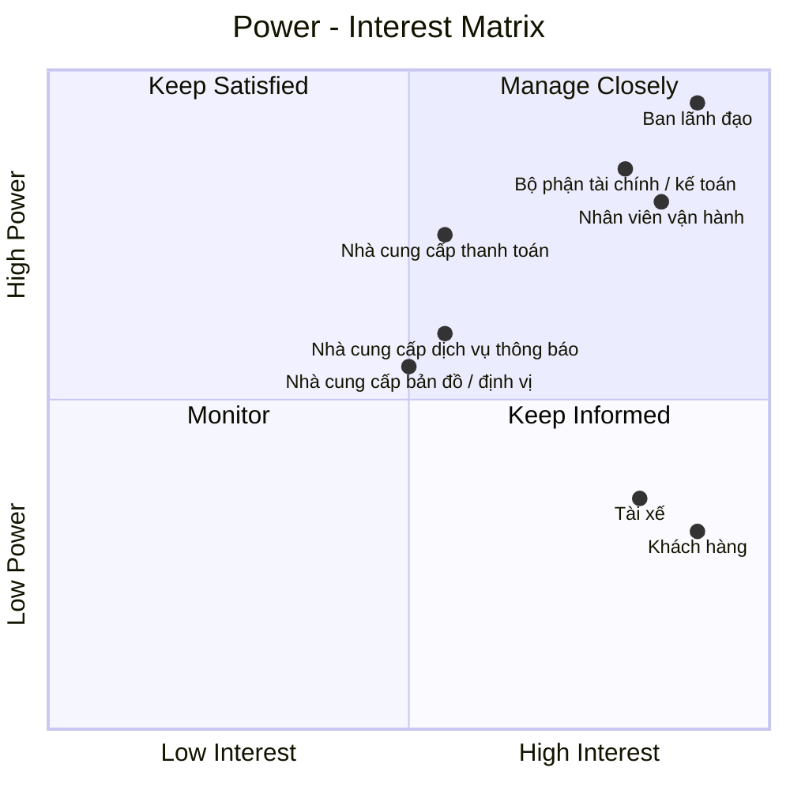

# 23630751_LeMinhThienPhuc_Cabsystem
## 1. Phân tích nghiệp vụ
### Hiện tại, Công ty ABC đang gặp nhiều khó khăn trong hoạt động đặt xe do việc phân công tài xế chủ yếu được thực hiện thủ công, khách hàng khó theo dõi trạng thái chuyến đi, thông tin thanh toán chưa được quản lý tập trung và bộ phận vận hành gặp nhiều hạn chế khi số lượng khách hàng, tài xế tăng lên. Ngoài ra, doanh nghiệp chưa có cơ chế tự động tìm và phân công tài xế phù hợp, xử lý trường hợp tài xế từ chối hoặc không phản hồi, cũng như chưa quản lý hiệu quả dữ liệu chuyến đi, giao dịch và hoạt động của tài xế. 
### Vì vậy, doanh nghiệp cần xây dựng một hệ thống CAB nhằm số hóa và tự động hóa toàn bộ quy trình đặt xe. Hệ thống cho phép khách hàng đăng ký, quản lý thông tin, nhập điểm đón và điểm đến, lựa chọn loại xe, gửi yêu cầu đặt xe và theo dõi trạng thái chuyến. Hệ thống tự động tìm kiếm và phân công tài xế dựa trên vị trí, trạng thái sẵn sàng và các tiêu chí vận hành; nếu tài xế không phản hồi hoặc từ chối, hệ thống tiếp tục tìm tài xế khác và thông báo cho khách hàng khi không tìm được tài xế. Tài xế có thể quản lý hồ sơ, phương tiện, trạng thái hoạt động, nhận hoặc từ chối chuyến và cập nhật trạng thái trong quá trình thực hiện chuyến. Sau khi chuyến hoàn thành, hệ thống thực hiện tính cước, hỗ trợ thanh toán bằng tiền mặt hoặc thanh toán điện tử thông qua nhà cung cấp bên ngoài, đồng thời quản lý lịch sử giao dịch và xử lý trường hợp thanh toán thất bại. Nhân viên vận hành có thể quản lý khách hàng, tài xế, phương tiện và chuyến đi, theo dõi các chuyến đang diễn ra, xử lý sự cố và tra cứu lịch sử. 
### Bên cạnh đó, hệ thống cung cấp thông báo cho khách hàng và tài xế, phân quyền người dùng, lưu vết các thao tác quan trọng và cung cấp báo cáo về số lượng chuyến, doanh thu, tỷ lệ hoàn thành, tỷ lệ hủy và hiệu quả hoạt động của tài xế. Hệ thống được định hướng xây dựng linh hoạt, có khả năng mở rộng để đáp ứng nhu cầu tăng trưởng và bổ sung các loại dịch vụ, phương thức thanh toán hoặc kênh thông báo mới trong tương lai.
## 2. Stakeholder

| Tên Stakeholder | Vai trò |
|:---|:---|
| Ban lãnh đạo | Định hướng, phê duyệt và đưa ra các quyết định quan trọng của dự án |
| Khách hàng | Đăng ký, đặt xe, theo dõi chuyến, thanh toán và đánh giá tài xế |
| Tài xế | Nhận chuyến, thực hiện chuyến và cập nhật trạng thái chuyến đi |
| Nhân viên vận hành | Quản lý khách hàng, tài xế, phương tiện, chuyến đi và xử lý sự cố |
| Nhà cung cấp thanh toán | Cung cấp dịch vụ và xử lý các giao dịch thanh toán điện tử |
| Bộ phận tài chính / kế toán | Quản lý doanh thu, giao dịch, đối soát và báo cáo tài chính |
| Nhà cung cấp bản đồ / định vị | Cung cấp dữ liệu vị trí, bản đồ, khoảng cách và hỗ trợ xác định tài xế |
| Nhà cung cấp dịch vụ thông báo | Cung cấp kênh gửi như thông báo ứng dụng, tin nhắn, thư điện tử... |
## Stakeholder matrix

## 3. Business Goals

| Mã | Business Goal | Mô tả |
|:---|:---|:---|
| **BG01** | **Tự động hóa và tối ưu hóa hoạt động điều phối xe** | Chuyển đổi quy trình tiếp nhận và phân công chuyến từ thủ công sang tự động, giảm thời gian xử lý yêu cầu và nâng cao hiệu quả sử dụng đội ngũ tài xế. |
| **BG02** | **Nâng cao chất lượng dịch vụ và trải nghiệm khách hàng** | Cung cấp quy trình đặt xe minh bạch, thuận tiện và có khả năng theo dõi xuyên suốt từ khi tạo yêu cầu đến khi hoàn thành chuyến, đồng thời cung cấp thông tin kịp thời thông qua hệ thống thông báo. |
| **BG03** | **Nâng cao hiệu quả quản lý và vận hành** | Cung cấp cho bộ phận vận hành khả năng theo dõi tập trung khách hàng, tài xế, phương tiện và chuyến đi; hỗ trợ xử lý các tình huống bất thường và đưa ra quyết định dựa trên dữ liệu vận hành. |
| **BG04** | **Chuẩn hóa và kiểm soát hoạt động tính cước, thanh toán và doanh thu** | Quản lý thống nhất quá trình tính cước và thanh toán, hỗ trợ nhiều phương thức thanh toán, kiểm soát trạng thái giao dịch và cung cấp dữ liệu phục vụ đối soát, quản lý doanh thu và báo cáo. |
| **BG05** | **Tăng cường khả năng kiểm soát và khai thác dữ liệu** | Hình thành nguồn dữ liệu tập trung về khách hàng, tài xế, phương tiện, chuyến đi và giao dịch nhằm phục vụ vận hành, tra cứu, báo cáo và phân tích hiệu quả kinh doanh. |
| **BG06** | **Đảm bảo tính liên tục và khả năng mở rộng của hoạt động kinh doanh** | Xây dựng nền tảng có khả năng đáp ứng sự gia tăng về số lượng khách hàng, tài xế và chuyến đi; hạn chế việc một thành phần gặp sự cố làm gián đoạn toàn bộ dịch vụ. |
| **BG07** | **Tạo nền tảng linh hoạt cho việc phát triển dịch vụ trong tương lai** | Cho phép doanh nghiệp bổ sung loại hình dịch vụ, phương thức thanh toán, kênh thông báo và các thành phần tích hợp mới mà không phải thay đổi lớn toàn bộ hệ thống. |
| **BG08** | **Đảm bảo an toàn thông tin và tuân thủ trong hoạt động kinh doanh** | Bảo vệ thông tin cá nhân, dữ liệu vị trí và dữ liệu giao dịch; kiểm soát quyền truy cập, lưu vết các thao tác quan trọng và hỗ trợ truy xuất khi phát sinh sự cố. |
## 4. Phạm vi dự án

Trong thời gian 7 tuần, dự án tập trung xây dựng các chức năng cơ bản và cần thiết để hệ thống CAB có thể vận hành như một nền tảng đặt xe trực tuyến, đồng thời hỗ trợ nhân viên vận hành quản lý khách hàng, tài xế, phương tiện và chuyến đi.

| STT | Module | Nội dung |
|:---:|:---|:---|
| 1 | **Quản lý khách hàng** | Quản lý thông tin tài khoản, hồ sơ, trạng thái hoạt động và lịch sử chuyến đi của khách hàng. |
| 2 | **Quản lý tài xế** | Quản lý thông tin tài khoản, hồ sơ, trạng thái hoạt động và thông tin phương tiện của tài xế. |
| 3 | **Đặt xe** | Nhập điểm đón, điểm đến, chọn loại xe và tạo yêu cầu đặt xe |
| 4 | **Tìm & phân công tài xế** | Tìm tài xế phù hợp, gửi yêu cầu, xử lý nhận/từ chối/không phản hồi |
| 5 | **Quản lý & theo dõi chuyến** | Nhận chuyến, cập nhật trạng thái, theo dõi trạng thái/vị trí/ETA |
| 6 | **Tính cước & thanh toán** | Tính cước, thanh toán tiền mặt/điện tử, xử lý kết quả thanh toán |
| 7 | **Thông báo** | Thông báo các sự kiện quan trọng cho Customer và Driver |
| 8 | **Quản lý vận hành** | Quản lý Customer, Driver, phương tiện, chuyến đi và xử lý sự cố |
| 9 | **Lịch sử & đánh giá** | Xem lịch sử chuyến, số tiền và đánh giá tài xế |
| 10 | **Bảo mật & phân quyền** | Xác thực, phân quyền và bảo vệ dữ liệu |
# 5. Business Requirements

Trong phạm vi MVP với thời gian triển khai **7 tuần**, hệ thống CAB tập trung vào các nghiệp vụ cốt lõi phục vụ toàn bộ quy trình đặt xe, từ quản lý tài khoản, quản lý khách hàng và tài xế, đặt xe, tìm tài xế, thực hiện chuyến, thanh toán đến quản lý vận hành, báo cáo và bảo mật.

| BR ID | Module | Business Requirement |
|:---:|:---|:---|
| **BR01** | Chức năng dùng chung | Hệ thống phải hỗ trợ Customer và Driver đăng ký tài khoản, đồng thời hỗ trợ Customer, Driver và Nhân viên vận hành đăng nhập và đăng xuất. |
| **BR02** | Quản lý khách hàng | Hệ thống phải hỗ trợ Customer xem và cập nhật thông tin cá nhân của mình. |
| **BR03** | Quản lý tài xế & phương tiện | Hệ thống phải hỗ trợ Driver quản lý thông tin tài khoản, phương tiện và trạng thái hoạt động của mình. |
| **BR04** | Đặt xe | Hệ thống phải cho phép Customer tạo yêu cầu đặt xe với điểm đón, điểm đến và loại xe hoặc dịch vụ. |
| **BR05** | Đặt xe | Hệ thống phải quản lý trạng thái của yêu cầu đặt xe trong quá trình xử lý. |
| **BR06** | Tìm & phân công tài xế | Hệ thống phải tự động tìm và lựa chọn tài xế phù hợp dựa trên trạng thái, vị trí và tiêu chí vận hành. |
| **BR07** | Tìm & phân công tài xế | Hệ thống phải xử lý trường hợp tài xế chấp nhận, từ chối hoặc không phản hồi và tiếp tục tìm tài xế khác khi cần. |
| **BR08** | Tìm & phân công tài xế | Hệ thống phải thông báo cho Customer khi không tìm được tài xế phù hợp. |
| **BR09** | Quản lý & theo dõi chuyến | Hệ thống phải tạo chuyến đi và liên kết chuyến với Customer, Driver và phương tiện sau khi Driver nhận yêu cầu. |
| **BR10** | Quản lý & theo dõi chuyến | Hệ thống phải cho phép Driver cập nhật các trạng thái chính của chuyến đi và cung cấp thông tin chuyến cho Customer. |
| **BR11** | Quản lý & theo dõi chuyến | Hệ thống phải hỗ trợ cập nhật và hiển thị thông tin vị trí, thời gian dự kiến và trạng thái chuyến trong phạm vi cho phép. |
| **BR12** | Tính cước & thanh toán | Hệ thống phải tính và lưu cước chuyến đi dựa trên loại dịch vụ và thông tin chuyến. |
| **BR13** | Tính cước & thanh toán | Hệ thống phải hỗ trợ thanh toán tiền mặt và thanh toán điện tử thông qua nhà cung cấp bên ngoài. |
| **BR14** | Tính cước & thanh toán | Hệ thống phải quản lý kết quả giao dịch và hỗ trợ xử lý thanh toán thất bại theo chính sách doanh nghiệp. |
| **BR15** | Thông báo | Hệ thống phải gửi thông báo cho Customer và Driver về các sự kiện quan trọng liên quan đến yêu cầu và chuyến đi. |
| **BR16** | Quản lý vận hành | Hệ thống phải cho phép Nhân viên vận hành quản lý khách hàng, tài xế, phương tiện và theo dõi các chuyến đang diễn ra. |
| **BR17** | Quản lý vận hành | Hệ thống phải hỗ trợ Nhân viên vận hành tra cứu và xử lý các chuyến có lỗi, bất thường và thông tin giao dịch theo quyền được cấp. |
| **BR18** | Lịch sử & đánh giá | Hệ thống phải lưu trữ lịch sử chuyến đi, thông tin thanh toán và cho phép Customer đánh giá Driver sau chuyến. |
| **BR19** | Báo cáo | Hệ thống phải cung cấp các báo cáo cơ bản về số lượng chuyến, doanh thu, tỷ lệ hoàn thành, tỷ lệ hủy và hiệu quả hoạt động của Driver. |
| **BR20** | Bảo mật & phân quyền | Hệ thống phải xác thực người dùng, phân quyền theo vai trò và bảo vệ dữ liệu khỏi truy cập trái phép. |
| **BR21** | Audit Log | Hệ thống phải lưu vết các thao tác quan trọng để phục vụ kiểm tra và xử lý sự cố. |

# 6. Functional Requirements

Functional Requirements (FR) được phân rã từ **21 Business Requirements (BR)**, mô tả các chức năng cụ thể mà hệ thống CAB cần cung cấp để đáp ứng phạm vi MVP trong thời gian 7 tuần.

## 6.1. Chức năng dùng chung

| FR ID | BR ID | Functional Requirement |
|:---:|:---:|:---|
| **FR01** | BR01 | Hệ thống cho phép Customer và Driver đăng ký tài khoản. |
| **FR02** | BR01 | Hệ thống cho phép Customer, Driver và Nhân viên vận hành đăng nhập vào hệ thống. |
| **FR03** | BR01 | Hệ thống cho phép Customer, Driver và Nhân viên vận hành đăng xuất khỏi hệ thống. |

## 6.2. Quản lý khách hàng

| FR ID | BR ID | Functional Requirement |
|:---:|:---:|:---|
| **FR04** | BR02 | Hệ thống cho phép Customer xem và cập nhật thông tin cá nhân. |

## 6.3. Quản lý tài xế & phương tiện

| FR ID | BR ID | Functional Requirement |
|:---:|:---:|:---|
| **FR05** | BR03 | Hệ thống cho phép Driver xem và cập nhật thông tin tài khoản cá nhân. |
| **FR06** | BR03 | Hệ thống cho phép Driver xem và cập nhật thông tin phương tiện của mình. |
| **FR07** | BR03 | Hệ thống cho phép Driver cập nhật trạng thái hoạt động và trạng thái sẵn sàng nhận chuyến. |

## 6.4. Đặt xe

| FR ID | BR ID | Functional Requirement |
|:---:|:---:|:---|
| **FR08** | BR04 | Hệ thống cho phép Customer nhập điểm đón, điểm đến và lựa chọn loại xe hoặc dịch vụ. |
| **FR09** | BR04 | Hệ thống kiểm tra thông tin đặt xe và hiển thị thông tin yêu cầu để Customer xác nhận. |
| **FR10** | BR05 | Hệ thống tạo mã yêu cầu và quản lý trạng thái đặt xe trong quá trình xử lý. |
| **FR11** | BR05 | Hệ thống cho phép Customer hủy yêu cầu đặt xe hoặc chuyến đi khi trạng thái hiện tại đáp ứng điều kiện hủy. |

## 6.5. Tìm và phân công tài xế

| FR ID | BR ID | Functional Requirement |
|:---:|:---:|:---|
| **FR12** | BR06 | Hệ thống tự động tìm kiếm các Driver đang có khả năng nhận chuyến dựa trên trạng thái và vị trí. |
| **FR13** | BR06 | Hệ thống áp dụng các tiêu chí vận hành để lựa chọn và ưu tiên Driver phù hợp. |
| **FR14** | BR07 | Hệ thống gửi yêu cầu nhận chuyến và ghi nhận kết quả chấp nhận, từ chối hoặc không phản hồi của Driver. |
| **FR15** | BR07 | Hệ thống tự động chuyển sang Driver phù hợp tiếp theo khi Driver được đề xuất từ chối hoặc không phản hồi trong thời gian quy định. |
| **FR16** | BR08 | Hệ thống thông báo cho Customer khi không còn Driver phù hợp để thực hiện chuyến. |

## 6.6. Quản lý & theo dõi chuyến

| FR ID | BR ID | Functional Requirement |
|:---:|:---:|:---|
| **FR17** | BR09 | Hệ thống tạo chuyến đi và liên kết chuyến với Customer, Driver và phương tiện sau khi Driver nhận chuyến. | 
| **FR18** | BR10 | Hệ thống cho phép Driver cập nhật các trạng thái chính: đã đến điểm đón, đã đón khách, đang di chuyển và hoàn thành. | 
| **FR19** | BR10 | Hệ thống hiển thị trạng thái và thông tin Driver của chuyến đi cho Customer. | 
| **FR20** | BR11 | Hệ thống tiếp nhận và cập nhật thông tin vị trí của Driver trong quá trình thực hiện chuyến. | 
| **FR21** | BR11 | Hệ thống hiển thị vị trí Driver và thời gian dự kiến đến cho Customer dựa trên dữ liệu vị trí. |

## 6.7. Tính cước & thanh toán

| FR ID | BR ID | Functional Requirement |
|:---:|:---:|:---|
| **FR22** | BR12 | Hệ thống tính và lưu số tiền phải thanh toán dựa trên loại dịch vụ và thông tin chuyến đi. | 
| **FR23** | BR13 | Hệ thống cho phép Customer lựa chọn thanh toán bằng tiền mặt hoặc thanh toán điện tử. | 
| **FR24** | BR13 | Hệ thống gửi yêu cầu thanh toán điện tử đến nhà cung cấp thanh toán bên ngoài và tiếp nhận kết quả giao dịch. | 
| **FR25** | BR14 | Hệ thống cập nhật trạng thái giao dịch và thông báo kết quả thanh toán cho Customer. | 
| **FR26** | BR14 | Hệ thống hỗ trợ thực hiện lại thanh toán khi giao dịch điện tử thất bại theo chính sách doanh nghiệp. |

## 6.8. Thông báo

| FR ID | BR ID | Functional Requirement |
|:---:|:---:|:---|
| **FR27** | BR15 | Hệ thống gửi thông báo cho Customer về các sự kiện chính: tiếp nhận yêu cầu, nhận chuyến, Driver đến, hoàn thành chuyến và kết quả thanh toán. | 
| **FR28** | BR15 | Hệ thống gửi thông báo cho Driver về chuyến mới và các thay đổi quan trọng liên quan đến chuyến. |

## 6.9. Quản lý vận hành

| FR ID | BR ID | Functional Requirement |
|:---:|:---:|:---|
| **FR29** | BR16 | Hệ thống cung cấp chức năng tra cứu và quản lý khách hàng, tài xế và phương tiện cho Nhân viên vận hành. | 
| **FR30** | BR16 | Hệ thống hiển thị danh sách và trạng thái các chuyến đang diễn ra cho Nhân viên vận hành. | 
| **FR31** | BR17 | Hệ thống cho phép Nhân viên vận hành tra cứu các chuyến có lỗi hoặc bất thường. | 
| **FR32** | BR17 | Hệ thống cho phép Nhân viên vận hành xử lý hoặc cập nhật trạng thái chuyến theo quyền được cấp. | 
| **FR33** | BR17 | Hệ thống cho phép Nhân viên vận hành tra cứu thông tin và lịch sử giao dịch. |

## 6.10. Lịch sử & đánh giá

| FR ID | BR ID | Functional Requirement |
|:---:|:---:|:---|
| **FR34** | BR18 | Hệ thống lưu trữ và cho phép Customer tra cứu lịch sử chuyến đi. | 
| **FR35** | BR18 | Hệ thống hiển thị chi tiết chuyến đi, số tiền và trạng thái thanh toán. | 
| **FR36** | BR18 | Hệ thống cho phép Customer đánh giá Driver sau khi chuyến hoàn thành và lưu kết quả đánh giá. |

## 6.11. Báo cáo

| FR ID | BR ID | Functional Requirement |
|:---:|:---:|:---|
| **FR37** | BR19 | Hệ thống cung cấp báo cáo về số lượng chuyến, doanh thu, tỷ lệ hoàn thành, tỷ lệ hủy và hiệu quả hoạt động của Driver theo khoảng thời gian và tiêu chí được lựa chọn. |

## 6.12. Bảo mật & phân quyền

| FR ID | BR ID | Functional Requirement |
|:---:|:---:|:---|
| **FR38** | BR20 | Hệ thống xác thực người dùng và phân quyền truy cập theo vai trò Customer, Driver và Nhân viên vận hành. | 
| **FR39** | BR20 | Hệ thống ngăn người dùng thực hiện các chức năng ngoài phạm vi quyền được cấp. | 
| **FR40** | BR20 | Hệ thống bảo vệ thông tin cá nhân, phương tiện, vị trí và dữ liệu giao dịch khỏi truy cập trái phép. |

## 6.13. Audit Log

| FR ID | BR ID | Functional Requirement |
|:---:|:---:|:---|
| **FR41** | BR21 | Hệ thống ghi nhận các thao tác quan trọng của người dùng và cho phép người dùng có quyền tra cứu lịch sử thao tác phục vụ kiểm tra và xử lý sự cố. |

## 7. Acceptance Criteria

## 7.1. Chức năng dùng chung

### FR01 – Đăng ký tài khoản

| AC ID | Acceptance Criteria |
|:---:|:---|
| AC01.1 | **Given** người dùng nhập đầy đủ thông tin hợp lệ, **When** thực hiện đăng ký, **Then** hệ thống tạo tài khoản thành công. |
| AC01.2 | **Given** thông tin đăng ký không hợp lệ hoặc tài khoản đã tồn tại, **When** thực hiện đăng ký, **Then** hệ thống từ chối đăng ký và thông báo lỗi. |

### FR02 – Đăng nhập

| AC ID | Acceptance Criteria |
|:---:|:---|
| AC02.1 | **Given** Customer, Driver hoặc Operations Staff có tài khoản hợp lệ, **When** nhập đúng thông tin đăng nhập, **Then** hệ thống cho phép đăng nhập thành công. |
| AC02.2 | **Given** thông tin đăng nhập không chính xác, **When** người dùng đăng nhập, **Then** hệ thống từ chối đăng nhập và thông báo lỗi. |
| AC02.3 | **Given** người dùng đăng nhập thành công, **Then** hệ thống xác định đúng vai trò của người dùng. |

### FR03 – Đăng xuất

| AC ID | Acceptance Criteria |
|:---:|:---|
| AC03.1 | **Given** người dùng đã đăng nhập, **When** thực hiện đăng xuất, **Then** hệ thống kết thúc phiên đăng nhập. |
| AC03.2 | **Given** người dùng đã đăng xuất, **When** truy cập chức năng yêu cầu đăng nhập, **Then** hệ thống không cho phép truy cập. |

---

## 7.2. Quản lý khách hàng

### FR04 – Xem và cập nhật thông tin cá nhân

| AC ID | Acceptance Criteria |
|:---:|:---|
| AC04.1 | **Given** Customer đã đăng nhập, **When** yêu cầu xem thông tin cá nhân, **Then** hệ thống hiển thị đúng thông tin của Customer. |
| AC04.2 | **Given** Customer nhập thông tin cập nhật hợp lệ, **When** thực hiện cập nhật, **Then** hệ thống lưu thông tin mới thành công. |
| AC04.3 | **Given** thông tin cập nhật không hợp lệ, **When** thực hiện cập nhật, **Then** hệ thống từ chối và thông báo lỗi. |

---

## 7.3. Quản lý tài xế và phương tiện

### FR05 – Xem và cập nhật thông tin tài xế

| AC ID | Acceptance Criteria |
|:---:|:---|
| AC05.1 | **Given** Driver đã đăng nhập, **When** yêu cầu xem thông tin cá nhân, **Then** hệ thống hiển thị đúng thông tin của Driver. |
| AC05.2 | **Given** Driver nhập thông tin cập nhật hợp lệ, **When** thực hiện cập nhật, **Then** hệ thống lưu thông tin mới thành công. |
| AC05.3 | **Given** thông tin cập nhật không hợp lệ, **When** thực hiện cập nhật, **Then** hệ thống từ chối và thông báo lỗi. |

### FR06 – Xem và cập nhật thông tin phương tiện

| AC ID | Acceptance Criteria |
|:---:|:---|
| AC06.1 | **Given** Driver đã đăng nhập, **When** yêu cầu xem thông tin phương tiện, **Then** hệ thống hiển thị thông tin phương tiện của Driver. |
| AC06.2 | **Given** Driver nhập thông tin phương tiện hợp lệ, **When** thực hiện cập nhật, **Then** hệ thống lưu thông tin phương tiện thành công. |
| AC06.3 | **Given** thông tin phương tiện không hợp lệ, **When** thực hiện cập nhật, **Then** hệ thống từ chối và thông báo lỗi. |

### FR07 – Cập nhật trạng thái hoạt động và khả dụng

| AC ID | Acceptance Criteria |
|:---:|:---|
| AC07.1 | **Given** Driver đã đăng nhập, **When** cập nhật trạng thái hoạt động hoặc khả dụng hợp lệ, **Then** hệ thống lưu trạng thái mới. |
| AC07.2 | **Given** trạng thái được cập nhật thành công, **Then** hệ thống sử dụng trạng thái mới cho việc tìm kiếm và phân công chuyến. |
| AC07.3 | **Given** trạng thái không hợp lệ, **When** Driver thực hiện cập nhật, **Then** hệ thống từ chối yêu cầu. |

---

## 7.4. Đặt xe

### FR08 – Nhập thông tin yêu cầu đặt xe

| AC ID | Acceptance Criteria |
|:---:|:---|
| AC08.1 | **Given** Customer đã đăng nhập, **When** nhập điểm đón, điểm đến và lựa chọn loại xe/dịch vụ, **Then** hệ thống tiếp nhận thông tin đặt xe. |
| AC08.2 | **Given** thiếu thông tin bắt buộc, **When** Customer gửi yêu cầu đặt xe, **Then** hệ thống không cho phép tiếp tục và yêu cầu bổ sung thông tin. |

### FR09 – Kiểm tra và xác nhận yêu cầu đặt xe

| AC ID | Acceptance Criteria |
|:---:|:---|
| AC09.1 | **Given** thông tin đặt xe đầy đủ, **When** Customer gửi yêu cầu, **Then** hệ thống kiểm tra tính hợp lệ của thông tin. |
| AC09.2 | **Given** thông tin hợp lệ, **Then** hệ thống hiển thị thông tin yêu cầu để Customer xác nhận. |
| AC09.3 | **Given** thông tin không hợp lệ, **Then** hệ thống thông báo lỗi và yêu cầu Customer chỉnh sửa. |

### FR10 – Tạo và quản lý yêu cầu đặt xe

| AC ID | Acceptance Criteria |
|:---:|:---|
| AC10.1 | **Given** Customer xác nhận yêu cầu hợp lệ, **When** hệ thống tạo yêu cầu, **Then** hệ thống tạo một mã yêu cầu duy nhất. |
| AC10.2 | **Given** yêu cầu đã được tạo, **Then** hệ thống lưu và quản lý trạng thái của yêu cầu trong suốt quá trình xử lý. |
| AC10.3 | **Given** trạng thái yêu cầu thay đổi, **Then** hệ thống cập nhật trạng thái mới tương ứng. |

---

## 7.5. Tìm kiếm và phân công tài xế

### FR11 – Tự động tìm kiếm tài xế phù hợp

| AC ID | Acceptance Criteria |
|:---:|:---|
| AC11.1 | **Given** có yêu cầu đặt xe cần phân công, **When** hệ thống bắt đầu tìm kiếm, **Then** hệ thống chỉ xem xét các Driver đáp ứng trạng thái hoạt động và khả dụng. |
| AC11.2 | **Given** Driver có thông tin vị trí hợp lệ, **Then** hệ thống sử dụng thông tin vị trí để hỗ trợ tìm kiếm Driver phù hợp. |

### FR12 – Lựa chọn và ưu tiên tài xế

| AC ID | Acceptance Criteria |
|:---:|:---|
| AC12.1 | **Given** hệ thống tìm được nhiều Driver phù hợp, **When** thực hiện lựa chọn, **Then** hệ thống áp dụng các tiêu chí vận hành đã quy định. |
| AC12.2 | **Given** danh sách Driver phù hợp, **Then** hệ thống lựa chọn/ưu tiên Driver theo các tiêu chí được áp dụng. |

### FR13 – Gửi yêu cầu và ghi nhận phản hồi của tài xế

| AC ID | Acceptance Criteria |
|:---:|:---|
| AC13.1 | **Given** hệ thống đã chọn Driver phù hợp, **When** gửi yêu cầu chuyến xe, **Then** Driver nhận được yêu cầu. |
| AC13.2 | **Given** Driver phản hồi nhận chuyến, **Then** hệ thống ghi nhận trạng thái chấp nhận. |
| AC13.3 | **Given** Driver từ chối hoặc không phản hồi trong thời gian quy định, **Then** hệ thống ghi nhận trạng thái tương ứng. |

### FR14 – Chuyển sang tài xế tiếp theo

| AC ID | Acceptance Criteria |
|:---:|:---|
| AC14.1 | **Given** Driver được đề xuất từ chối chuyến, **When** hệ thống xử lý phản hồi, **Then** hệ thống tự động chuyển sang Driver phù hợp tiếp theo. |
| AC14.2 | **Given** Driver không phản hồi trong thời gian quy định, **When** thời gian chờ kết thúc, **Then** hệ thống chuyển sang Driver phù hợp tiếp theo. |
| AC14.3 | **Given** còn Driver phù hợp, **Then** hệ thống tiếp tục quá trình phân công. |

### FR15 – Thông báo không tìm được tài xế

| AC ID | Acceptance Criteria |
|:---:|:---|
| AC15.1 | **Given** hệ thống đã thử phân công và không còn Driver phù hợp, **Then** hệ thống xác định yêu cầu không thể phân công. |
| AC15.2 | **Then** hệ thống thông báo cho Customer rằng chưa tìm được Driver phù hợp. |

---

## 7.6. Quản lý và theo dõi chuyến

### FR16 – Tạo chuyến

| AC ID | Acceptance Criteria |
|:---:|:---|
| AC16.1 | **Given** Driver chấp nhận yêu cầu đặt xe, **When** hệ thống xử lý phản hồi, **Then** hệ thống tạo chuyến xe. |
| AC16.2 | **Then** chuyến xe được liên kết đúng với Customer, Driver và phương tiện tương ứng. |

### FR17 – Cập nhật trạng thái chuyến

| AC ID | Acceptance Criteria |
|:---:|:---|
| AC17.1 | **Given** Driver đang thực hiện chuyến, **When** cập nhật trạng thái hợp lệ, **Then** hệ thống lưu trạng thái mới. |
| AC17.2 | **Then** hệ thống hỗ trợ cập nhật các trạng thái chính như tài xế đã đến, đã đón khách, đang thực hiện chuyến và hoàn thành. |
| AC17.3 | **Given** trạng thái cập nhật không hợp lệ, **Then** hệ thống từ chối yêu cầu. |

### FR18 – Customer theo dõi trạng thái chuyến

| AC ID | Acceptance Criteria |
|:---:|:---|
| AC18.1 | **Given** Customer có chuyến đang được xử lý, **When** xem thông tin chuyến, **Then** hệ thống hiển thị trạng thái hiện tại của chuyến. |
| AC18.2 | **Then** hệ thống hiển thị thông tin Driver được phân công cho chuyến. |
| AC18.3 | **Given** trạng thái chuyến thay đổi, **Then** Customer có thể xem trạng thái mới. |

### FR19 – Cập nhật vị trí tài xế

| AC ID | Acceptance Criteria |
|:---:|:---|
| AC19.1 | **Given** Driver đang thực hiện chuyến, **When** hệ thống nhận dữ liệu vị trí, **Then** hệ thống cập nhật vị trí mới của Driver. |
| AC19.2 | **Then** hệ thống lưu thông tin vị trí mới để phục vụ việc theo dõi chuyến. |

### FR20 – Hiển thị vị trí và thời gian dự kiến

| AC ID | Acceptance Criteria |
|:---:|:---|
| AC20.1 | **Given** hệ thống có dữ liệu vị trí Driver, **When** Customer xem chuyến, **Then** hệ thống hiển thị vị trí hiện tại của Driver. |
| AC20.2 | **Then** hệ thống hiển thị thời gian dự kiến đến dựa trên dữ liệu vị trí có được. |
| AC20.3 | **Given** chưa có dữ liệu vị trí phù hợp, **Then** hệ thống không hiển thị dữ liệu vị trí không hợp lệ. |

---

## 7.7. Tính cước và thanh toán

### FR21 – Tính và lưu cước chuyến

| AC ID | Acceptance Criteria |
|:---:|:---|
| AC21.1 | **Given** chuyến có đầy đủ thông tin cần thiết, **When** hệ thống tính cước, **Then** hệ thống tính số tiền dựa trên loại dịch vụ và thông tin chuyến. |
| AC21.2 | **Then** hệ thống lưu số tiền cước tương ứng với chuyến. |

### FR22 – Lựa chọn phương thức thanh toán

| AC ID | Acceptance Criteria |
|:---:|:---|
| AC22.1 | **Given** Customer thực hiện thanh toán, **When** lựa chọn phương thức thanh toán, **Then** hệ thống cho phép lựa chọn tiền mặt hoặc thanh toán điện tử. |
| AC22.2 | **Then** hệ thống lưu phương thức thanh toán được Customer lựa chọn. |

### FR23 – Thực hiện thanh toán điện tử

| AC ID | Acceptance Criteria |
|:---:|:---|
| AC23.1 | **Given** Customer chọn thanh toán điện tử, **When** thực hiện thanh toán, **Then** hệ thống gửi yêu cầu thanh toán đến nhà cung cấp thanh toán bên ngoài. |
| AC23.2 | **Given** nhà cung cấp thanh toán trả kết quả, **Then** hệ thống tiếp nhận và lưu kết quả thanh toán. |

### FR24 – Cập nhật trạng thái giao dịch và thông báo kết quả

| AC ID | Acceptance Criteria |
|:---:|:---|
| AC24.1 | **Given** hệ thống nhận được kết quả thanh toán, **Then** hệ thống cập nhật trạng thái giao dịch tương ứng. |
| AC24.2 | **Then** hệ thống thông báo kết quả thanh toán cho Customer. |
| AC24.3 | **Given** thanh toán thất bại, **Then** trạng thái giao dịch được ghi nhận là thất bại. |

### FR25 – Thử lại thanh toán điện tử

| AC ID | Acceptance Criteria |
|:---:|:---|
| AC25.1 | **Given** giao dịch thanh toán điện tử thất bại, **When** Customer thực hiện thử lại theo chính sách, **Then** hệ thống cho phép gửi lại yêu cầu thanh toán. |
| AC25.2 | **Then** hệ thống ghi nhận kết quả của lần thanh toán thử lại. |

---

## 7.8. Thông báo

### FR26 – Thông báo cho Customer

| AC ID | Acceptance Criteria |
|:---:|:---|
| AC26.1 | **Given** yêu cầu đặt xe được tiếp nhận, **Then** hệ thống gửi thông báo cho Customer. |
| AC26.2 | **Given** Driver được phân công/chấp nhận chuyến, **Then** hệ thống gửi thông báo cho Customer. |
| AC26.3 | **Given** Driver đã đến, chuyến hoàn thành hoặc thanh toán có kết quả, **Then** hệ thống gửi thông báo tương ứng cho Customer. |

### FR27 – Thông báo cho Driver

| AC ID | Acceptance Criteria |
|:---:|:---|
| AC27.1 | **Given** có yêu cầu chuyến xe mới phù hợp, **Then** hệ thống gửi thông báo cho Driver được đề xuất. |
| AC27.2 | **Given** có thay đổi quan trọng liên quan đến chuyến, **Then** hệ thống gửi thông báo tương ứng cho Driver. |

---

## 7.9. Quản lý vận hành

### FR28 – Quản lý khách hàng, tài xế và phương tiện

| AC ID | Acceptance Criteria |
|:---:|:---|
| AC28.1 | **Given** Operations Staff có quyền phù hợp, **When** thực hiện tra cứu, **Then** hệ thống hiển thị thông tin Customer, Driver hoặc phương tiện. |
| AC28.2 | **Given** Operations Staff có quyền phù hợp, **When** thực hiện quản lý thông tin, **Then** hệ thống cho phép thực hiện thao tác được cấp quyền. |
| AC28.3 | **Given** người dùng không có quyền phù hợp, **Then** hệ thống từ chối thao tác quản lý. |

### FR29 – Theo dõi các chuyến đang diễn ra

| AC ID | Acceptance Criteria |
|:---:|:---|
| AC29.1 | **Given** Operations Staff có quyền truy cập, **When** xem danh sách chuyến đang diễn ra, **Then** hệ thống hiển thị danh sách các chuyến tương ứng. |
| AC29.2 | **Then** hệ thống hiển thị trạng thái hiện tại của từng chuyến. |
| AC29.3 | **Given** trạng thái chuyến thay đổi, **Then** thông tin hiển thị được cập nhật tương ứng. |

### FR30 – Tra cứu chuyến có lỗi/bất thường

| AC ID | Acceptance Criteria |
|:---:|:---|
| AC30.1 | **Given** Operations Staff có quyền truy cập, **When** thực hiện tra cứu, **Then** hệ thống hiển thị các chuyến có lỗi hoặc bất thường theo điều kiện tìm kiếm. |
| AC30.2 | **Then** hệ thống hiển thị thông tin cần thiết để Operations Staff kiểm tra chuyến. |

### FR31 – Xử lý và cập nhật trạng thái chuyến

| AC ID | Acceptance Criteria |
|:---:|:---|
| AC31.1 | **Given** Operations Staff có quyền xử lý chuyến, **When** cập nhật trạng thái hợp lệ, **Then** hệ thống lưu trạng thái mới. |
| AC31.2 | **Given** Operations Staff không có quyền, **When** thực hiện cập nhật, **Then** hệ thống từ chối thao tác. |
| AC31.3 | **Then** thay đổi trạng thái được ghi nhận trong hệ thống. |

### FR32 – Tra cứu thông tin giao dịch

| AC ID | Acceptance Criteria |
|:---:|:---|
| AC32.1 | **Given** Operations Staff có quyền truy cập, **When** tra cứu giao dịch, **Then** hệ thống hiển thị thông tin giao dịch phù hợp với điều kiện tìm kiếm. |
| AC32.2 | **Then** hệ thống cho phép xem lịch sử giao dịch. |
| AC32.3 | **Given** người dùng không có quyền, **Then** hệ thống không cho phép truy cập thông tin giao dịch. |

---

## 7.10. Lịch sử và đánh giá

### FR33 – Lưu và tra cứu lịch sử chuyến

| AC ID | Acceptance Criteria |
|:---:|:---|
| AC33.1 | **Given** chuyến xe được ghi nhận trong hệ thống, **Then** thông tin chuyến được lưu vào lịch sử. |
| AC33.2 | **Given** Customer đã đăng nhập, **When** xem lịch sử chuyến, **Then** hệ thống hiển thị các chuyến thuộc Customer đó. |

### FR34 – Xem chi tiết chuyến và thanh toán

| AC ID | Acceptance Criteria |
|:---:|:---|
| AC34.1 | **Given** Customer chọn một chuyến trong lịch sử, **When** xem chi tiết, **Then** hệ thống hiển thị thông tin chi tiết của chuyến. |
| AC34.2 | **Then** hệ thống hiển thị số tiền cước của chuyến. |
| AC34.3 | **Then** hệ thống hiển thị trạng thái thanh toán của chuyến. |

### FR35 – Đánh giá tài xế

| AC ID | Acceptance Criteria |
|:---:|:---|
| AC35.1 | **Given** chuyến đã hoàn thành, **When** Customer thực hiện đánh giá Driver, **Then** hệ thống cho phép Customer gửi đánh giá hợp lệ. |
| AC35.2 | **Then** hệ thống lưu kết quả đánh giá gắn với chuyến và Driver tương ứng. |
| AC35.3 | **Given** chuyến chưa hoàn thành, **Then** hệ thống không cho phép Customer đánh giá Driver. |

---

## 7.11. Báo cáo

### FR36 – Thống kê và báo cáo

| AC ID | Acceptance Criteria |
|:---:|:---|
| AC36.1 | **Given** người dùng có quyền xem báo cáo, **When** chọn khoảng thời gian và tiêu chí thống kê, **Then** hệ thống tạo báo cáo tương ứng. |
| AC36.2 | **Then** báo cáo thể hiện số lượng chuyến, doanh thu, tỷ lệ hoàn thành và tỷ lệ hủy chuyến. |
| AC36.3 | **Then** báo cáo có thể thể hiện hiệu quả hoạt động của Driver theo tiêu chí được lựa chọn. |

---

## 7.12. Bảo mật và phân quyền

### FR37 – Xác thực và phân quyền người dùng

| AC ID | Acceptance Criteria |
|:---:|:---|
| AC37.1 | **Given** người dùng đăng nhập, **Then** hệ thống xác thực thông tin tài khoản trước khi cho phép truy cập. |
| AC37.2 | **Then** hệ thống xác định quyền truy cập dựa trên vai trò Customer, Driver hoặc Operations Staff. |
| AC37.3 | **Given** thông tin xác thực không hợp lệ, **Then** hệ thống không cho phép truy cập. |

### FR38 – Ngăn chặn truy cập chức năng ngoài quyền

| AC ID | Acceptance Criteria |
|:---:|:---|
| AC38.1 | **Given** người dùng không có quyền thực hiện một chức năng, **When** cố gắng truy cập, **Then** hệ thống từ chối truy cập. |
| AC38.2 | **Given** người dùng có quyền phù hợp, **When** truy cập chức năng, **Then** hệ thống cho phép thực hiện chức năng đó. |

### FR39 – Bảo vệ dữ liệu

| AC ID | Acceptance Criteria |
|:---:|:---|
| AC39.1 | **Given** người dùng không có quyền, **When** cố gắng truy cập dữ liệu cá nhân, phương tiện, vị trí hoặc giao dịch, **Then** hệ thống từ chối truy cập. |
| AC39.2 | **Given** người dùng có quyền phù hợp, **Then** hệ thống chỉ cung cấp dữ liệu nằm trong phạm vi quyền được cấp. |
| AC39.3 | **Then** dữ liệu được bảo vệ khỏi việc truy cập hoặc sử dụng trái phép. |

---

## 7.13. Audit Log

### FR40 – Ghi nhận và tra cứu lịch sử thao tác

| AC ID | Acceptance Criteria |
|:---:|:---|
| AC40.1 | **Given** người dùng thực hiện một thao tác quan trọng, **Then** hệ thống ghi nhận thao tác vào Audit Log. |
| AC40.2 | **Then** Audit Log lưu được thông tin cần thiết về người thực hiện, thao tác, đối tượng và thời điểm thực hiện. |
| AC40.3 | **Given** người dùng có quyền tra cứu Audit Log, **When** thực hiện tìm kiếm, **Then** hệ thống hiển thị lịch sử thao tác phù hợp. |
| AC40.4 | **Given** người dùng không có quyền, **When** cố gắng truy cập Audit Log, **Then** hệ thống từ chối truy cập. |

##8. Usecase tổng quát

##9. Đặc tả Use Case

## UC01 – Đăng ký tài khoản

### Đăng ký tài khoản

**Tiền điều kiện**

Customer hoặc Driver chưa có tài khoản trong hệ thống.

**Hậu điều kiện**

Tài khoản được tạo thành công và thông tin tài khoản được lưu vào hệ thống.

**Actor chính**

Customer / Driver

**Actor phụ**

Không

### Basic flow

| Customer / Driver | Hệ thống |
|---|---|
| **1.** Chọn chức năng “Đăng ký” | |
| | **2.** Hiển thị biểu mẫu đăng ký |
| **3.** Nhập thông tin đăng ký | |
| | **4.** Kiểm tra tính hợp lệ của thông tin |
| | **5.** Kiểm tra tài khoản đã tồn tại hay chưa |
| | **6.** Tạo tài khoản |
| | **7.** Lưu thông tin tài khoản |
| | **8.** Hiển thị thông báo đăng ký thành công |

### Alternative flow

**3.1 Thông tin đăng ký không hợp lệ:**

1. Hệ thống hiển thị thông báo thông tin không hợp lệ.
2. Quay lại bước **3**.

**5.1 Tài khoản đã tồn tại:**

1. Hệ thống hiển thị thông báo tài khoản đã tồn tại.
2. Quay lại bước **3**.

### Exception flow

**3.1 Customer / Driver hủy đăng ký:**

1. Customer / Driver chọn “Hủy”.
2. Hệ thống không lưu thông tin đang nhập.
3. Hệ thống kết thúc use case.

---

## UC02 – Đăng nhập / Đăng xuất tài khoản

### Đăng nhập / Đăng xuất tài khoản

**Tiền điều kiện**

Đối với đăng nhập: người dùng đã có tài khoản và chưa đăng nhập.

Đối với đăng xuất: người dùng đã đăng nhập vào hệ thống.

**Hậu điều kiện**

Đối với đăng nhập: người dùng được xác thực và tạo phiên đăng nhập với vai trò tương ứng.

Đối với đăng xuất: phiên đăng nhập của người dùng được kết thúc.

**Actor chính**

Customer / Driver / Nhân viên vận hành

**Actor phụ**

Không

### Basic flow – Đăng nhập

| Customer / Driver / Nhân viên vận hành | Hệ thống |
|---|---|
| **1.** Chọn chức năng “Đăng nhập” | |
| | **2.** Hiển thị biểu mẫu đăng nhập |
| **3.** Nhập thông tin đăng nhập | |
| | **4.** Kiểm tra thông tin đăng nhập |
| | **5.** Xác thực tài khoản |
| | **6.** Xác định vai trò người dùng |
| | **7.** Tạo phiên đăng nhập |
| | **8.** Chuyển người dùng đến giao diện phù hợp |
| | **9.** Hiển thị thông báo đăng nhập thành công |

### Basic flow – Đăng xuất

| Customer / Driver / Nhân viên vận hành | Hệ thống |
|---|---|
| **10.** Chọn chức năng “Đăng xuất” | |
| | **11.** Xác nhận thao tác đăng xuất |
| | **12.** Kết thúc phiên đăng nhập |
| | **13.** Xóa thông tin phiên truy cập |
| | **14.** Chuyển về giao diện đăng nhập |
| | **15.** Hiển thị thông báo đăng xuất thành công |

### Alternative flow

**3.1 Thông tin đăng nhập không chính xác:**

1. Hệ thống hiển thị thông báo thông tin đăng nhập không chính xác.
2. Quay lại bước **3**.

### Exception flow

**11.1 Người dùng không xác nhận đăng xuất:**

1. Người dùng chọn “Quay lại”.
2. Hệ thống giữ nguyên phiên đăng nhập.
3. Kết thúc thao tác đăng xuất.

**12.1 Không thể kết thúc phiên đăng nhập:**

1. Hệ thống ghi nhận lỗi.
2. Hệ thống thông báo không thể đăng xuất.
3. Kết thúc use case.

---

## UC03 – Quản lý thông tin cá nhân

### Quản lý thông tin cá nhân

**Tiền điều kiện**

Customer đã đăng nhập thành công vào hệ thống.

**Hậu điều kiện**

Thông tin cá nhân được hiển thị hoặc cập nhật thành công.

**Actor chính**

Customer

**Actor phụ**

Không

### Basic flow

| Customer | Hệ thống |
|---|---|
| **1.** Chọn chức năng “Thông tin cá nhân” | |
| | **2.** Hiển thị thông tin cá nhân hiện tại |
| **3.** Chọn chức năng cập nhật thông tin | |
| | **4.** Hiển thị biểu mẫu cập nhật |
| **5.** Chỉnh sửa thông tin cá nhân | |
| | **6.** Kiểm tra tính hợp lệ của thông tin |
| | **7.** Lưu thông tin mới |
| | **8.** Hiển thị thông báo cập nhật thành công |

### Alternative flow

**5.1 Thông tin cá nhân không hợp lệ:**

1. Hệ thống hiển thị thông báo thông tin không hợp lệ.
2. Quay lại bước **5**.

### Exception flow

**5.1 Customer hủy cập nhật thông tin:**

1. Customer chọn “Hủy”.
2. Hệ thống không lưu thay đổi.
3. Hệ thống giữ nguyên thông tin hiện tại.
4. Kết thúc use case.

---

## UC04 – Quản lý tài khoản và phương tiện

### Quản lý tài khoản và phương tiện

**Tiền điều kiện**

Driver đã đăng nhập thành công vào hệ thống.

**Hậu điều kiện**

Thông tin tài khoản hoặc phương tiện của Driver được hiển thị hoặc cập nhật thành công.

**Actor chính**

Driver

**Actor phụ**

Không

### Basic flow

| Driver | Hệ thống |
|---|---|
| **1.** Chọn chức năng “Tài khoản và phương tiện” | |
| | **2.** Hiển thị thông tin tài khoản và phương tiện hiện tại |
| **3.** Chọn thông tin cần cập nhật | |
| | **4.** Hiển thị biểu mẫu cập nhật |
| **5.** Nhập hoặc chỉnh sửa thông tin | |
| | **6.** Kiểm tra tính hợp lệ của thông tin |
| | **7.** Lưu thông tin mới |
| | **8.** Hiển thị thông báo cập nhật thành công |

### Alternative flow

**5.1 Thông tin tài khoản hoặc phương tiện không hợp lệ:**

1. Hệ thống hiển thị thông báo thông tin không hợp lệ.
2. Quay lại bước **5**.

### Exception flow

**3.1 Driver hủy cập nhật:**

1. Driver chọn “Hủy”.
2. Hệ thống không lưu thay đổi.
3. Hệ thống giữ nguyên thông tin hiện tại.
4. Kết thúc use case.

---

## UC05 – Cập nhật trạng thái tài xế

### Cập nhật trạng thái tài xế

**Tiền điều kiện**

Driver đã đăng nhập thành công vào hệ thống.

**Hậu điều kiện**

Trạng thái hoạt động và trạng thái sẵn sàng nhận chuyến của Driver được cập nhật.

**Actor chính**

Driver

**Actor phụ**

Không

### Basic flow

| Driver | Hệ thống |
|---|---|
| **1.** Chọn chức năng cập nhật trạng thái | |
| | **2.** Hiển thị trạng thái hiện tại |
| **3.** Chọn trạng thái mới | |
| | **4.** Kiểm tra điều kiện chuyển trạng thái |
| | **5.** Cập nhật trạng thái mới |
| | **6.** Hiển thị thông báo cập nhật thành công |

### Alternative flow

**3.1 Trạng thái được chọn không hợp lệ:**

1. Hệ thống hiển thị thông báo trạng thái không hợp lệ.
2. Quay lại bước **3**.

### Exception flow

**3.1 Driver hủy thao tác:**

1. Driver chọn “Hủy”.
2. Hệ thống giữ nguyên trạng thái hiện tại.
3. Kết thúc use case.

---

## UC06 – Đặt xe

### Đặt xe

**Tiền điều kiện**

Customer đã đăng nhập thành công vào hệ thống.

**Hậu điều kiện**

Yêu cầu đặt xe được tạo và lưu vào hệ thống. Hệ thống cấp mã yêu cầu và chuyển yêu cầu sang quá trình tìm và phân công tài xế.

**Actor chính**

Customer

**Actor phụ**

Map/Location Provider

### Basic flow

| Customer | Hệ thống |
|---|---|
| **1.** Chọn chức năng “Đặt xe” | |
| | **2.** Hiển thị biểu mẫu đặt xe |
| **3.** Nhập điểm đón và điểm đến | |
| | **4.** Kiểm tra thông tin địa điểm |
| **5.** Chọn loại xe hoặc dịch vụ | |
| | **6.** Kiểm tra loại xe hoặc dịch vụ |
| | **7.** Hiển thị thông tin yêu cầu để Customer kiểm tra |
| **8.** Xác nhận đặt xe | |
| | **9.** Tạo mã yêu cầu đặt xe |
| | **10.** Lưu yêu cầu đặt xe |
| | **11.** Cập nhật trạng thái yêu cầu |
| | **12.** Chuyển yêu cầu sang quá trình tìm và phân công tài xế |
| | **13.** Hiển thị thông báo đặt xe thành công |

### Alternative flow

**3.1 Địa điểm không hợp lệ:**

1. Hệ thống hiển thị thông báo địa điểm không hợp lệ.
2. Quay lại bước **3**.

**5.1 Loại xe hoặc dịch vụ không hợp lệ:**

1. Hệ thống hiển thị thông báo loại xe hoặc dịch vụ không hợp lệ.
2. Quay lại bước **5**.

### Exception flow

**8.1 Customer hủy đặt xe:**

1. Customer chọn “Hủy”.
2. Hệ thống không tạo yêu cầu đặt xe.
3. Hệ thống kết thúc use case.

---

## UC07 – Hủy yêu cầu / chuyến đi

### Hủy yêu cầu / chuyến đi

**Tiền điều kiện**

Customer đã đăng nhập và có yêu cầu đặt xe hoặc chuyến đi thuộc quyền của mình.

**Hậu điều kiện**

Yêu cầu đặt xe hoặc chuyến đi được cập nhật sang trạng thái hủy nếu đáp ứng điều kiện hủy.

**Actor chính**

Customer

**Actor phụ**

Không

### Basic flow

| Customer | Hệ thống |
|---|---|
| **1.** Chọn yêu cầu đặt xe hoặc chuyến đi cần hủy | |
| | **2.** Hiển thị thông tin và trạng thái hiện tại |
| **3.** Chọn chức năng “Hủy” | |
| | **4.** Kiểm tra điều kiện hủy |
| | **5.** Hiển thị thông báo xác nhận hủy |
| **6.** Xác nhận hủy | |
| | **7.** Cập nhật trạng thái hủy |
| | **8.** Lưu thông tin hủy |
| | **9.** Hiển thị thông báo hủy thành công |

### Alternative flow

**3.1 Yêu cầu/chuyến đi không thể hủy:**

1. Hệ thống hiển thị thông báo không thể hủy yêu cầu/chuyến đi.
2. Quay lại bước **3**.

### Exception flow

**6.1 Customer không xác nhận hủy:**

1. Customer chọn “Quay lại”.
2. Hệ thống giữ nguyên trạng thái yêu cầu/chuyến đi.
3. Kết thúc use case.

---

## UC08 – Tìm và phân công tài xế

### Tìm và phân công tài xế

**Tiền điều kiện**

Yêu cầu đặt xe đã được tạo thành công và đang ở trạng thái cần tìm tài xế.

**Hậu điều kiện**

Một Driver phù hợp được phân công cho chuyến hoặc hệ thống xác định không có Driver phù hợp.

**Actor chính**

Driver

**Actor phụ**

Không

### Basic flow

| Driver | Hệ thống |
|---|---|
| | **1.** Xác định yêu cầu đặt xe cần tìm tài xế |
| | **2.** Xác định các Driver đang sẵn sàng nhận chuyến |
| | **3.** Xác định các Driver phù hợp |
| | **4.** Áp dụng tiêu chí lựa chọn và ưu tiên Driver |
| | **5.** Gửi yêu cầu nhận chuyến đến Driver được lựa chọn |
| **6.** Nhận thông báo yêu cầu nhận chuyến | |
| **7.** Chấp nhận yêu cầu nhận chuyến | |
| | **8.** Ghi nhận kết quả chấp nhận |
| | **9.** Phân công chuyến cho Driver |
| | **10.** Cập nhật trạng thái booking/chuyến |
| | **11.** Gửi thông báo kết quả phân công |
| **12.** Nhận thông tin chuyến được phân công | |

### Alternative flow

**7.1 Driver từ chối yêu cầu:**

1. Hệ thống ghi nhận Driver từ chối yêu cầu.
2. Quay lại bước **5**.

**7.2 Driver không phản hồi:**

1. Hệ thống ghi nhận Driver không phản hồi.
2. Quay lại bước **5**.

### Exception flow

**4.1 Không tìm thấy Driver phù hợp:**

1. Hệ thống cập nhật trạng thái yêu cầu.
2. Hệ thống thông báo cho Customer.
3. Kết thúc use case.

---

## UC09 – Cập nhật trạng thái chuyến đi

### Cập nhật trạng thái chuyến đi

**Tiền điều kiện**

Chuyến đi đã được phân công cho Driver.

**Hậu điều kiện**

Trạng thái chuyến đi được cập nhật thành công.

**Actor chính**

Driver

**Actor phụ**

Không

### Basic flow

| Driver | Hệ thống |
|---|---|
| **1.** Xem thông tin chuyến được phân công | |
| | **2.** Hiển thị trạng thái hiện tại |
| **3.** Chọn trạng thái mới | |
| | **4.** Kiểm tra điều kiện chuyển trạng thái |
| | **5.** Cập nhật trạng thái chuyến |
| | **6.** Lưu trạng thái mới |
| | **7.** Thông báo trạng thái mới cho Customer |
| | **8.** Hiển thị thông báo cập nhật thành công |

### Alternative flow

**3.1 Trạng thái mới không hợp lệ:**

1. Hệ thống hiển thị thông báo trạng thái không hợp lệ.
2. Quay lại bước **3**.

### Exception flow

**3.1 Driver hủy thao tác cập nhật:**

1. Driver chọn “Hủy”.
2. Hệ thống giữ nguyên trạng thái hiện tại.
3. Kết thúc use case.

---

## UC10 – Theo dõi chuyến đi

### Theo dõi chuyến đi

**Tiền điều kiện**

Customer có chuyến đi đang được thực hiện.

**Hậu điều kiện**

Customer có thể xem trạng thái và thông tin vị trí của Driver trong quá trình chuyến đi.

**Actor chính**

Customer

**Actor phụ**

Map/Location Provider

### Basic flow

| Customer | Hệ thống |
|---|---|
| **1.** Chọn chuyến đang diễn ra | |
| | **2.** Hiển thị thông tin chuyến |
| | **3.** Tiếp nhận dữ liệu vị trí của Driver |
| | **4.** Cập nhật vị trí Driver |
| | **5.** Hiển thị vị trí Driver trên bản đồ |
| | **6.** Hiển thị trạng thái hiện tại của chuyến |
| | **7.** Hiển thị thời gian dự kiến đến nếu có dữ liệu |
| **8.** Theo dõi chuyến | |
| | **9.** Cập nhật thông tin theo dữ liệu vị trí mới |

### Alternative flow

**3.1 Dữ liệu vị trí không hợp lệ hoặc không được cập nhật:**

1. Hệ thống hiển thị thông báo dữ liệu vị trí không hợp lệ hoặc chưa được cập nhật.
2. Quay lại bước **3**.

### Exception flow

**8.1 Chuyến đã hoàn thành:**

1. Hệ thống cập nhật trạng thái chuyến là “Hoàn thành”.
2. Hệ thống kết thúc chức năng theo dõi.
3. Kết thúc use case.

---

## UC11 – Tính cước

### Tính cước

**Tiền điều kiện**

Chuyến đi đã hoàn thành và có đầy đủ thông tin cần thiết để tính cước.

**Hậu điều kiện**

Số tiền phải thanh toán được tính toán và lưu vào thông tin chuyến/giao dịch.

**Actor chính**

Không có Actor trực tiếp

**Actor phụ**

Không

### Basic flow

| Hệ thống |
|---|
| **1.** Nhận thông tin chuyến đã hoàn thành |
| **2.** Xác định loại dịch vụ |
| **3.** Lấy thông tin chuyến cần thiết để tính cước |
| **4.** Áp dụng quy tắc tính cước |
| **5.** Tính số tiền phải thanh toán |
| **6.** Lưu số tiền vào thông tin chuyến/giao dịch |
| **7.** Chuyển sang quá trình thanh toán |

### Alternative flow

**3.1 Thông tin chuyến không đầy đủ:**

1. Hệ thống hiển thị thông báo thiếu thông tin để tính cước.
2. Quay lại bước **3**.

### Exception flow

**5.1 Không thể tính cước:**

1. Hệ thống ghi nhận lỗi tính cước.
2. Hệ thống không xác nhận số tiền phải thanh toán.
3. Hệ thống thông báo lỗi cho Nhân viên vận hành.
4. Kết thúc use case.

---

## UC12 – Thanh toán

### Thanh toán

**Tiền điều kiện**

Số tiền phải thanh toán của chuyến đi đã được xác định.

**Hậu điều kiện**

Giao dịch được ghi nhận với trạng thái phù hợp và Customer nhận được kết quả thanh toán.

**Actor chính**

Customer

**Actor phụ**

Payment Provider

### Basic flow

| Customer | Hệ thống |
|---|---|
| **1.** Xem số tiền phải thanh toán | |
| | **2.** Hiển thị số tiền và phương thức thanh toán |
| **3.** Chọn phương thức thanh toán | |
| | **4.** Xử lý phương thức thanh toán được lựa chọn |
| | **5.** Gửi yêu cầu thanh toán điện tử đến Payment Provider |
| | **6.** Tiếp nhận kết quả giao dịch |
| | **7.** Cập nhật trạng thái thanh toán |
| | **8.** Hiển thị kết quả thanh toán |

### Alternative flow

**3.1 Phương thức thanh toán không hợp lệ:**

1. Hệ thống hiển thị thông báo phương thức thanh toán không hợp lệ.
2. Quay lại bước **3**.

### Exception flow

**5.1 Thanh toán điện tử thất bại:**

1. Payment Provider trả về kết quả thất bại.
2. Hệ thống cập nhật trạng thái giao dịch là thất bại.
3. Hệ thống thông báo cho Customer.
4. Customer có thể thực hiện lại thanh toán theo chính sách doanh nghiệp.
5. Kết thúc use case.

---

## UC13 – Gửi thông báo

### Gửi thông báo

**Tiền điều kiện**

Một sự kiện cần thông báo xảy ra trong hệ thống và xác định được người nhận.

**Hậu điều kiện**

Thông báo được gửi thành công hoặc hệ thống ghi nhận trạng thái gửi thất bại.

**Actor chính**

Không có Actor trực tiếp

**Actor phụ**

Notification Provider

### Basic flow

| Hệ thống | Notification Provider |
|---|---|
| **1.** Phát hiện sự kiện cần thông báo | |
| **2.** Xác định người nhận | |
| **3.** Tạo nội dung thông báo | |
| **4.** Gửi yêu cầu thông báo | |
| | **5.** Tiếp nhận yêu cầu gửi thông báo |
| | **6.** Xử lý và gửi thông báo |
| **7.** Tiếp nhận kết quả gửi | |
| **8.** Ghi nhận trạng thái gửi | |

### Alternative flow

**5.1 Yêu cầu gửi thông báo không hợp lệ:**

1. Notification Provider trả về thông báo yêu cầu không hợp lệ.
2. Quay lại bước **4**.

### Exception flow

**6.1 Không thể gửi thông báo:**

1. Notification Provider trả về lỗi.
2. Hệ thống ghi nhận trạng thái gửi thất bại.
3. Hệ thống lưu thông tin lỗi.
4. Kết thúc use case.

---

## UC14 – Quản lý vận hành

### Quản lý vận hành

**Tiền điều kiện**

Nhân viên vận hành đã đăng nhập thành công và có quyền vận hành.

**Hậu điều kiện**

Thông tin được tra cứu hoặc thao tác vận hành được thực hiện thành công theo quyền được cấp.

**Actor chính**

Nhân viên vận hành

**Actor phụ**

Không

### Basic flow

| Nhân viên vận hành | Hệ thống |
|---|---|
| **1.** Chọn chức năng “Quản lý vận hành” | |
| | **2.** Hiển thị các chức năng quản lý |
| **3.** Chọn đối tượng hoặc chức năng cần quản lý | |
| | **4.** Hiển thị danh sách và thông tin liên quan |
| **5.** Chọn đối tượng hoặc chuyến cần xem/xử lý | |
| | **6.** Hiển thị thông tin chi tiết |
| **7.** Thực hiện thao tác theo quyền được cấp | |
| | **8.** Kiểm tra quyền thực hiện |
| | **9.** Cập nhật thông tin hoặc trạng thái |
| | **10.** Lưu thông tin và ghi nhận thao tác |
| | **11.** Hiển thị kết quả xử lý |

### Alternative flow

**3.1 Đối tượng hoặc thông tin không hợp lệ:**

1. Hệ thống hiển thị thông báo thông tin không hợp lệ.
2. Quay lại bước **3**.

**5.1 Dữ liệu tra cứu không hợp lệ:**

1. Hệ thống hiển thị thông báo dữ liệu tra cứu không hợp lệ.
2. Quay lại bước **5**.

### Exception flow

**7.1 Nhân viên vận hành không có quyền thực hiện thao tác:**

1. Hệ thống từ chối thao tác.
2. Hệ thống hiển thị thông báo không có quyền.
3. Hệ thống ghi nhận thao tác bị từ chối.
4. Kết thúc thao tác.

**9.1 Không thể cập nhật dữ liệu:**

1. Hệ thống ghi nhận lỗi cập nhật.
2. Hệ thống thông báo thao tác không thành công.
3. Hệ thống giữ nguyên dữ liệu trước đó.
4. Kết thúc thao tác.

---

## UC15 – Tra cứu lịch sử và đánh giá

### Tra cứu lịch sử và đánh giá

**Tiền điều kiện**

Customer đã đăng nhập thành công vào hệ thống.

**Hậu điều kiện**

Thông tin lịch sử chuyến được hiển thị hoặc đánh giá được lưu thành công.

**Actor chính**

Customer

**Actor phụ**

Không

### Basic flow

| Customer | Hệ thống |
|---|---|
| **1.** Chọn chức năng “Lịch sử chuyến đi” | |
| | **2.** Hiển thị danh sách lịch sử chuyến |
| **3.** Chọn chuyến cần xem | |
| | **4.** Hiển thị chi tiết chuyến, số tiền và trạng thái thanh toán |
| **5.** Chọn chức năng đánh giá Driver | |
| | **6.** Kiểm tra điều kiện đánh giá |
| **7.** Nhập mức đánh giá và nội dung nếu có | |
| | **8.** Kiểm tra dữ liệu đánh giá |
| | **9.** Lưu đánh giá |
| | **10.** Hiển thị thông báo đánh giá thành công |

### Alternative flow

**7.1 Dữ liệu đánh giá không hợp lệ:**

1. Hệ thống hiển thị thông báo dữ liệu đánh giá không hợp lệ.
2. Quay lại bước **7**.

### Exception flow

**5.1 Customer không thực hiện đánh giá:**

1. Customer chọn “Quay lại” hoặc bỏ qua chức năng đánh giá.
2. Hệ thống giữ nguyên thông tin chuyến.
3. Kết thúc thao tác đánh giá.

**6.1 Chuyến không đủ điều kiện đánh giá:**

1. Hệ thống thông báo chuyến không đủ điều kiện đánh giá.
2. Kết thúc thao tác.

**6.2 Chuyến đã được đánh giá:**

1. Hệ thống thông báo chuyến đã được đánh giá.
2. Kết thúc thao tác.

---

## UC16 – Xem báo cáo

### Xem báo cáo

**Tiền điều kiện**

Nhân viên vận hành đã đăng nhập và có quyền xem báo cáo.

**Hậu điều kiện**

Báo cáo được tổng hợp và hiển thị theo khoảng thời gian và tiêu chí được lựa chọn.

**Actor chính**

Nhân viên vận hành

**Actor phụ**

Không

### Basic flow

| Nhân viên vận hành | Hệ thống |
|---|---|
| **1.** Chọn chức năng “Báo cáo” | |
| | **2.** Hiển thị các loại báo cáo được hỗ trợ |
| **3.** Chọn loại báo cáo | |
| | **4.** Hiển thị các tiêu chí tra cứu |
| **5.** Chọn khoảng thời gian và tiêu chí | |
| | **6.** Kiểm tra điều kiện truy vấn |
| | **7.** Tổng hợp dữ liệu |
| | **8.** Hiển thị báo cáo |
| **9.** Xem kết quả báo cáo | |

### Alternative flow

**5.1 Khoảng thời gian hoặc tiêu chí không hợp lệ:**

1. Hệ thống hiển thị thông báo tiêu chí không hợp lệ.
2. Quay lại bước **5**.

### Exception flow

**7.1 Không có dữ liệu phù hợp:**

1. Hệ thống hiển thị thông báo không có dữ liệu.
2. Kết thúc use case.
